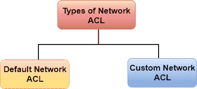
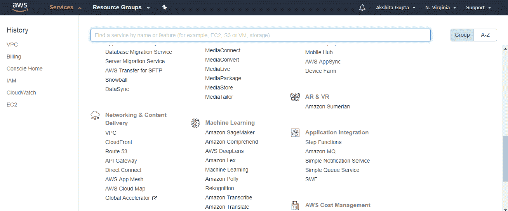
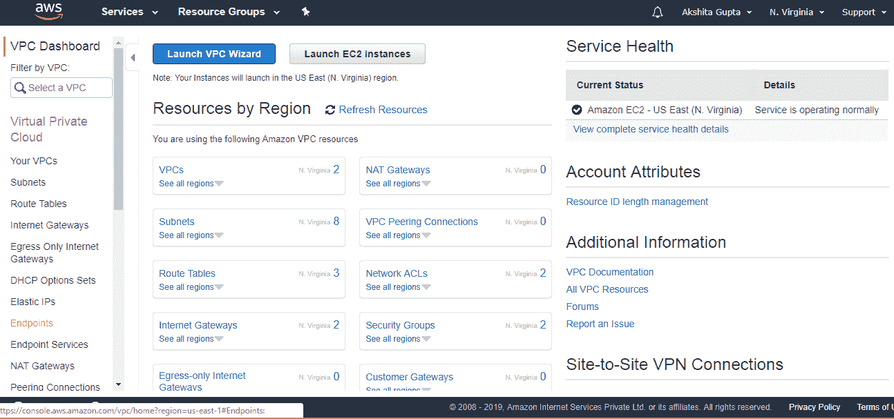
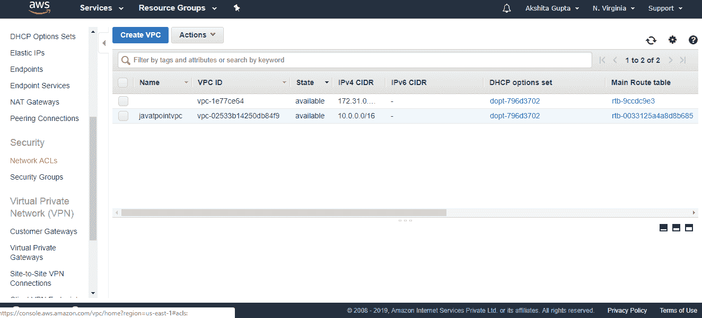
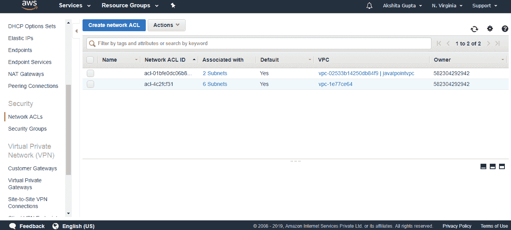
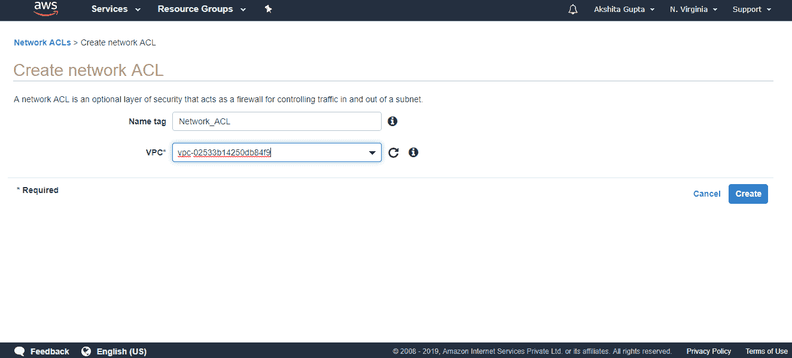
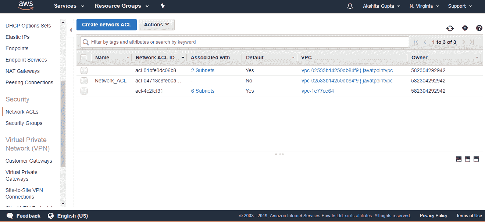

# 氯化钠

> 原文：<https://www.javatpoint.com/aws-nacl>

*   NACL 代表网络访问控制列表。
*   它是 VPC 的安全层，控制进出一个或多个子网的流量。
*   这是你的 VPC 可选层。
*   您可以设置类似于安全组的网络 ACL，为您的 VPC 增加额外的安全层。

## 与网络 ACL 相关的一些重要信息:

*   您的自定义 VPC 会自动附带默认网络 ACL，其中包括所有入站和出站 ipv4 流量。
*   您还可以创建自定义网络 ACL 并将其与子网相关联。默认情况下，自定义网络 ACL 拒绝所有入站和出站 ipv4 流量，直到您添加规则。
*   如果没有显式创建网络 ACL，则默认网络 ACL 会自动与子网相关联。
*   您可以将多个子网与一个网络 ACL 相关联。但是，一个子网一次只能与一个网络 ACL 相关联。
*   网络 ACL 与可以拒绝或允许规则的入站和出站规则相关联。
*   网络 ACL 包含规则的编号列表，这些规则从编号最低的规则开始按顺序评估，以确定流量是流入还是流出与网络 ACL 相关联的子网。编号最高的规则可以是 32766。建议以增量(例如，10 或 100 的增量)创建新规则，以便您可以轻松地在以后需要的地方添加新规则。

## 网络访问控制列表组件

**以下是网络 ACL 的组成部分:**

*   **规则编号:**规则编号是与每个规则相关联的编号。规则从编号最低的规则开始计算。只要规则匹配流量，就应用该规则，而不管编号最高的规则是否与之冲突。
*   **协议:**您可以指定任何具有标准协议号的协议。比如 Http、Https、ICMP、SSH 等。
*   **入站规则:**指定流量的来源和目的端口。
*   **出站规则:**指定目的流量和目的端口。

## 网络 ACL 的类型

**网络 ACL 有两种类型:**

*   **自定义网络 ACL**
*   **默认网络 ACL**

### 默认网络访问控制列表

默认网络 ACL 允许所有流量流入或流出与其关联的子网。每个网络 ACL 还包括一个规则，其规则编号为星号，用于确定流量是否与任何编号规则不匹配，然后被拒绝。无法修改或删除此规则。

| 规则# | 类型 | 草案 | 端口范围 | 来源 | 允许/拒绝 |
| One hundred | 所有流量 | 全部 | 全部 | 0.0.0.0/0 | 允许 |
| One hundred and one | 所有流量 | 全部 | 全部 | ::/0 | 允许 |
| * | 所有流量 | 全部 | 全部 | 0.0.0.0/0 | 否认 |
| * | 所有流量 | 全部 | 全部 | ::/0 | 否认 |

上表是与子网相关联的默认网络 ACL 表。规则 100 规定允许所有 IPv4 流量。第 101 条规则规定，允许所有 IPv6 流量。规则号“*”表示所有的交易都被拒绝

### 自定义网络访问控制列表

自定义网络 ACL 是用户定义的网络 ACL，默认情况下，它拒绝所有入站和出站流量，直到您添加规则。

| 规则# | 类型 | 草案 | 端口范围 | 来源 | 允许/拒绝 |
| * | 所有流量 | 全部 | 全部 | 0.0.0.0/0 | 否认 |
| * | 所有流量 | 全部 | 全部 | ::/0 | 否认 |

上表是拒绝所有流量的网络 ACL 的默认表。您需要自己添加规则来允许或拒绝流量。

## 创建网络访问控制列表

*   登录到 AWS 管理控制台。
*   转到网络和内容交付下的 VPC 服务。

*   点击出现在控制台左侧的**您的 VPCs** 。

*   在前面的主题中，我们已经创建了一个自定义的 VPC，它的名称是 **javatpointvpc。**
*   点击控制台左侧出现的**网络访问控制列表**。

*   点击**创建网络 ACL。**

*   填写以下详细信息以创建网络 ACL。

*   下面的屏幕显示已经创建了网络 ACL。

* * *