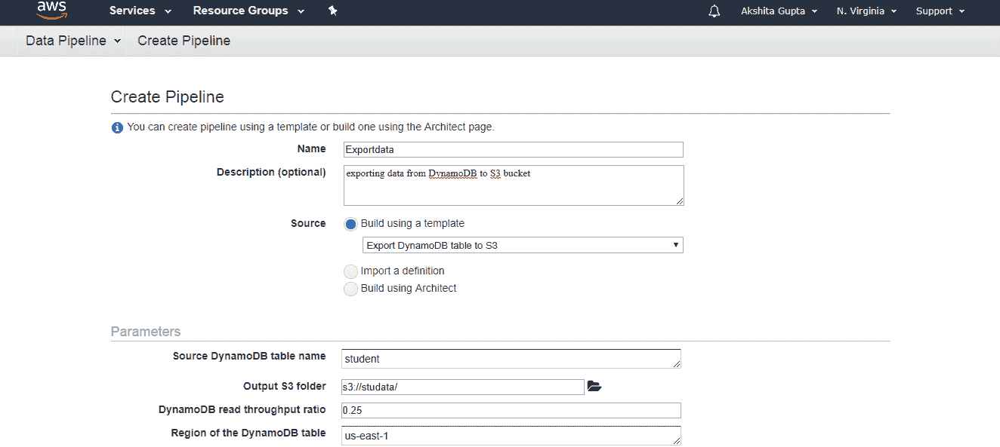

# 为什么我们需要数据管道？

> 原文：<https://www.javatpoint.com/aws-data-pipeline>

让我们考虑一个 javaTpoint 的例子，它专注于技术内容。以下是主要目标:

*   **完善内容:**展示客户未来想看的内容。通过这种方式，可以增强内容。
*   **高效管理应用程序:**跟踪应用程序中的所有活动，并将数据存储在现有数据库中，而不是将数据存储在新数据库中。
*   **更快:**以更快但更便宜的速度改善业务。

实现上述目标可能是一项艰巨的任务，因为大量数据以不同的格式存储，因此数据的分析、存储和处理变得非常复杂。各种工具用于存储不同格式的数据。对于这种情况，可行的解决方案是使用**数据管道。**数据管道集成了分布在不同数据源的数据，同时也处理同一位置的数据。

## 什么是数据管道？

AWS 数据管道是一种网络服务，可以从不同的服务中访问数据，并在同一位置对数据进行分析、处理，然后将数据存储到不同的 AWS 服务中，如 DynamoDB、亚马逊 S3 等。

例如，使用数据管道，您可以每天将 web 服务器日志归档到亚马逊 S3 存储桶，然后对这些日志运行 EMR 集群，这些日志每周生成报告。

### AWS数据管道的概念

AWS 数据管道的概念非常简单。我们有一个位于顶部的数据管道。我们有输入商店，可以是亚马逊 S3，迪纳摩数据库或红移。来自这些输入存储的数据被发送到数据管道。数据管道分析、处理数据，然后将结果发送到输出存储。这些输出存储可以是亚马逊红移、亚马逊 S3 或红移。

### AWS数据管道的优势

*   **易用**
    AWS 数据管道的创建非常简单，因为 AWS 提供了一个拖放控制台，也就是说，您不必编写业务逻辑来创建数据管道。
*   **分布式**
    它建立在分布式和可靠的基础设施上。如果在创建数据管道时活动中出现任何故障，则 AWS 数据管道服务将重试该活动。
*   **灵活**
    数据管道还支持各种功能，如调度、依赖跟踪和错误处理。数据管道可以执行各种操作，例如运行 Amazon EMR 作业，对数据库执行 SQL 查询，或者执行 EC2 实例上运行的自定义应用程序。
*   **不贵**
    AWS 数据管道使用起来非常便宜，而且是按月低费率建造的。
*   **scalable**
    通过使用数据管道，可以将工作串行或并行地分派给一台或多台机器。
*   **透明**
    AWS 数据管道提供对计算资源的完全控制，如 EC2 实例或 EMR 报告。

## AWS数据管道的组件

**以下是 AWS 数据管道的主要组件:**

*   **管道定义**
    它指定了业务逻辑应该如何与数据管道通信。它包含不同的信息:
    *   **数据节点**
        指定亚马逊 S3、Dynamo DB 等数据源的名称、位置和格式。
    *   **活动**
        活动是对数据库执行 SQL 查询，将数据从一个数据源转换到另一个数据源的操作。
    *   **调度**
        调度在活动上执行。
    *   **前提条件**
        在安排活动前必须满足前提条件。例如，您想要从亚马逊 S3 移动数据，那么前提条件是检查数据在亚马逊 S3 是否可用。如果前提条件得到满足，那么活动将被执行。
    *   **资源**
        你有计算资源，比如亚马逊 EC2 或者 EMR 集群。
    *   **动作**
        它更新关于你的管道的状态，例如通过向你发送电子邮件或触发警报。
*   **管道**
    **它由三个重要项目组成:**
    *   **管道组件**
        关于管道组件我们已经讨论过了。它基本上是您如何将您的数据管道与 AWS 服务进行通信。
    *   **实例**
        当所有的管道组件都在一个管道中编译时，它会创建一个包含特定任务信息的可操作实例。
    *   **尝试**
        我们知道数据管道允许您重试失败的操作。这些不过是尝试。
*   **任务运行器**
    任务运行器是一个从数据管道轮询任务并执行任务的应用程序。

## 任务运行器的体系结构

在上面的体系结构中，任务运行器从数据管道轮询任务。任务运行器在任务完成后立即报告其进度。报告后，检查任务是否成功。如果任务成功，则任务结束，如果不成功，则检查重试尝试。如果剩余重试尝试，则整个过程再次继续；否则，任务就戛然而止。

## 创建数据管道

*   登录到 AWS 管理控制台。
*   首先，我们将创建迪纳摩数据库表和两个 S3 桶。
*   现在，我们将创建迪纳摩数据库表。点击**创建表格。**

*   填写以下详细信息，如表名、主键以创建新表。

*   下面的屏幕显示表格**“学生”**已经创建。

*   点击**项**，然后点击**创建一个项。**
*   我们添加了三个项目，即身份证、姓名和性别。

*   下面的屏幕显示数据被插入到一个动态数据库表中。

*   现在我们创建两个 S3 桶。首先将存储我们从 DynamoDB 导出的数据，其次将存储日志。

我们创建了两个桶，即 logstoredata 和 studata。logstoredata 存储桶存储日志，而 studata 存储桶存储我们从 DynamoDB 导出的数据。

*   现在我们创建数据管道。转到数据管道服务，然后点击**开始**按钮

*   填写以下详细信息以创建管道，如果要更改管道中的任何组件，请单击“在建筑上编辑”。

*   点击建筑中的**编辑，出现以下屏幕。**我们可以看到警告出现，即**终止后丢失。**要删除此警告，您需要在参考资料中添加终止后的新字段。添加字段后，单击激活按钮。

*   最初，会出现等待依赖状态。刷新时，状态为等待运行。一旦出现运行状态，您就可以检查您的 S3 存储桶，数据将存储在那里。

* * *