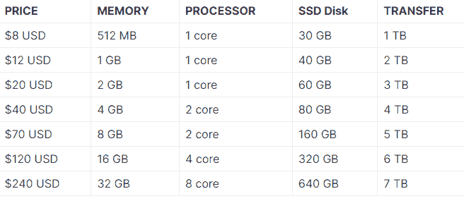
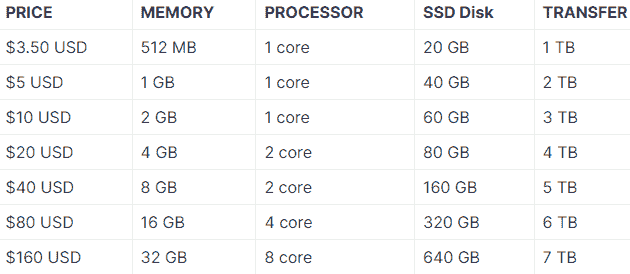
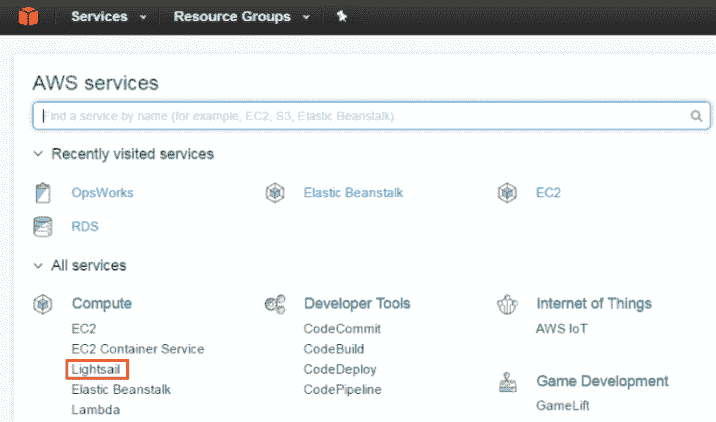
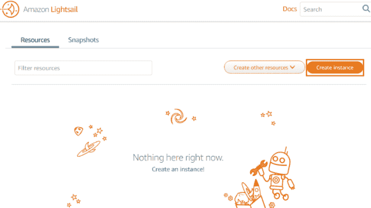
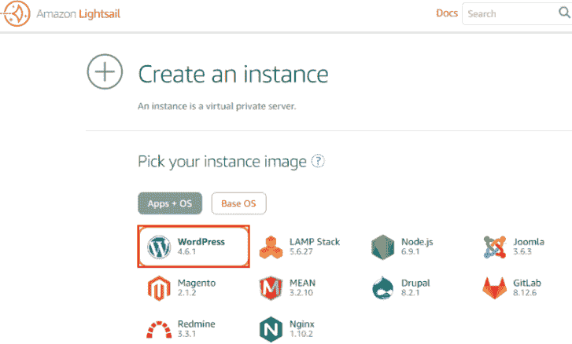
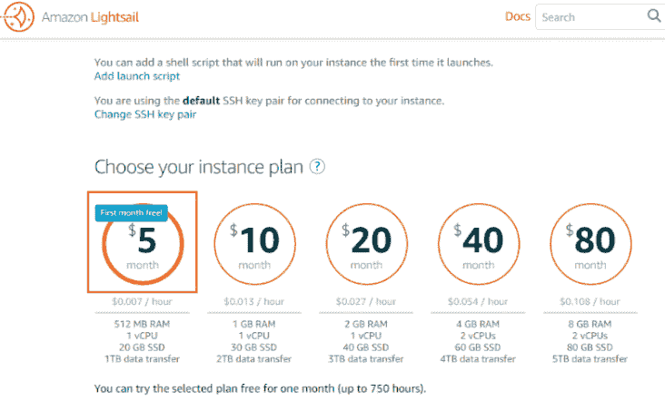
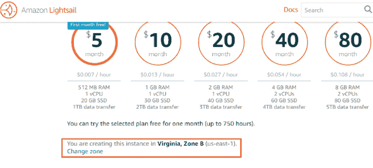
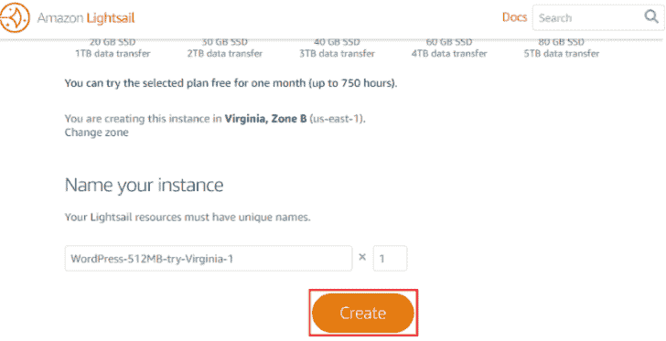
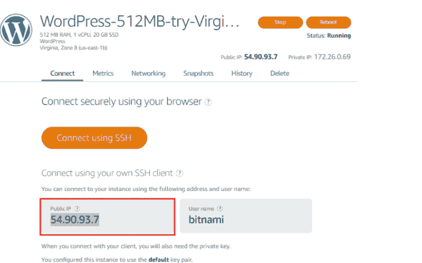
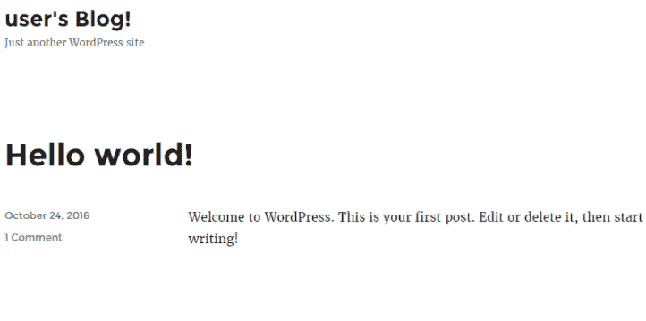

# AWS 光帆

> 原文：<https://www.javatpoint.com/aws-lightsail>

## 介绍

在本文中，我们将讨论 AWS 光帆。AWS 或亚马逊光帆是一种全新的 **VPS** ( **虚拟私人服务**)。它是根据放宽一些业务的概念制定的。考虑一个例子，在这个例子中，你可能知道每一个业务都是在一个想法背后运行的，如果这个想法被平稳地驱动，它就会呈指数级增长。如今可能影响企业的因素与技术有很大关系。技术越快，业务越多，利润越多。用技术实现商业的想法越快，随着时间的推移，商业可能会变得越成功。

为了在世界范围内缓解这种面向业务的服务，我们需要看看当前市场已经使用了一段时间的资源。也可能是这种情况，即这种资源可以用更少的费用覆盖更多的业务，从而使利润略有增加。这就是 [AWS](https://www.javatpoint.com/aws-tutorial) 的用武之地。它是云计算领域的领导者，也是当今大多数企业的驱动力。具体来说，我们来详细了解一下 AWS Lightsail，这是目前云计算市场的又一巨头。

这将花费他相当多的钱，而不是他从博客上赚到的钱。这就是 AWS 光帆救援的地方。它不需要数据库，不需要对服务器进行物理访问，也不需要在流量出现时进行扩展。在探索 AWS Lightsail 之前，我们需要了解更多关于虚拟专用服务器的信息。

## 什么是 VPS？

**虚拟专用服务器**或 VPS 是软件服务器的代表，它允许用户访问一项作业或任务的可计算资源，同时保持对物理服务器层的抽象或隐藏。每个虚拟专用网都独立于物理层运行，并允许其用户设置 Lightsail，因为如果没有虚拟专用服务器，通常无法通过 AWS 管理控制台看到它。通常有两种类型的虚拟专用服务器，即:

**托管 VPS** :它让其客户更关心“什么”而不是“如何”管理全规模前端应用程序所需的资源。该虚拟专用网可以与自动布线系统一起管理用户想要在虚拟专用网上执行的作业或任务集所需的抽象铺设基础设施。

**非托管 VPS** :这允许 VPS 执行简单的托管体验，其中客户端负责管理所有任务，如配置它、安装和更新软件。

## 什么是 AWS Lightsail？

AWS Lightsail 是一个虚拟专用服务器或所谓的 VPS，它提供了各种各样的模板来选择，从简单的操作系统到强大的 T2 应用程序，只需点击一下按钮就可以实现。

因此，无需担心底层基础设施。只要启动应用程序，开始构建你的想法，就这么简单！

## 为什么是 AWS 光帆？

我们可能有几十家公司提供出色的云服务，但为什么要选择 AWS Lightsail 呢？考虑一个例子来理解为什么。假设，一个人正在计划创业，有一个伟大的想法，但没有很好地配备资源，这可能不会导致他以他期望的成本赚取利润。他/她可能会开始一个博客业务，但不知道他可能需要什么资源来进行这项业务。他以将数据存储在需要扩展和配置的 [MySQL](https://www.javatpoint.com/mysql-tutorial) 数据库中开始他的博客。后来，它不得不在网络服务器上实现，这可能会让这位可怜的博主损失一大笔钱。

## 用户和服务

考虑一下我们之前讨论的博主例子。我们可以采用一个 **WordPress** 配置的系统，为此，我们可以使用**创建实例**仪表盘中的 [WordPress](https://www.javatpoint.com/wordpress-tutorial) 标志。然后我们可以选择托管服务与期望的计划，我们都准备好向前迈进。

此外，有了 AWS Lightsail，技术方面的安装、配置和扩展等一般任务可以自动完成，不需要自动扩展，因为系统会立即完成。

下一个由 AWS Lightsail 处理的实例每当我们单击“创建实例”按钮时，都会发生以下操作:

1.  启动**虚拟机。**
2.  连接固态硬盘(**固态硬盘**)。
3.  **IAM** 管理完成。
4.  创建各种**安全组**。
5.  设置域名服务器( **DNS** )。
6.  **静态 IP** 被创建。

## AWS 光帆的特点

要了解 AWS Lightsail 与所有其他自动服务(如 **Lambda、OpsWorks** 和**豆茎**的区别，请考虑以下几点:

**自动缩放**:限于 Lightsail，因为用户无法增加容量。像豆茎和 Lambda 这样的其他服务可以很容易地扩展。自动缩放 Lightsail 的唯一方法是更改现有计划，资源和功能将在计费后自动调整。

**固定成本**:AWS lightail 无论用户短时间或长时间使用其功能，价格都是固定的，不像其他服务，用户根据资源的使用情况付费。

**配置**:在 Opworks、Lambda 等其他服务中，用户掌握着完整的配置控制权。他可以创建堆栈并逐步配置层。Lightsail 的情况并非如此。Lightsail 不像其他系统那样复杂，而是一个简单的系统，不提供任何配置。与豆茎不同，在豆茎中，用户可以控制他为应用程序上传或执行部署的代码，而 Lightsail 没有任何自我参与的机制来定制或控制。它在操作系统下相当抽象地工作，并为您执行所有这些任务。它还自动控制后台任务，用户只需按下某些按钮即可执行。因此，在某种程度上，Ligthtsail 不同于所有其他云服务提供商。

现在让我们分析并接受它给用户带来的资本成本的差异。请考虑下图，该图显示了 Lightsail 提供的每项服务的大致成本估算。

**对于窗户:**

**对于 Linux:**

## AWS 光帆的优势

“光剑”的一些核心优势列举如下:

**简单 UI**:lightail 在预装软件的兜帽下运行。用户界面为第一次使用它的用户提供了更少的困惑。

**适应性**:组织或开发人员觉得 Lightsail 非常有吸引力，因为它的主机和后端处理起来难度要小得多，不像其他需要用户自行配置资产的系统。

**可负担性**:lightail 可能提供最便宜的套餐，一个月 5 美元，第一个月也是免费的。

**环境**:由于 AWS 为 Lightsail 的所有核心资产提供动力，因此它被大量支持到各种应用中。

**可靠性**:当一个人运行由 Lightsail 提供动力的服务时，存在非常罕见的更换情况，这是被认为高度可靠的主要原因。

**发射光帆**

现在让我们通过一个简单的 WordPress 配置的站点创建我们自己的 Lightsail 实例。请考虑以下步骤，这些步骤将帮助我们了解如何创建或启动 Lightsail 实例。

1.登录**亚马逊管理控制台**，找到并选择**亚马逊光信**。

1.点击**创建实例**按钮。

2.我们可以从下图所示的列表中选择，但是由于我们使用的是 **WordPress** ，我们将选择它。

3.我们现在将考虑各种选项，选择第一个选项是因为它为**提供一个月的免费等级订阅。**

4.弗吉尼亚区域是自动选择的，因为它是目前唯一可用的选项。

5.我们现在可以轻松地重命名实例，然后单击创建。

6.创建实例可能需要一些时间，将出现以下窗口。

7.该窗口将标志着我们实例的成功创建。

## 摘要

在这篇文章中，我们遇到了 AWD 光帆的各个方面，并从根源上发现了它。我们还了解到 VPS，它只不过是亚马逊提供的远程服务，旨在增强 Lightsail 的能力。后来，我们了解了目前根据需求使用的不同类型的虚拟专用网络，并了解了它们的案例研究。值得注意的是，我们刚才讨论的所有事实都与术语“云”相关。云只不过是一个虚拟服务器，它提供不同类型的服务，并且远程存在于可以访问它的某些部分或区域。重要的是要理解 AWS Lightsail 并不像我们讨论的豆茎或 Lambda 那样是自动可扩展的。这是亚马逊提供的一项自动化服务，为预装软件创建实例，特别是修复实例中所需的资源，以便业务可以扩展和管理。Lightsail 不仅为 WordPress 这样的域供电，还可以使用 [Node.js](https://www.javatpoint.com/nodejs-tutorial) 、 [LAMP](https://www.javatpoint.com/what-is-lamp) 轻松实现，类似于可以将数据迁移到云中的工具。在文章的后面，我们了解了 Lightsail 投入使用的确切原因以及它的好处。由于不需要这种技术配置来手动超越其功能，它允许其用户轻松进入实例，从而命名为 Lightsail。

* * *