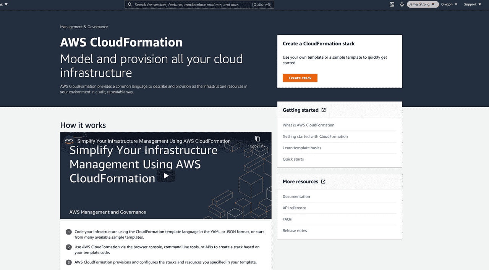
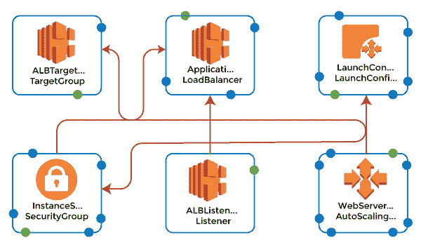

# AWS 云阵

> 原文：<https://www.javatpoint.com/aws-cloudformation>

如果您只需要在 AWS 上部署少量的服务或应用程序，您会很快发现手动设置每个服务或应用程序既繁琐又耗时。

更不用说，手工配置每个 AWS 资源会让您面临更高的出错或引入不一致的风险。

### 输入 AWS 云信息

CloudFormation 是一个用于 AWS 的基础设施自动化平台，它使得以更快、更高效和更安全的规模部署 AWS 资源。

本文概述了 AWS 云信息，包括它的工作原理、优点，以及如何使用控制台、云信息设计器和 AWS 命令行创建和部署云信息模板。

### 什么是 AWS 云信息？

AWS 云信息是一种 AWS 服务，它使用模板文件来自动设置 AWS 资源。

它也可以被描述为基础设施自动化或基础设施即代码(IAC)工具和云自动化解决方案，因为它可以在 AWS 云信息支持上自动设置和部署各种基础设施即服务(IAA)产品。您可以使用云信息自动配置运行在最流行的 AWS 服务上的工作负载，如 EC2 计算服务、S3 存储服务和 IAM 服务，以配置访问控制。

您还可以将 CloudFormation 模板应用于满足特定用例的 AWS 服务，例如地面站、AWS 卫星管理解决方案。

一般来说，如果一个服务在 AWS 上运行，您可以放心地使用云信息来自动化它的配置和部署。

值得注意的是，CloudFormation 不是在 AWS 上配置和部署服务的唯一方法。您*可以使用 AWS 命令行界面、应用编程接口或网络控制台手动处理这些过程。*

手动配置是团队在开始使用 AWS 并学习如何部署服务时通常采用的方法。然而，随着环境规模的扩大，许多团队很快意识到他们需要像云信息这样的解决方案来使部署过程更快、更一致。



### 云形成的好处

CloudFormation 和其他与 AWS 兼容的 IaC 工具提供了一系列好处，使云服务部署和管理更快、更高效。

### 部署速度

当您创建云信息模板来管理如何配置和部署 AWS 资源时，您几乎可以只使用一个模板立即部署相同资源的多个实例。如果您通过在命令行界面上运行命令或按下 AWS 控制台中的按钮来手动设置每个部署，这种方法将导致比您所能获得的更快的部署。

当然，需要注意的是，您需要花时间设置您的云信息模板。但是，假设您多次重复相同类型的部署。在这种情况下，总体而言，创建一个可以在每个部署中重用的云信息模板要快得多，而不必手动配置每个模板。

### 按比例放大

即使您最初不希望部署相同 AWS 资源的多个实例，云信息模板也很有用，因为它们确保您可以在时机成熟时快速扩展您的环境。有了 CloudFormation 模板，您会发现您可以添加更多的虚拟机实例或存储空间，例如，如果您的应用程序增加了流量，并且您需要升级您的环境，请注意。是必需的。

或者，您可以在需求下降时让一些部署离线，并且希望做得更少以节省资金，同时保持在需求增加时使用云信息快速重新部署它们的能力。

### 服务集成

单个云信息模板可以管理单个服务或资源，以及多个资源的部署。这种可管理性意味着您可以使用云信息来集成各种 AWS 云服务。例如，您可以编写一个模板，在 AWS 虚拟私有云(VPC)中设置 EC2 虚拟机，或者部署 S3 存储桶，并使用 IAM 服务配置访问控制。

通过单个模板管理多个服务 AWS 在您构建完整的云环境时集成服务。

### 一致性

当您使用云信息模板来定义和部署 AWS 资源时，您可以一次又一次地应用完全相同的配置。通过这种方式，CloudFormation 确保您的应用程序和服务将是一致和统一的，无论您创建了多少个实例。

另一种方法是手工设置每个资源，这种方法引入了风险，即工作工程师可能会对不同的实例应用不同的设置，从而导致不兼容。反过来，管理您的环境将更具挑战性，因为有些资源看起来与其他资源不同，即使它们执行相同的主要功能。例如，您可以让不同的 EC2 实例托管同一应用程序的副本，或者对同一服务使用不同的 IAM 访问控制。这种差异将使公平管理资源变得具有挑战性。

### 安全

同样，尽管云信息本身不是一个安全工具，但它可以提高您的 AWS 环境的整体安全性，降低疏忽或人为错误导致违规的风险。只要您将您的云信息模板设计得安全，您就不必担心部署资源的工程师会忘记打开关键的访问控制，或者让数据不受限制。这会让你暴露在公众面前。

### 轻松更新

除了部署新资源，您还可以使用云信息模板对现有资源进行更改。

例如，此功能简化了向 ec2 实例群添加更多存储或更改访问控制规则的过程。

### 审计和变更管理

当您使用云形成来管理您的基础架构时，您可以跟踪您应用了哪些模板的更改，以及它们是如何随着时间的推移而更改的。云形成中的变更跟踪意味着您将能够确定您的 AWS 服务和资源随着时间的推移发生了什么变化，而不必通过查看日志来重新创建更新的时间表。

### 云形成替代方案

CloudFormation 是亚马逊自己的 IaC 解决方案，但它不是您可以在 AWS 云中使用的唯一云自动化或 IaC 工具，以获得上述好处。您的团队还可以使用与 AWS 兼容的第三方 IaC 平台，如 HashiCorp Terraform 或 Ansible。

选择 CloudFormation 的主要优势是大多数第三方 IaC 工具可以配置资源在各种公共云上运行，而不仅仅是 AWS。

如果您同时使用多个云，换句话说，如果您在 AWS 上运行一些工作负载，而在微软 Azure 上运行其他工作负载，第三方 IaC 工具平台会很方便，因为它让您可以为每个人访问相同的配置管理工具。提供。允许使用。

**另一方面，**作为 AWS 的原生 IaC 平台，Cloud information 提供了与 AWS Cloud 最深层次的集成，包括像 Designer 这样的功能，可以直接在 AWS 网站上创建和修改 Cloud information 模板。

CloudFormation 还提供了高水平的保证，即使亚马逊对其服务进行了更改，您的模板也将始终与 AWS 服务兼容。如果亚马逊更新其服务之一，第三方 IAC 工具很可能会停止使用它，至少在工具的开发人员有时间赶上变化之前是这样。

这并不是一个常见的问题，因为亚马逊并不经常对其云服务进行重大更改。在 CloudFormation 中提供新服务可能需要一段时间，但第三方更新仍然需要更长时间。如果您考虑使用云信息或替代基础设施自动化和云自动化解决方案，这不是一个因素。

### 云信息模板术语和概念

了解云信息模板围绕哪些基本概念来构造资源、变量和函数是有帮助的。

### 模板

CloudFormation 模板只是一个以特定方式格式化的文本文件(有关格式化的详细信息，请参见下文)，它定义了应该如何配置和部署 AWS 服务或资源。

### 堆

Stack 是 AWS 用来指代多个 AWS 资源的集合的术语，例如 EC2 虚拟机、S3 存储和 IAM 访问控制，您可以使用单个模板一起管理这些资源。

CloudFormation 支持使用 JSON 或 YAML 格式化的模板，这些模板是构造文本文件最广泛使用的文件格式。大多数其他 IaC 工具使用与 Kubernetes 等平台相同的格式化语言。

### 因素

如果需要对每个部署应用唯一的设置，可以使用参数来实现。参数允许您为 CloudFormation 将在运行时应用的每个部署定义自定义值。

### 情况

您还可以通过设置条件来微调部署，条件允许您定义条件规则来精确控制每个部署的进行方式。

### 变更集

如果要使用云信息更新部署，可以更新用于创建部署的模板。然后，您可以创建一个变更集，在进行变更之前，该变更集汇总了来自更新模板的变更。

### 任务

有几种方法可以将数据获取到云信息模板中，参数是主要的。但是这些参数在部署时可能是未知的。cloud information 函数允许 cloud information 设计者从当前 cloud information 中部署的资源或 AWS 帐户中的外部来源检索数据。Refs 广泛用于引用模板中的其他资源，如下例所示。它创建了一个 EIP，例如，在模板的前面创建的。

```

"MyEIP" : {
   "Type" : "AWS::EC2::EIP",
   "Properties" : {
      "InstanceId" : { "Ref" : "MyEC2Instance" }
   }
}

```

### 如何创建云信息模板

创建云信息模板有两种方法:

*   使用预先存在的模板作为基础，或者
*   从头开始写一个全新的模板

在大多数情况下，前一种方法会更快、更舒适，尤其是如果您是云信息的新手，并且有简单的部署配置。如果您有一个极其复杂的部署，或者需要使用特定的 AWS 资源，而这些资源在 AWS 现有的模板库中没有很好地表现出来，那么创建新的模板通常是有意义的。

### 1:现有模板

要使用预先存在的模板作为部署的基础，请浏览 AWS 模板集合以找到最适合您需求的模板。例如，如果您想要部署一个 EC2 实例并为其配置存储，那么一个名为“带有临时驱动器的 Amazon EC2 实例”的模板将是一个很好的起点。

一旦您选择了一个模板，您可以将它下载到您的计算机上，在本地文本编辑器中编辑它，或者在 AWS 云信息设计器中打开它，这是一个与 AWS 云信息一起工作的在线工具，提供创建和修改模板的功能。设计器提供了可视化和拖放功能，这使得无需大量编码就可以轻松创建部署(尽管如果需要实现的不仅仅是基本功能，您应该编写一些代码)。

此模板将部署弹性负载平衡负载平衡器和仅从负载平衡器接收流量的自动扩展组。

**这是云形成模板设计器**的视图



### 2:新模板

如果选择创建新模板，可以使用任何文本编辑器来创建。您可以使用云信息设计器的可视化功能快速创建新的部署规则，因为它支持新的和以前创建的模板。

### 如何部署云信息模板

一旦模板准备好了，您就可以开始部署过程，在实际的 AWS 环境中创建模板中定义的资源。

部署云信息模板有几种方法。您采取的方法将取决于您如何创建模板以及您更喜欢 AWS 界面的哪个部分:

**AWS 控制台**:如果你的模板是一个存储在本地计算机上的文本文件，最简单的部署方式就是登录 AWS 云信息控制台 https://console.aws.amazon.com/cloudformation，点击新建栈创建。控制台将指导您命名模板并将模板文件上传到您的计算机。完成这些步骤并检查配置后，单击“创建”按钮部署模板。

**来自 cloud information Designer**:如果在 cloud information Designer 中创建模板，可以直接创建，方法是:点击“创建堆栈”按钮，按照屏幕上的说明进行操作，准备好应用模板后，按下“创建”。可以直接部署。

**AWS CLI** :可以使用 AWS CloudFormation 部署命令，使用 AWS CLI 工具部署模板。使用命令行参数来确定模板的存储位置(通常，您将首先将其上传到 S3，并将 CLI 指向该文件)以及您想要配置的其他选项。AWS 文档提供了命令行界面部署的完整细节。

### 更新云信息堆栈

有两种基本方法可以使用云信息模板对您部署的堆栈进行更改。

首先是更新相关模板，然后使用上述部署方法之一立即部署更新的模板。AWS 将此方法称为直接更新。这是更新您的部署的最快和最明显的方法，它没有提供机会在实现之前看到您想要的更改的效果。

第二种方法提供了更多的控制和在更改生效前预览更改的能力，它创建了一个更改集并使用它来更新。通过选择堆栈，然后选择堆栈操作，可以在云信息控制台中创建更改集。然后，您可以选择要更新的模板，控制台将引导您完成修改模板、查看更改并应用它们的步骤。您也可以使用 create-change-set 命令在 AWS CLI 上创建变更集。

### 高级云信息

云信息中可以使用许多高级功能。这些功能是 cloud information 中的辅助脚本，它们扩展了 cloud information，以便设计人员可以在 cloud information 之外执行脚本。

*   **if-Init**:cfn-Init 帮助器脚本从 AWS::CloudFormation::Init 键读取元数据，并根据从 CloudFormation 接收和解析的元数据进行操作。它还可以安装软件包，将文件写入磁盘，以及在 EC2 实例上启用或禁用服务。
*   **cfn-signal:** 设计者使用带有 CreationPolicy 或 WaitCondition 的 cfn-signal 作为信号，在先决条件准备就绪时同步堆栈中的资源。这允许在资源上执行更新或任务，并允许云信息继续在堆栈中创建资源。
*   **可以检索元数据**:用于从 CloudFormation 栈中检索元数据。
*   **cfn-hup** :用于检查元数据的更新，检测到变化时执行自定义钩子，比如脚本和文件的更新。
*   像 AWS SAM 和 eksctl 这样的服务在后端使用 CloudFormation 来促进无服务器和 Kubernetes 集群部署。

### 结论

手动设置和部署 AWS 资源是对团队时间的无效使用。这种配置还增加了监督和不一致的风险，导致管理问题和安全风险。此外，很难快速更新或扩展资源。

通过利用像云信息这样的 IaC 工具，您的团队可以简化 AWS 部署过程。您可以定义一次资源配置，然后根据需要部署多次。您还可以通过更改快速、可预测地更新资源，并且可以使用云信息模板来跟踪您如何配置资源以及它们如何随着时间的推移而工作。

* * *