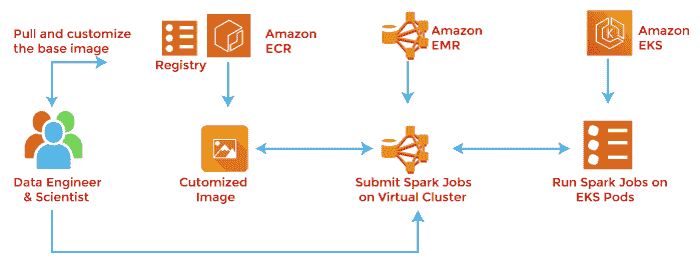

# 什么是亚马逊 EMR？

> 原文：<https://www.javatpoint.com/what-is-amazon-emr>

亚马逊弹性MapReduce(Amazon EMR)是一种网络服务，它使快速且经济高效地处理大量数据变得容易。

亚马逊 EMR 使用开源框架 Hadoop，将您的数据和处理分布在可调整大小的**亚马逊 EC2** 实例集群中。

亚马逊 EMR 用于各种应用，包括日志分析、网页索引、数据仓库、机器学习、金融分析、科学模拟和生物信息学。客户每年都会推出数百万个**亚马逊 EMR** 集群。

Amazon EMR ( **原名 Amazon Elastic Map Reduce** )是一款用于大数据处理和分析的 Amazon Web Services (AWS)工具。亚马逊将电子病历营销为一种可扩展的低配置服务，提供在内部运行集群计算的选项。

Amazon EMR 基于 Apache Hadoop，这是一个基于 Java 的编程框架，支持在分布式计算环境中处理大型数据集。使用 Hadoop 软件框架的核心组件 Map Reduce，开发人员可以编写程序，在分布式处理器集群或独立计算机中处理大量非结构化数据。

谷歌开发了它来索引网页，并在 2004 年取代了它最初的索引算法和推理。

亚马逊 EMR 在亚马逊弹性计算云( **EC2** )和亚马逊简单存储服务( **S3** )上的虚拟服务器 Hadoop 集群中处理大数据。

*EMR 名称中的弹性*是指其动态调整大小的能力，让管理员可以根据自己当前的需求增减资源。

Amazon EMR 用于日志分析、web 索引、数据仓库、机器学习(ML)、财务分析、科学模拟以及生物信息学中的数据分析。

它还支持基于 **Apache Spark、Apache Hive、Presto** 和 **Apache HBase** 的工作负载，它们与 Hive 和 Pig 集成在一起，Hive 和 Pig 是面向 Hadoop 的开源数据仓库工具。Hive 使用查询和分析数据，Pig 提供了一种高级机制来编程要在 Hadoop 中执行的 Map Reduce 作业。

## 亚马逊电子病历用例

企业可以通过多种方式使用亚马逊 EMR，包括:

**机器学习。** EMR 的内置 ML 工具使用 Hadoop 框架构建各种算法来支持决策，包括决策树、随机森林、支持向量机和逻辑回归。

**提取、转换和加载。** ETL 是将数据从一个或多个数据存储移动到另一个数据存储的过程。数据转换——例如排序、聚合和连接——可以使用 EMR 来完成。

**点击流分析。**亚马逊 S3 点击流数据可以通过 Apache Spark 和 Apache Hive 进行分析。Apache Spark 是一个开源的数据处理工具，可以帮助使数据更容易管理和分析。Spark 使用一个框架，使作业能够在大型计算机集群上运行，并可以并行处理数据。Apache Hive 是一个建立在 Hadoop 之上的数据仓库基础设施，它提供了处理 Spark 可以分析的数据的工具。点击流分析可以帮助组织了解客户行为，改进网站布局，找出人们在搜索引擎中使用的关键词，并查看哪些单词组合会带来销售。

**实时流。**用户可以使用 Apache Spark Streaming 和 Apache Flink 实时分析使用流数据源的事件。它支持在 EMR 上构建流数据管道。

**互动分析。** EMR Notebook 是一项托管服务，可为数据分析提供安全、可扩展和可靠的环境。

**使用 Jupyter Notebook** -开源网络应用数据科学家可以使用它来创建和共享实时代码和方程-数据可以被准备和可视化以执行交互式分析。

**基因组学。**组织可以使用 EMR 处理基因组数据，使数据处理和分析可扩展到包括制药和电信在内的行业。

## 亚马逊电子病历部署选项

作为云服务，亚马逊 EMR 可以部署在各种设置中，例如:

亚马逊 EC2 上的亚马逊 EMR。使用亚马逊 EC2，亚马逊 EMR 可以快速处理大量数据。用户可以配置亚马逊电子病历，以利用按需、保留和现货实例。

亚马逊弹性 Kubernetes 服务上的亚马逊 EMR(**EKS**)。亚马逊 EMR 控制台使用户能够在同一个 EKS 集群上运行 Apache Spark 应用程序和其他应用程序。组织可以跨应用程序共享计算和内存资源，并使用 Kubera 来监控和管理基础架构。

## 亚马逊 EMR 功能

亚马逊电子病历的功能旨在让管理员和开发人员更轻松、更方便地完成以下任务:

*   **EMR 工作室。**这种集成开发环境有助于开发人员编写代码，是构建和测试应用程序的一种高效、简单的方法。EMR Studio 由源代码编辑器、构建自动化工具和调试器组成。
*   亚马逊 10 节点 EMR 集群每小时的成本为 0.15 美元，组织只为其集群运行的时间付费。他们可以通过建立具有现货实例的 EMR 集群来进一步控制成本，这使得用户能够对额外的 EC2 容量进行竞价，并且只为所使用的资源付费。
*   EMR 将计算和存储分开，用于个人扩展，并受益于亚马逊 S3 的分层存储。实例可以以任何规模处理数据，并自动进行资源调配、管理和监控。使用 AWS 自动缩放，用户可以根据使用情况增加或减少实例数量。
*   亚马逊 EMR 监控集群以确保最佳资源利用率。它使用亚马逊云观察服务来收集和解释指标。Amazon EMR 可以监控集群的运行状况、使用情况和性能，并帮助识别有问题的节点或作业。它还提供了负载平衡器服务，有助于将流量自动定向到健康的节点。
*   **保护。** Amazon EMR 包括安全功能，例如自动配置 EC2 防火墙，以便实例上只允许必要的网络流量。集群已经在亚马逊虚拟私有云中推出。服务器端加密或客户端加密有助于管理密钥。修改AWS湖泊形成或Apache游侠数据库的数据访问控制。
*   **灵活性。** Amazon EMR 支持用户使用脚本定制集群和安装第三方软件包。用户也可以在不启动集群的情况下重新配置应用程序。

* * *