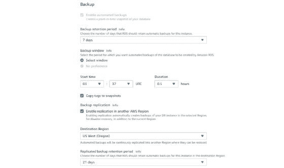

# 亚马逊关系数据库服务

> 原文：<https://www.javatpoint.com/amazon-relational-database-service>

亚马逊关系数据库服务(Amazon RDS)使得在云中设置、操作和扩展关系数据库变得非常容易。它提供了经济高效且可调整大小的功能，同时自动化了耗时的管理任务，如硬件配置、数据库设置、修补和备份。它让您能够专注于您的应用程序，以便为它们提供所需的快速性能、高可用性、安全性和兼容性。

亚马逊 RDS 提供多种数据库实例类型——针对内存、性能或 I/O 进行了优化——并为您提供了六种熟悉的数据库引擎供您选择，包括亚马逊 Aurora、PostgreSQL、MySQL、MariaDB、Oracle 数据库和 SQL Server Huh。您可以使用 AWS 数据库迁移服务轻松地将现有数据库迁移或复制到亚马逊 RDS。

## 什么是亚马逊 RDS？

亚马逊关系数据库服务(RDS)是由亚马逊网络服务(AWS)提供的托管 SQL 数据库服务。亚马逊 RDS 支持一系列数据库引擎来存储和组织数据。它还有助于关系数据库管理任务，如数据迁移、备份、恢复和修补。

亚马逊 RDS 促进了关系数据库在云中的部署和维护。云管理员使用亚马逊 RDS 来设置、操作、管理和扩展云数据库的关系实例。亚马逊 RDS 本身不是数据库；它是一种用于管理关系数据库的服务。

## 亚马逊 RDS 是如何工作的？

数据库存储大量数据，应用程序可以利用这些数据来帮助它们执行各种任务。关系数据库使用表来存储数据，被称为关系数据库，因为它用定义的关系来组织数据点。

管理员通过 AWS 管理控制台、Amazon RDS API 调用或 AWS 命令行界面来控制 Amazon RDS。他们使用这些接口来部署用户可以应用特定设置的数据库实例。

Amazon 为几种实例类型提供了不同的资源，例如 CPU、内存、存储选项和网络功能。每种类型都有多种尺寸，以满足不同工作负载的需求。

RDS 用户可以使用 AWS 身份和访问管理来定义和设置访问 RDS 数据库的权限。

## 亚马逊无线电数据系统功能

亚马逊无线电数据系统功能包括以下内容:

**复制。** RDS 使用复制功能创建读取副本，这些副本是应用程序使用的数据库实例的只读副本，无需更改原始生产数据库。管理员还可以通过 RDS 多边缘部署和同步数据复制实现跨多个可用性区域的自动故障切换。

## RDS 提供三种类型的存储:

**通用固态硬盘(SSD)。**亚马逊推荐这款存储作为默认选择。

**每秒提供的输入输出操作数(IOPS)。**面向输入/输出密集型工作负载的固态硬盘存储。

**磁性。**更低成本的选择。

**监测。**亚马逊**云观察**服务支持托管监控，它允许用户查看容量和输入/输出指标。

**打补丁。** RDS 为用户选择的任何数据库引擎提供补丁。

**备份。**另一个特点是故障检测和恢复。RDS 为托管实例备份提供事务日志，以实现时间点恢复。用户选择一个保留期，并将数据库恢复到该期间的任何时间。他们还可以手动拍摄实例的快照，这些快照会一直保留到被手动删除。

RDS 允许用户指定备份过程的时间和持续时间。他们还可以选择备份和快照的保留时间。

*   **增量计费。**用户每月为他们启动的实例付费。
*   RDS 使用公钥加密来保护自动备份、读取副本、数据快照和其他静态存储的数据。

## 亚马逊 RDS 的优点和缺点是什么？

使用亚马逊 RDS 有几个利弊。

*   **易于管理:**亚马逊 RDS 让项目从构思到部署变得简单。使用亚马逊 RDS 管理控制台、AWS RDS 命令行界面或简单的 API 调用，可以在几分钟内访问生产就绪关系数据库的功能。不需要配置基础架构，也不需要安装和维护数据库软件。
*   **高度可扩展:**只需点击几下鼠标或调用一次 API，就可以扩展数据库的计算和存储资源，而且通常不会停机。许多亚马逊 RDS 引擎类型允许您启动一个或多个读取副本，以从主数据库实例中卸载读取流量。
*   **可用且耐用:**亚马逊 RDS 运行在与其他亚马逊 Web 服务相同的高度可靠的基础设施上。当您调配多 AZ 数据库实例时，Amazon RDS 会将数据同步复制到不同可用性区域(AZ)中的备用实例。Amazon RDS 还有许多其他功能可以增强关键生产数据库的可靠性，包括自动备份、数据库快照和自动主机更换。
*   **Fast:** 亚马逊 RDS 支持要求最苛刻的数据库应用。您可以在两个支持固态硬盘的存储选项之间进行选择:一个针对高性能 OLTP 应用程序进行了优化，另一个针对经济高效的通用用途进行了优化。此外，亚马逊极光以 1/10 的成本提供了与商业数据库相当的性能。
*   **安全:**亚马逊 RDS 可以轻松控制网络对您数据库的访问。亚马逊 RDS 还允许您在亚马逊虚拟私有云(亚马逊 VPC)中运行您的数据库实例，使您能够隔离您的数据库实例，并通过行业标准的加密 IPsec VPN 连接到您现有的 IT 基础架构。许多亚马逊 RDS 引擎类型提供静态加密和传输加密。
*   **不贵:**你支付的费率非常低，而且只针对你消耗的资源。此外，通过我们的保留实例定价，您可以选择按需定价，无需预先或长期承诺，甚至可以降低小时费率。
*   **易用性。**管理员不需要学习特定的数据库管理工具，也可以使用管理控制台管理多个数据库实例。RDS 与用户可能已经熟悉的数据库引擎(如 MySQL 和 Oracle)兼容，它可以自动执行手动备份和恢复过程。
*   **成本效益。**根据 AWS，客户只为自己使用的东西付费。此外，维护实例所花费的时间也减少了，因为备份和修补等维护任务是自动化的。

读取副本会将读取量大的流量从主数据库实例路由出去，从而减少该实例的工作负载。

RDS 将计算和存储分开，因此管理员可以独立扩展它们。

### 缺点

使用亚马逊无线电数据系统的一些缺点包括:

**缺乏根访问权限。**由于是托管服务，用户没有运行 RDS 的服务器的 root 访问权限。RDS 将某些程序的访问权限限制为具有高级权限的程序。

**停机时间。**系统必须离线进行一些修补和扩展程序，这些过程的时间各不相同。随着扩展，计算资源平均需要几分钟的停机时间。

## 亚马逊无线电数据系统数据库实例

数据库管理员可以创建、配置、管理和删除**亚马逊 RDS** 实例及其使用的资源。亚马逊 RDS 实例是一个云数据库环境。管理员还可以启动许多数据库或模式；多少取决于使用的数据库。

亚马逊 RDS 将每个客户的每个帐户限制为总共 40 个数据库实例，AWS 对 Oracle 和 SQL Server 实例施加了进一步的限制。对于这些数据库实例，用户通常最多只能拥有 **10 个。**

### 亚马逊无线电数据系统数据库引擎

一个 AWS 客户可以在亚马逊 RDS 中旋转多达六种类型的数据库引擎:

*   **亚马逊极光**是专有的 AWS 关系数据库引擎。亚马逊极光兼容 MySQL 和 **PostgreSQL** 。
*   【MariaDB 的 RDS 与 MariaDB 兼容，Maria DB 是 MySQL 的一个分支，是一个开源的关系数据库管理系统( **RDBMS** )。
*   **MySQL 的 RDS**与 MySQL 开源的 RDBMS 兼容。
*   **Oracle 数据库的 RDS**兼容 Oracle 数据库的多个版本，包括自带许可证和包含许可证的版本。
*   **用于 PostgreSQL 的 RDS**与 PostgreSQL 开源对象——RDBMS 兼容。
*   **用于 SQL Server 的 RDS**兼容微软 SQL Server，一个 RDBMS。

随着时间的推移，亚马逊 RDS 增加了对数据库引擎主要和次要版本的支持。它旨在允许管理员在创建数据库实例时指定引擎版本。在大多数情况下，亚马逊 RDS 可以支持已在现有数据库中使用的开发人员代码、应用程序和工具。

### AWS 提供其他数据库服务，包括:

*   **NoSQL** 数据库的亚马逊 DynamoDB 键值和文档数据库；
*   亚马逊海王星图形数据库；和
*   AWS 数据库迁移服务，用于简化数据库传输和转换。

## 亚马逊 RDS 用例

亚马逊 RDS 的**可扩展性、安全性**和**可用性**使其适用于各种应用。一些可能的用途包括:

*   **线上零售。**这些应用程序管理跟踪库存、交易和定价的复杂数据库。
*   **手机和网络游戏。** RDS 支持需要不断更新这些应用的开发者和需要高可用性的用户。
*   **出行申请。**像 **Airbnb** 这样的应用程序利用了 **RDS 的**能力来简化耗时的数据库管理任务，并实现数据库复制自动化。像 Airbnb 这样的移动应用也利用了 RDS 的可扩展存储能力。
*   **流媒体应用。**像网飞这样的应用程序利用了 **RDS** 的存储可扩展性和亚马逊 **RDS** 的可用性，这使得它们能够处理日常的高需求。
*   **金融应用。**与其他移动应用程序一样，这些应用程序可以使用 RDS 来简化管理数据库任务并节省时间和金钱。

企业对企业报告公司 Enlyft 表示，2021 年有 6096 家公司在使用亚马逊 RDS，包括美国红十字会、企鹅兰登书屋和 Zendesk。亚马逊还在 2021 年报告称，Airbnb、Intuit 和美国退伍军人事务部是使用 RDS 支持其数据工作负载的组织之一。

## 特色无线电数据系统合作伙伴

**应用关联**

Apps Associate 是 AWS 合作伙伴和 Oracle 专家，致力于将企业工作负载迁移到云，让客户能够专注于高价值计划。加入我们的网络研讨会，了解应用关联如何帮助客户迁移到亚马逊极光。

**Rackspace**

Rackspace 是一个 AWS 合作伙伴，可以帮助您与 Amazon Aurora 一起实施现代应用程序开发最佳实践，以帮助您跟上客户和业务需求的步伐。阅读电子书，了解 Rackspace 如何帮助 TotalTracks 实现流程自动化并满足不断增长的需求。

## 用例

**网络和移动应用**

为大规模运行而构建的 Web 和移动应用程序需要具有高吞吐量、大容量存储可扩展性和高可用性的数据库。亚马逊 RDS 满足了这类高要求应用的需求，具有未来发展空间。由于亚马逊 RDS 没有许可限制，因此它完全符合这些应用程序的可变使用模式。

**Airbnb**

Airbnb 之所以选择亚马逊 RDS，是因为它简化了大多数通常与数据库相关的耗时管理任务。Airbnb 使用多可用性区域(Multi-AZ)部署来进一步自动化其数据库复制并提高数据持久性。Airbnb 仅用 15 分钟的停机时间就完成了向亚马逊 RDS 的整个数据库迁移。

**电商应用**

亚马逊 RDS 为小型和大型电子商务企业提供灵活、安全、高度可扩展和低成本的在线销售和零售数据库解决方案。亚马逊 RDS 提供了一个托管数据库，帮助电子商务公司满足 PCI 合规性，并专注于创建高质量的客户体验，而无需担心管理底层数据库。

**不稳定**

Instacart 向亚马逊 RDS 寻求新的当日杂货配送服务，以避免从头开始构建新生产数据库的复杂性。该公司现在每月可以向其数据库添加数百万个新项目，其工程团队可以专注于开发新功能和改善整体客户体验。

**手机和网络游戏**

移动和网络游戏需要一个高吞吐量和高可用性的数据库平台。亚马逊 RDS 管理数据库基础设施，因此游戏开发人员不必担心数据库服务器的供应、扩展或监控。亚马逊 RDS 提供了一个熟悉的数据库引擎，可以快速增加容量以满足用户需求。

## 亚马逊极光和亚马逊极光无服务器 vs 亚马逊 RDS

亚马逊极光是亚马逊创建的数据库引擎。RDS 是一项用于管理数据库引擎和实例的服务，包括亚马逊极光数据库。

亚马逊极光无服务器也可以用来管理亚马逊极光的实例。它的自动化功能使开发人员不必启动服务器和手动管理数据库容量。

借助 RDS，必须手动扩展服务器，这可能会导致大量停机。极光无服务器的自动扩展功能支持快速部署，停机时间很少或没有。

Aurora Serverless 的一个缺点是它只适用于亚马逊 Aurora、MySQL 和 PostgreSQL。RDS 与六个数据库引擎兼容。

亚马逊 RDS 适用于更可预测的应用，因为 RDS 中的容量调整比 Aurora 无服务器需要更长的时间。

## 外卖

Amazon RDS 帮助组织处理关系数据库管理任务，如迁移、备份、恢复和修补。亚马逊 RDS 的一些主要功能是复制、高性能存储和故障检测。

亚马逊 RDS 最大的好处之一是它的易用性，它允许管理员管理多个数据库实例，而不必学习其他数据库管理工具。

这些功能允许 RDS 帮助组织削减耗时的数据库管理任务的成本，并管理在 AWS 中使用高性能存储的隐藏成本。

## 亚马逊 RDS 在 VMware 上的前景如何？

亚马逊在 VMware 上的 RDS 为内部部署的 VMware 基础架构提供了亚马逊的关系数据库服务，并指出混合云服务的潜在未来。

以前很多人把 VMware 和 AWS 视为死敌，但当他们在 2017 年宣布在 AWS 上部署 VMware Cloud 时，这种情况就改变了。在 2018 年 VMware world 大会上，亚马逊 RDS 在 VMware 上的发布表明了两家公司之间不断发展的关系，这可能预示着潜力。实现云供应商和内部基础设施之间的更大协作。

事实证明，将所有内容迁移到云所需的投资对许多组织来说过于昂贵，因此随着现实预期的设定，越来越多的云供应商将尝试将云的功能和优势与其内部基础架构相集成。

亚马逊 RDS 旨在简化关系数据库的设置、运行和开发。RDS 提供了一种灵活且简单的方法来完成以前繁琐的任务，如修补、容量管理和数据库调整。因为这是亚马逊的一项服务，所以它只为您使用的内容提供按需定价，或者为保留的专用容量付费。直到最近，亚马逊将这项服务限制在亚马逊云上。

VMware 上的 Amazon RDS 位于技术预览版中，因此目前无法获得有关该平台如何工作的所有详细信息。如果它像原生的亚马逊 RDS 一样，您将能够从六种流行的数据库类型中创建和管理数据库，包括 Oracle 和微软 SQL Server。

Amazon RDS for VMware 将实现经济实惠、高可用性的混合部署、AWS 的简单数据库灾难恢复，以及 AWS 中内部数据的只读克隆。这种合作关系可以帮助亚马逊客户轻松地将传统的数据库部署从他们的站点和 AWS 迁移，甚至是那些有困难的许可要求的站点。它还可以帮助 VMware 客户了解传统基础架构中数据库的 AWS 管理堆栈的优势。

## 亚马逊 RDS Vs .VMware 产品

亚马逊专注于将工作负载转移到公共云；甚至 AWS 上的 VMware Cloud 也专注于将较旧的工作负载转移到异地。VMware 上的亚马逊 RDS 就不一样了。随着这一版本的发布，亚马逊正在跟随微软在数据中心的范围内提供公共云服务。

假设亚马逊继续向数据中心添加服务，并继续向微软 Azure Stack 添加服务。在这种情况下，客户可以看到几个主要的云优势，而无需付出巨大的努力将工作负载迁移到公共云。尽管业界一直在谈论混合云，但大多数客户都没有实施它。

实现公共云的灵活性、易用性、敏捷性和可扩展性需要客户进行大量投资。组织通常不会进行这种投资，而是将时间和精力投入到将特定工作负载迁移到云中。随着云提供商寻求将公共云扩展为私有数据中心，客户可以两全其美，拥有真正的混合云模式。

在你的数据中心内运行亚马逊服务的能力，只不过是亚马逊承认公共云不是唯一的出路。再加上您现在可以在亚马逊的公共云中运行传统的 VMware 内部基础架构，您可以看到这两家公司已经决定拥有公共云、私有云和混合云，它们都可以共存。

* * *