# 雅典娜号

> 原文：<https://www.javatpoint.com/aws-athena>

数据分析是一个非常复杂的过程，人们总是努力使它变得容易。有许多分析工具，甚至受欢迎的科技巨头亚马逊也提供了一项名为*亚马逊雅典娜的 AWS 服务。*本亚马逊雅典娜教程将指导您基本和高级使用亚马逊雅典娜。

亚马逊雅典娜是一个交互式数据分析工具，用于在相对较短的时间内处理复杂的查询。它没有服务器。因此，设置起来没有麻烦，也不需要基础设施管理。它不是数据库服务。因此，您需要为运行的查询付费。您只需将数据指向 S3，定义必要的模式，就可以使用标准的 SQL 了。通过 AWS 培训了解有关亚马逊网络服务的所有信息。

### 亚马逊雅典娜介绍

2016 年 11 月 20 日，亚马逊推出雅典娜作为其服务之一。如前所述，亚马逊雅典娜是一个无服务器查询服务，使用存储在亚马逊 S3 的标准 SQL 来分析数据。只需在 AWS 管理控制台中点击几下，客户就可以将亚马逊雅典娜指向他们存储在亚马逊 S3 的数据，并使用标准的 SQL 运行查询，在几秒钟内检索结果。

有了亚马逊雅典娜，就没有基础设施可以设置或管理，客户只需为他们运行的查询付费。亚马逊雅典娜自动缩放，并行执行查询，即使在大型数据集和复杂查询中也能给出快速结果。

### 微软 SQL Server 与亚马逊雅典娜的区别

| 特征 | 搜寻配置不当的 | 亚马逊雅典娜 |
| **定义** | 微软 SQL Server 是一个数据库管理和分析系统。 | 亚马逊雅典娜是一个交互式查询服务，使数据分析变得容易。 |
| 用法 | 用于数据库上的 DML、DCL、DDL 和 TCL 操作。 | 用于数据库上的 DML 操作。 |
| **优势** | 

1.  Reliable and easy to use.

2.  Easy to maintain.
3.  Install the server easily.
4.  Multi-tool integration becomes possible.

 | 

1.  Easy to use.

2.  No maintenance is required.
3.  No server configuration is required.
4.  Multi-tool integration becomes possible.

 |
| **集成** | 

1.  dry
2.  【SQL dep】
3.  come on

 | *   Amazon S3*   自动警报系统胶*   come on |
| **限制** | 

1.  Limited RDS storage.
2.  Examples are limited.
3.  Unable to handle recursion.

 | 

1.  DDL is not supported.
2.  Applicable to external tables only.
3.  Custom user function is not supported.

 |

### 在雅典娜中创建表格

我们使用实时资源，因此只对您运行的查询收费，而不对您使用的数据集收费，如果您想将数据文件上传到亚马逊 S3，则需要收费。

要查询 S3 文件数据，必须有一个与文件结构相关联的外部表。我们可以通过两种方式创建外部表:

*   手动。
*   使用 AWS 胶水爬虫。

要手动创建外部表，请遵循正确的结构创建详细信息创建外部表并指定正确的格式和确切的位置。下面给出了一个例子:

### 手动创建外部表

创建的外部表存储在 AWS 胶合目录中。Glu Clover 解析输入文件结构，并创建一个在 Glu 数据目录中定义的元数据表。

爬网程序使用 AWS IAM(身份和访问管理)角色来允许归档数据和数据目录。您必须拥有将角色传递给爬网程序的权限，才能访问已爬网的亚马逊 S3 路径。

转到 AWS 胶水，选择**“添加表格”，**，选择**“使用爬虫添加表格”选项。**

### 使用粘附爬行器添加表格。

给爬虫一个名字。比方说，一辆汽车履带车

**输入爬虫名称**

在**亚马逊 S3，**选择保存文件的路径。

如果您计划只查询一个文件，可以选择 S3 文件路径或 S3 文件夹路径来查询具有相同结构的文件夹中的所有文件。

### 输入爬网程序名称

在**亚马逊 S3，**选择保存文件的路径。

如果您计划只查询一个文件，可以选择 S3 文件路径或 S3 文件夹路径来查询具有相同结构的文件夹中的所有文件。

```

The Cars.json file is in the S3 location s3://rosyll-niranjana-xavier/data_input/json-files/cars.json. You can also choose s3://rosyll-niranjana-xavier/data_input/json-files/ 

```

作为路径。

创建一个对您要查询的目标的 S3 对象具有权限的 IAM 角色，或者选择一个现有的 IAM 角色(该角色有足够的权限访问 S3 对象)。

选择包含外部表的数据库，并选择要添加到外部表名的前缀。

### 为外部表选择数据库和前缀

**点击【完成】创建胶水爬虫**

*   **运行爬虫**

外部表已在指定的数据库下创建。现在，您可以使用这个查询 S3 对象。

*   **从外部表格中选择数据**

既然我们放了一个文件，**查询“从 json_files 中选择*”**返回文件中的一条记录。让我们尝试将另一个具有相同结构的文件放在同一个 S3 文件夹中，并再次查询外部表。

```

petercars.json file S3\. 

```

如果查询同一个外部表，您将看到返回两行而不是一行。

当查询同一个外部表时，会得到两条记录。这是因为在 S3 文件夹中有两个具有所需结构的文件。您可以对数据执行许多操作。例如，下面的查询将在结果集中取消数组。

### 访问亚马逊雅典娜

雅典娜很容易接近，你可以:

这些是访问亚马逊雅典娜的一些方法。到现在，你已经知道了亚马逊雅典娜的所有重要信息，让我告诉你雅典娜的不同特征。

## 雅典娜的特征

在亚马逊提供的众多服务中，雅典娜就是其中之一。它有几个适合数据分析的特性。让我们一个接一个地看看不同的功能。

1.  **轻松实现:**雅典娜不需要安装，也可以通过 AWS CLI 直接从 AWS 控制台访问。
2.  **无服务器:**它是无服务器的，因此最终用户不需要担心基础架构、配置、扩展或故障。雅典娜自己照顾一切。
3.  **按查询付费:**雅典娜只对您运行的查询收费，即每个查询管理的数据量。如果您可以压缩它们并相应地格式化数据集，就可以节省很多。
4.  **快速:**雅典娜是一个非常快速的分析工具。它可以通过将复杂的查询分解成更简单的查询并并行运行它们，然后将结果组合起来得到所需的输出，从而快速执行复杂的查询。
5.  **安全:**借助 IAM 策略和 AWS 身份，Athena 让你完全掌控数据集。由于数据存储在 S3 存储桶中，IAM 策略可以帮助您管理用户的控制。
6.  **高可用:**在 AWS 的保证下，雅典娜高可用，用户可以全天候执行查询。AWS 99.999%可用，雅典娜也是。
7.  **集成:**雅典娜最好的特点就是可以和 AWS 胶水集成。AWS Glue 将帮助用户构建一个更好集成的数据仓库。它帮助您创建更好的数据版本、更好的表、视图等。

从现在开始，你会对 AWS 雅典娜印象深刻。既然你对雅典娜了解很多。让我们卷起袖子，通过做一个小演示来了解雅典娜的作品。

### 演示(亚马逊雅典娜和 MySQL 的比较)

在这个亚马逊雅典娜教程中，现在我们将比较 MySQL 和雅典娜，并了解在雅典娜中，即使是简单的查询也需要更少的时间来执行。

1.  将 CSV 文件加载到 MySQL 大约需要 1 个小时，但是在雅典娜中，将 CSV 文件上传到 S3 只需要 3 分钟，创建一个表只需要 0.42 秒。
    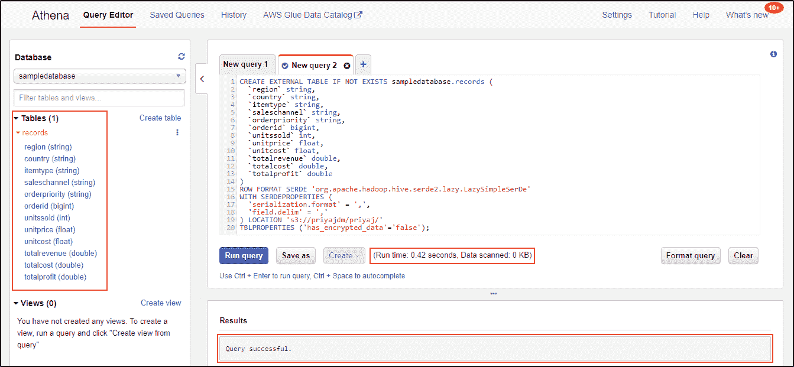
2.  选择查询。从表格中选择*。
    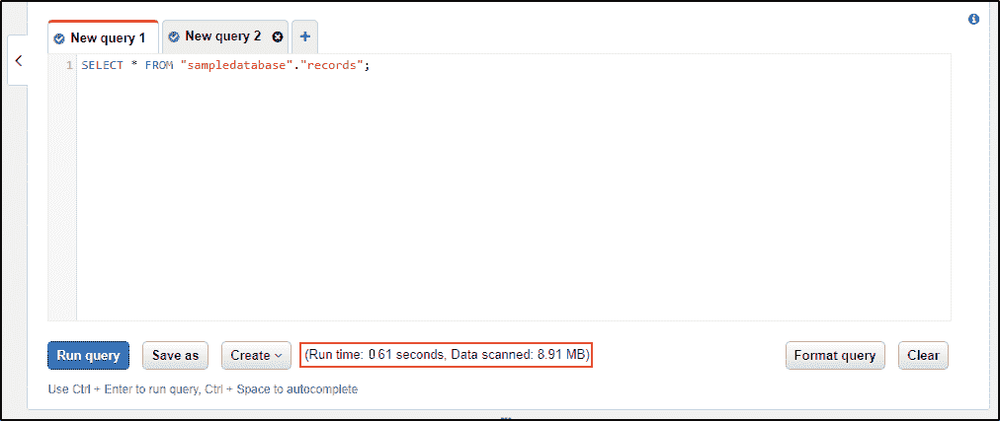
3.  在雅典娜中选择查询。
    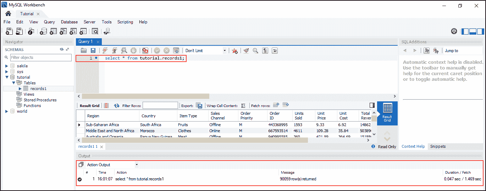
4.  在 MySQL 中选择查询。
5.  从表中选择特定的列。
    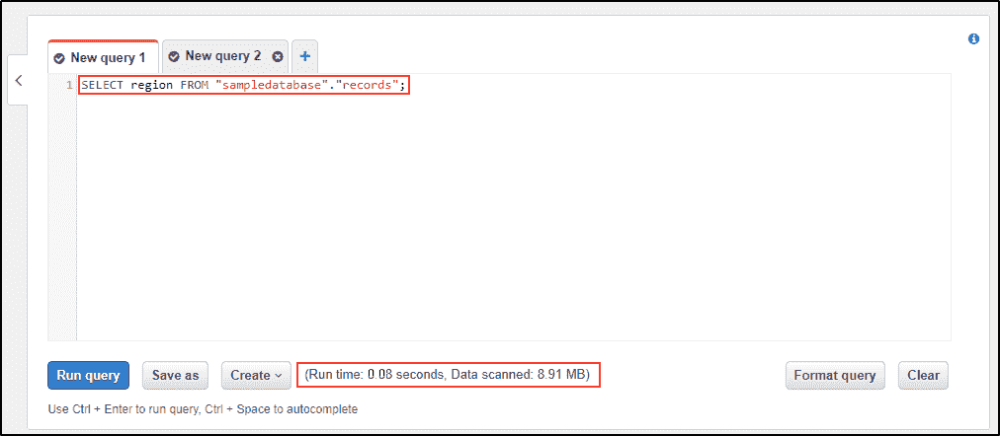
    **在雅典娜**
    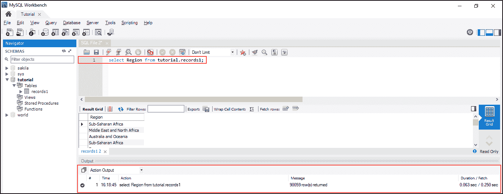中选择特定列
6.  在 MySQL 中选择特定的列。

7.  获取特定列的计数。
    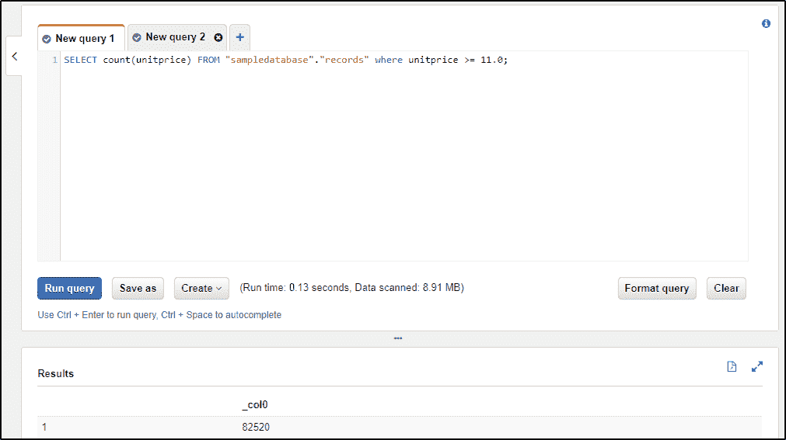
8.  雅典娜中特定列的计数。
    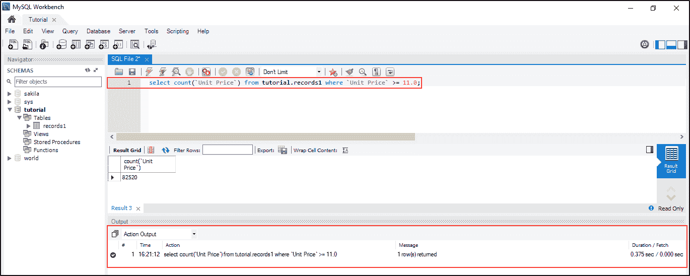
9.  计算表中记录的数量。
    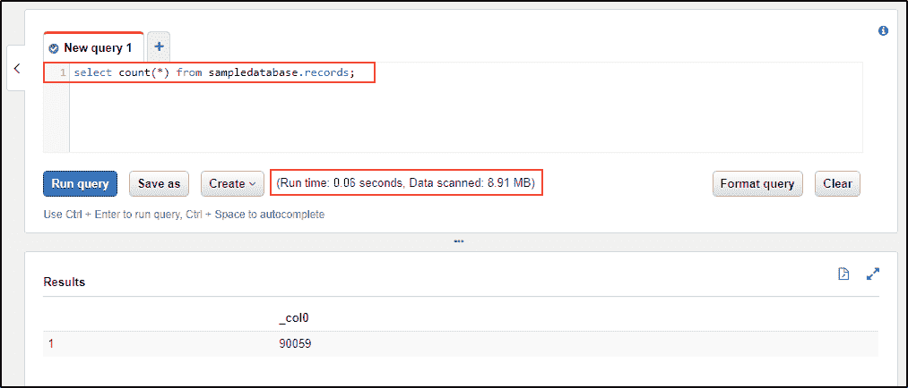
    **统计雅典娜**
    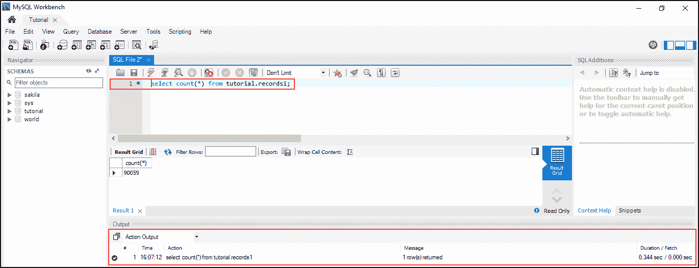
    中指定范围内的所有记录，选择查询。
    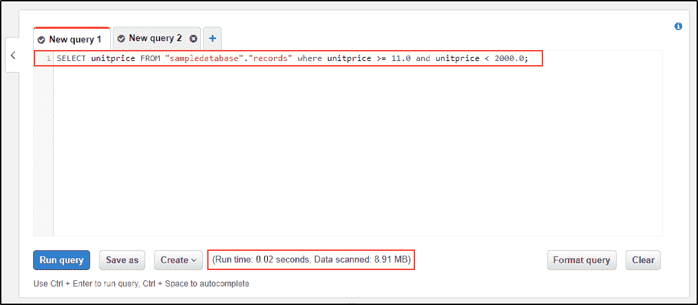
    **在雅典娜中选择上述范围内的查询。**
    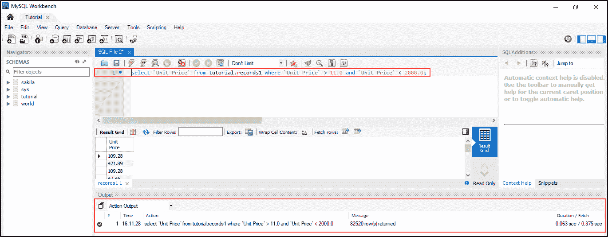

**在 MySQL 中选择上述范围内的查询。**

### 亚马逊雅典娜有什么局限性？

*   优化仅限于查询。例如，已经存储在 S3 的数据无法优化。
*   没有索引选项。索引选项通常出现在传统数据库中。如果没有索引，雅典娜上的操作负载会增加，可能会影响性能。
*   高效的查询需要分区。为了实现高效的查询，首先必须对数据进行分区，然后必须根据最适合性能需求的方式来管理分区。
*   不支持存储过程、参数化查询和 Presto 联邦连接器。连接数据源需要亚马逊雅典娜联邦查询。
*   当查询具有数千个分区的表时，雅典娜会超时。
*   以下划线或点开头的源文件被视为隐藏文件。
*   行和列大小不能超过 32 兆字节。
*   雅典娜不支持查询 S3 冰川和 S3 冰川深度档案存储类中的数据。
*   类似创建表格、描述输入和描述输出、执行？不支持使用、合并和更新。

## AWS 雅典娜对 AWS 胶水

自 2017 年 8 月首次发布以来，AWS Glu 一直作为一个完全托管的提取、转换和加载(ETL)服务运行。它有三个主要组件:

1.  处理作业监控的灵活调度程序
2.  能够生成 Scala 或 Python 代码的 ETL 引擎
3.  作为中央元数据存储库的数据目录

AWS Glue 可帮助您查找和转换数据集，并为使用这些工具进行发现和查询做好准备。

所以，你应该可以使用 AWS 雅典娜与 AWS 胶水。随后的数据目录将创建、存储和检索雅典娜查询的表元数据(或模式)。

### 使用 AWS 雅典娜有什么优缺点？

事实证明，AWS 雅典娜是一把双刃剑。使它变得方便、便宜和容易获得的特性可能会在某种程度上限制你。

### AWS 雅典娜的优点

*   **无服务器:**由于它是作为完全托管的无服务器服务交付的，AWS Athena 为您省去了管理基础架构带来的所有麻烦。您不必担心设置集群、调节容量或加载数据。
*   **性价比:** AWS 雅典娜不仅性价比高，而且和它的亲密竞争对手相比也相当实惠。这是因为该服务不会向您收取计数实例的费用。相反，您只为正在运行的查询付费。
*   **可广泛访问:**作为一个使用标准 SQL 运行其查询的服务，AWS Athena 可以被任何人广泛访问——不仅仅是开发人员和工程师。业务分析师和其他数据专业人员可以采用它，因为标准的 SQL 查询非常简单明了。
*   **灵活性:**亚马逊雅典娜的开放和多功能架构不会将你局限于任何特定的供应商、技术或设备。例如，您可以使用各种开源文件格式，并在查询引擎之间自由切换，而无需调整模式。

## 雅典娜女神的缺点

*   **无数据优化:** AWS 雅典娜没有提供很多定制功能。这里你能做的最大的事情就是优化查询，而不是底层数据。即使当您试图使用 AWS Glu 替换亚马逊 S3 的数据时，您仍然需要注意不要损害访问相同数据的其他服务。
*   **共享资源:**根据亚马逊的服务水平协议(SLA)，全球所有 AWS Athena 用户在运行查询时共享同一资源。这种多租户方法会不时引发资源压力，导致查询性能波动。
*   **数据操作操作的减少:** AWS Athena 只是一个查询服务，这里你会发现只有一个查询引擎。它没有内置的数据操作语言 **(DML)** 接口来插入、删除和更新数据。
*   **需要数据分区:**如果您打算高效地运行您的 SQL 查询，您可能希望对存储在亚马逊 S3 的数据集进行分区。您必须创建的分区数量将在很大程度上影响查询的速度和性能。例如，每扫描 500 个分区，查询时间就会增加一秒。
*   **缺少索引:**虽然索引在传统数据库中一直是一个内置的配置，但是在 AWS Athena 中您并没有获得这个特权。因此，您应该预料到合并大型表等操作中的挑战。

### AWS 雅典娜是如何定价的？

正如我们已经说过的， **AWS** Athena 遵循一个定价表，根据您在数据分析中选择运行的查询向您收费。

亚马逊计算字节，然后将它们四舍五入到最接近的兆字节，10MB 是每个查询的最小数量。

你应该期望为你能负担的每万亿字节的数据支付 5 美元。与此同时，您不会因为失败的查询、管理分区的语句以及**数据定义语言(DDL)** 语句而被收费。

但这还不是全部。亚马逊还让您可以将每次查询的成本降低 30%到 90%。您只需要**分割、压缩**或**将**数据转换为柱状格式。

* * *