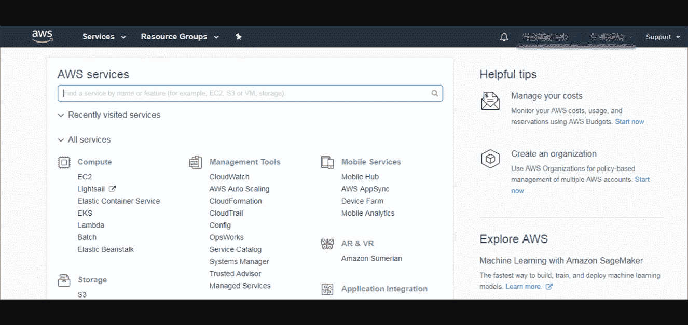
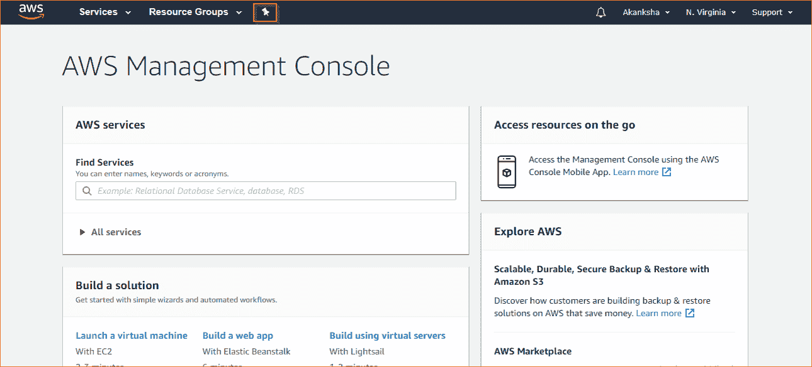

# 什么是 AWS 控制台？

> 原文：<https://www.javatpoint.com/what-is-aws-console>

长期以来，应用程序科学家一直在寻找各种方法来构建和部署复杂的基础架构或应用程序，以提供高度可扩展的、基于网络的服务。在很大程度上，他们成功地创建了基于网络的服务，如亚马逊网络服务和微软 Azure。

然而，由于我们对讨论 AWS 控制台感兴趣，所以我们不会深入讨论 Azure。在全球范围内，AWS 是一种趋势，这种流行的一个关键驱动因素是，近 80%的财富 500 强公司都以这样或那样的方式在其网络业务解决方案和数字转型战略中实施了亚马逊网络服务。

AWS 是一个全球云平台，允许用户以合理的成本通过互联网实时托管和管理网络服务。

既然我们已经收集了一些关于 AWS 的基本信息，让我们看看这里的程序。

## 什么是 AWS 控制台？

让我们这样来看，假设您想访问您的脸书帐户的所有功能；您将需要一个界面，在那里您可以输入您的用户名和密码来获得访问权限。然后，您可以浏览您的更新、消息和其他帐户信息。同样，AWS 控制台的工作方式也是如此。AWS 控制台是一个网络应用程序，允许用户访问亚马逊网络服务。控制台可以被认为是主干或基本的网络基础设施，通过它可以访问亚马逊网络服务。如果没有控制台让用户可以轻松导航到每一个亚马逊网络服务，集中访问所有亚马逊网络服务就不容易了。

该控制台为用户执行资源调配等任务提供了一个内置界面，允许您启动实例，并与亚马逊 S3 水桶一起工作。随着我们的前进，我们将了解更多功能，并发现其他重要的配置。

## AWS 控制台入门

除了通过网络浏览器访问 AWS 控制台，还可以通过手机应用版本访问。如果你正在使用手机，点击这里的[开始使用手机应用](https://aws.amazon.com/console/mobile/)。

您需要在计算机上安装一个 AWS 帐户和一个网络浏览器才能开始。

要打开 AWS 控制台，您需要执行以下操作:

## 打开网页浏览器

输入网址**http://aws.amazon.com/console/**进入 AWS 管理控制台。

如果您没有帐户，请通过此链接创建新帐户:**创建新帐户。**

单击登录并输入您的登录电子邮件和密码，从您的控制台访问您的 AWS 服务。

关闭控制台很简单，

*   点击页面右上角的姓名链接。
*   当您单击“注销”时，会出现一个下拉菜单。
*   您将被重定向到控制台主页。
*   关闭浏览器，你就完成了。

### 发现它的特点

您可以通过两种方式在控制台上访问 AWS 服务:通过“搜索”选项卡或使用“服务”菜单。用户不仅可以使用这些服务，还可以管理他们的每月账单和费用。还可以更新现有服务，订阅新服务，管理紧急任务。

有了 AWS 控制台，您将能够管理 AWS 帐户，了解更多关于 AWS 的信息，并与标签编辑器一起工作。您也可以从移动设备管理 AWS。需要注意的是，AWS Console 支持微软 Edge、火狐、Chrome、Internet Explorer 和 Safari 等浏览器。

## AWS 控制台的未来

控制台已经被用来控制信息技术接口很多年了。第一个 AWS 控制台是在 20 世纪 90 年代推出的。如果我们现在比较，我们都会说它又慢又丑:网景是用界面构建的。

最近推出了新的界面，更加直白，用户体验极佳。导航很快，您可以快速访问所有想要的服务。

这种转变表明变化是不可避免的，它贯穿了每一个技术方面，让每一个旧的技术平台都屈服了。如果在未来几年里，我们有一个可以以完全数字化的网络应用程序的形式与我们对话的控制台，我们不会感到惊讶。

### 什么是亚马逊 AWS 管理控制台？

AWS 被公认为领先的云服务提供商之一。AWS 站在云计算平台 AWS 之上的一个主要原因是，它提供了一种通过 AWS 管理控制台访问和管理亚马逊网络服务的简单和交互式的方法。在这个关于亚马逊 AWS 管理控制台的博客中，您将通过所有步骤来了解如何使用 AWS 控制台管理和使用亚马逊网络服务。

AWS 提供大约 70 种不同的服务，分为不同的领域，如计算、存储、数据库、网络等。使用这些服务，您可以将您的应用程序转变为高度可扩展的，并轻松地在云中部署它们。要使用和管理亚马逊网络服务，您必须拥有 AWS 管理控制台。AWS 管理控制台是一个网络应用程序，允许用户访问和管理 AWS 基础架构上运行的任何资源/服务。它还提供与计费等相关的信息。

**以下是您可以使用 AWS 管理控制台执行的一些操作的列表:**

*   查找和访问服务
*   创建和删除服务快捷方式
*   选择特定地区的服务
*   获取账单信息

本博客将学习如何使用 AWS 管理控制台来执行上述所有任务。但是，在您开始使用 AWS 管理控制台并探索亚马逊网络服务的无限可能性之前，您需要在 AWS 上创建一个帐户。所以，首先，开始在 AWS 上创建一个帐户。

### 创建 AWS 帐户

您可以创建一个一年免费的全功能 AWS 帐户。您可以访问官方 AWS 网站，然后点击创建 AWS 帐户。以下是创建 AWS 帐户以开始使用亚马逊管理控制台时要遵循的步骤。

**第一步:**这个链接会带你进入如下截图所示的页面。如果你已经有一个帐户，你可以登录。如果没有，请填写详细信息，然后单击继续。

**第二步:**进一步按照线上说明进行。您需要提供您的信用卡/借记卡详细信息来创建帐户。亚马逊将从该卡中扣除少量交易费用，以验证该卡是否有效。金额将是最小的和可变的，根据不同的地区，并在 2-3 天内退款。此后，您在免费订阅期(一年)内使用免费层服务将不会被收取费用。

**第三步:**接下来是身份验证。您将可以选择接收来自亚马逊的验证短信或自动电话。

**第四步:**验证成功后，你要选择一个支持计划。您可以在基本计划、开发商计划和 T4 商业计划中选择 T2。基本计划是免费的，提供有限的资源。如果您想获得免费套餐，请选择基本计划。

**第五步:**现在，你需要再次登录控制台，你的账号就好走了。您的 AWS 管理控制台将如下图所示:

### AWS 管理控制台入门

现在您的 AWS 帐户已经创建，您可以登录亚马逊管理控制台并开始执行任务，如查找和访问 AWS 服务、创建服务快捷方式等。现在，让我们开始使用 AWS 管理控制台访问亚马逊网络服务。

### 访问亚马逊网络服务

您可以使用搜索栏搜索要查找的服务，也可以单击控制台左上角的可用服务选项卡，如下图所示:

### 在 AWS 控制台上创建服务快捷方式

您可以通过将常用服务固定到控制台来创建访问这些服务的快捷方式。为此，单击控制台上的 pin 图标。它将打开所有服务的列表。请看下面的截图:

当列表显示时，单击并按住要固定到控制台的服务，并将其拖到主菜单栏的顶部，如下图所示:

您可以向菜单栏添加多个服务，并以任何顺序排列它们。

### 从 AWS 控制台删除服务快捷方式

要从菜单栏中删除或移除锁定的服务，请单击锁定图标，当服务列表打开时，将服务从菜单栏拖到服务列表中，并将其放在任何位置。这样，快捷方式将被删除。

### 选择 AWS 区域

由于某些 AWS 服务是特定于地区的，因此您必须选择一个地区来访问和管理该地区内的服务。右上角您的名字旁边是“区域”选项卡。当您单击它时，将显示不同字段的下拉列表。你可以根据自己的需要选择任何地区。

### 更改亚马逊帐户密码

使用 AWS 管理控制台，您可以查看您的账单信息或帐户详细信息，更改密码等。要更改密码，请单击以您的帐户命名的选项卡。完成后，将显示一个包含各种选项的下拉列表，从中选择**我的安全凭证**，如下图所示:

将打开一个新页面，您可以按照在线说明更改帐户密码。出于身份验证的目的，您将被要求再次登录。

* * *