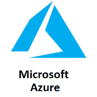
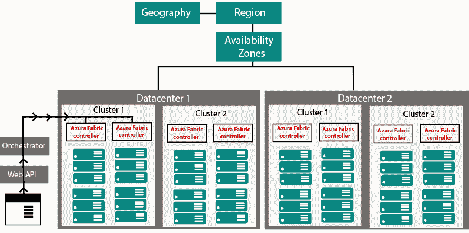
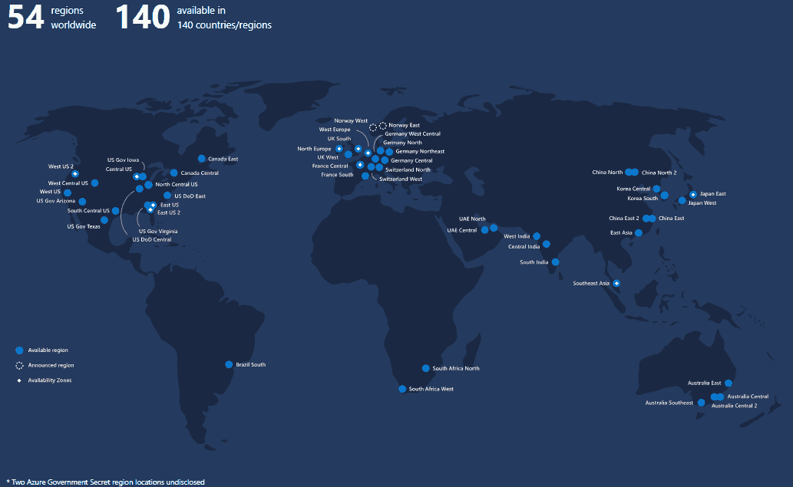
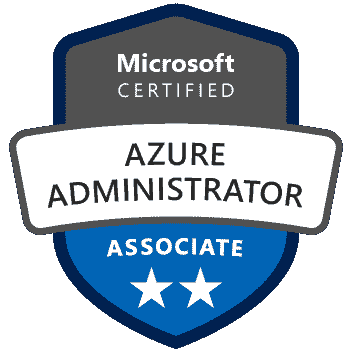
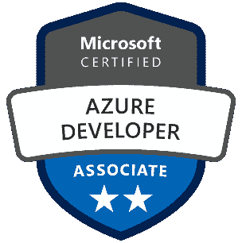
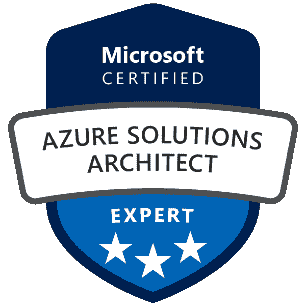

# Microsoft Azure 教程

> 原文：<https://www.javatpoint.com/microsoft-azure>

微软 Azure 是一个云计算平台，它提供了各种各样的服务，我们无需购买和安排硬件就可以使用。它支持解决方案的快速开发，并提供资源来完成在内部环境中可能无法完成的任务。像计算、存储、网络和应用服务这样的 Azure 服务使我们能够致力于构建出色的解决方案，而无需担心物理基础架构的组装。

本教程涵盖了 Azure 的基础知识，这将为我们提供关于所有 Azure 关键服务的想法，我们很可能需要了解这些服务才能开始开发解决方案。完成本教程后，我们可以破解求职面试或能够获得不同的微软 Azure 认证。

## 什么是蓝色

微软 Azure 是由微软创建的一组不断增长的云计算服务，托管您现有的应用程序，简化新应用程序的开发，并增强我们的内部应用程序。它通过微软管理的数据中心帮助组织构建、测试、部署和管理应用程序和服务。

## 蔚蓝服务

*   **计算服务:**它包括微软 Azure 云服务、Azure 虚拟机、Azure 网站和 Azure 移动服务，这些服务在强大处理器的帮助下处理云上的数据。
*   **数据服务:**该服务用于通过云存储可根据需求进行扩展的数据。它包括微软 Azure 存储(Blob、队列表和 Azure 文件服务)、Azure SQL 数据库和 Redis 缓存。
*   **应用服务:**它包括帮助我们构建和运行应用的服务，比如 Azure Active Directory、连接分布式系统的服务总线、处理大数据的 HDInsight、Azure Scheduler 和 Azure Media Services。
*   **网络服务:**它帮助您连接云和内部基础架构，包括虚拟网络、Azure 内容交付网络和 Azure 流量管理器。

## Azure 的工作原理

理解 Azure 的内部工作机制是非常重要的，这样我们就可以在 Azure 上有效地设计我们的应用程序，具有高可用性、数据驻留、弹性等。

微软 Azure 完全基于虚拟化的概念。所以，与其他虚拟化数据中心类似，它也包含*个机架*。每个机架都有一个独立的电源单元和网络交换机，每个机架还集成了一个名为*织物控制器*的软件。这个*织物控制器*是一个分布式应用程序，负责管理和监控机架内的服务器。如果出现任何服务器故障，结构控制器会识别并恢复它。而这些织物控制器中的每一个都依次连接到一个名为*指挥器*的软件上。这个 *Orchestrator* 包括网络服务、休息应用编程接口来创建、更新和删除资源。

当用户使用 PowerShell 或 Azure 门户发出请求时。首先，它将进入 Orchestrator，在那里它将从根本上做三件事:

1.  验证用户
2.  它将授权用户，即它将检查用户是否被允许执行请求的任务。
3.  它将查看数据库中基于资源的空间可用性，并将请求传递给适当的 Azure Fabric 控制器来执行请求。

机架的组合形成一个集群。我们在一个数据中心内有多个集群，我们可以在一个可用性区域内有多个数据中心，在一个区域内有多个可用性区域，在一个地理区域内有多个区域。

*   **地理位置:**这是一个离散的市场，通常包含两个或多个区域，保留了数据驻留和法规遵从性的界限。
*   **Azure regions:** 区域是部署在定义的周界内的数据中心的集合，并通过专用的区域低延迟网络互连。

Azure 覆盖的全球区域比任何其他云提供商都多，它提供了将应用程序和用户拉近世界各地所需的可扩展性。它在全球 50 个地区提供。由于其在许多地区的可用性，它有助于保留数据驻留，并为客户提供全面的法规遵从性和灵活的选项。

*   **可用性区域:**这些是蔚蓝色区域中物理上分离的位置。其中每一个都由一个或多个独立配置的数据中心组成。

## 蔚蓝定价

是学习微软 Azure 的主要原因之一。因为微软在 Azure 帐户中提供了免费的信用点数，可以在短时间内免费访问 Azure 服务。对于刚接触微软 Azure 并想使用这些服务的人来说，这个积分已经足够了。

微软提供了“现收现付”的方法，帮助组织满足他们的需求。通常，云服务将根据使用情况收费。灵活的定价选项有助于根据我们的要求扩大和缩小架构**。**

## 蔚蓝认证

微软 Azure 有助于填补行业需求和可用资源之间的空白。微软将 Azure 认证分为三大类，它们是:

*   **Azure 管理员:**实施、监控和维护微软 Azure 解决方案的人员，包括主要服务。

*   **Azure Developer:** 设计、构建、测试和维护云解决方案(如应用和服务)的人员，与云解决方案架构师、云数据库管理员、云管理员和客户端合作实施这些解决方案。

*   **Azure 解决方案架构师:**那些在计算、网络、存储和安全方面拥有专业知识的人，他们可以设计在 Azure 上运行的解决方案。

所有这些认证都分为不同的级别。如果有人计划获得认证，那么他/她首先必须获得副水平认证，然后进入高级水平。

## 先决条件

在学习 AWS 之前，应该具备云计算和计算机基础的基础知识。

## 观众

我们的 Microsoft Azure 教程是为刚接触云计算并希望从事或转换职业道路成为 Microsoft Azure 开发人员或管理员的学生和在职 IT 专业人员设计的。

## 本教程的范围

我们将看到云计算的概述，azure 的内部工作，以及 Azure 如何分配资源。之后，我们将深入了解 Azure 服务的不同领域，即存储服务、计算服务、网络服务、应用服务、数据库、分析、集成服务、物联网、安全服务、监控和诊断以及工具。本教程还提供了关于创建虚拟机、网站和存储帐户等的想法。

* * *