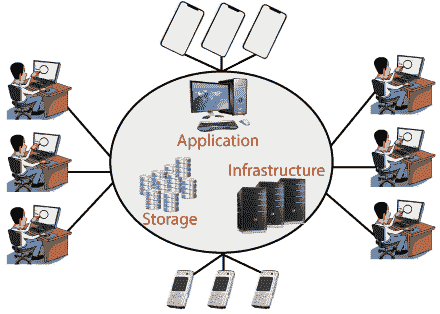
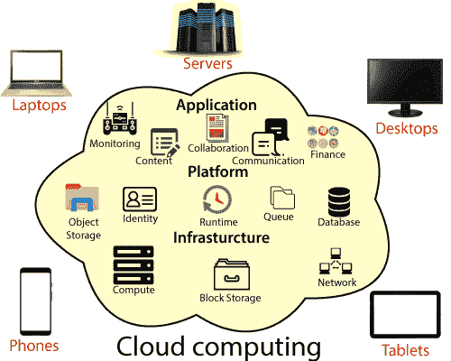
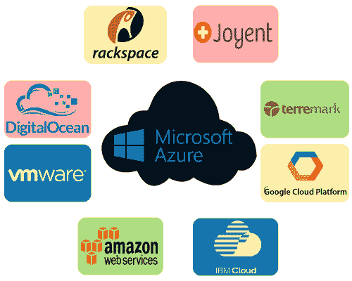
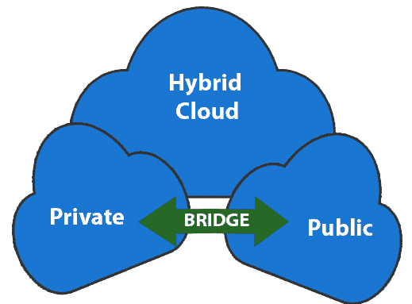
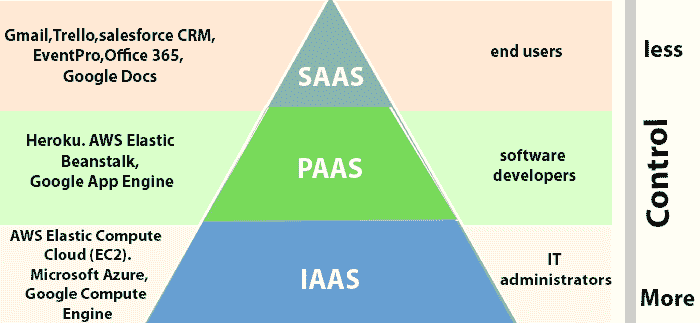
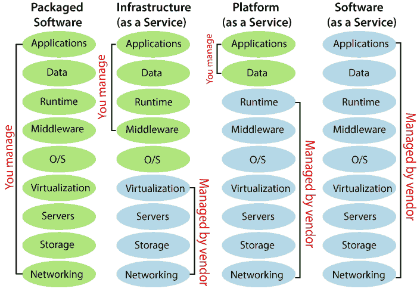

# 云计算简介

> 原文：<https://www.javatpoint.com/introduction-to-cloud-computing>

云计算是通过云(互联网)提供计算服务，如服务器、存储、数据库、网络、软件、分析、智能等。

云计算提供了内部数据中心的替代方案。借助内部数据中心，我们必须管理一切，例如购买和安装硬件、虚拟化、安装操作系统和任何其他必需的应用程序、设置网络、配置防火墙以及设置数据存储。完成所有设置后，我们将负责在其整个生命周期中维护它。

但是如果我们选择云计算，那么硬件的购买和维护是由云供应商负责的。他们还提供各种各样的软件和平台即服务。我们可以出租任何需要的服务。云计算服务将根据使用情况收费。

云环境提供了一个易于访问的在线门户，方便用户管理计算、存储、网络和应用程序资源。一些云服务提供商如下图。

## 云计算的优势

*   **成本:**降低了购买软硬件的巨大资金成本。
*   **速度:**可以在几分钟内访问资源，通常只需点击几下。
*   **可扩展性:**我们可以根据业务需求增减资源需求。
*   **生产力:**在使用云计算的同时，我们投入的运营精力更少。我们不需要打补丁，也不需要维护硬件和软件。因此，通过这种方式，信息技术团队可以提高工作效率，专注于实现业务目标。
*   **可靠性:**数据的备份和恢复成本较低，并且对于业务连续性非常快。
*   **安全性:**许多云供应商提供了一套广泛的策略、技术和控制来加强我们的数据安全性。

## 云计算的类型

*   **公有云:**由第三方云服务提供商拥有和运营的云资源称为公有云。它通过互联网提供计算资源，如服务器、软件和存储
*   **私有云:**在单个企业或组织内部专门使用的云计算资源被称为私有云。私有云可以位于公司的现场数据中心，也可以由第三方服务提供商托管。
*   **混合云:**它是公有云和私有云的结合体，通过允许数据应用在它们之间共享的技术将它们绑定在一起。混合云为企业提供了灵活性和更多的部署选项。

## 云服务的类型

1.  **基础设施即服务(IaaS):** 在 IaaS 中，我们可以从云服务供应商那里租赁服务器和虚拟机(VMs)、存储、网络、操作系统等 IT 基础设施。我们可以创建运行 Windows 或 Linux 的虚拟机，并在其上安装我们想要的任何东西。使用 IaaS，我们不需要关心硬件或虚拟化软件，但除此之外，我们还必须管理其他一切。使用 IaaS，我们获得了最大的灵活性，但是，我们仍然需要在维护方面投入更多的精力。
2.  **平台即服务(PaaS):** 该服务为开发、测试、交付和管理软件应用程序提供按需环境。开发人员负责应用程序，而 PaaS 供应商提供部署和运行它的能力。使用平台即服务，灵活性降低，但环境管理由云供应商负责。
3.  **软件即服务(SaaS):** 它向最终用户提供集中托管和管理的软件服务。它通过互联网按需交付软件，并且通常以订阅为基础。例如微软 One Drive、Dropbox、WordPress、Office 365 和亚马逊 Kindle。SaaS 被用来最大限度地降低运营成本。

* * *