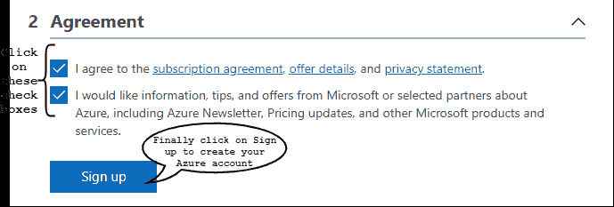
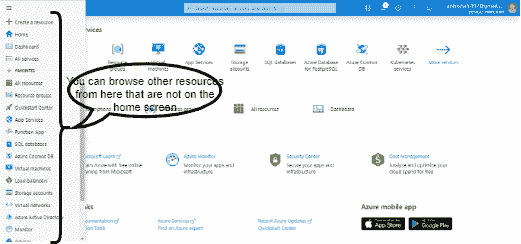
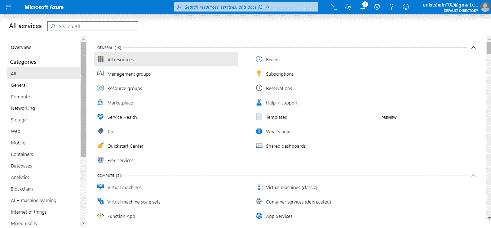

# Azure 门户概述

> 原文：<https://www.javatpoint.com/azure-portal-overview>

Azure portal 是一个我们可以在一个地方访问和管理所有应用程序的平台。我们可以使用单一控制台构建、管理和监控从简单的网络应用程序到复杂的云应用程序的一切。

所以，首先，要登录 Azure 门户，我们需要注册。而且，如果我们是第一次注册，我们将获得 12 个月的流行免费服务。此外，根据国家的不同，我们将获得一些需要在 30 天内消费的免费信贷。除了所有这些，我们还将获得一些永远免费的服务。

因此，在您注册 Azure 之前，请确保您已经完全准备好尝试所有服务，因为该点数只能使用 30 天。

**创建蔚蓝账户**

**第一步:**打开[https://azure.microsoft.com/en-us/free/](https://azure.microsoft.com/en-us/free/)然后点击*开始免费；*它会将你重定向到下一步。

**第二步:**它会要求你用你的微软账号登录。如果您已经有一个微软帐户，您可以填写详细信息并登录。如果你没有呢？如果你没有，你必须先注册才能继续。

**步骤 3:** 登录到您的微软帐户后。您将被重定向到下一页，如下所示。在这里你需要填写必填字段，他们会询问你的信用卡号码，以验证你的身份，并阻止垃圾邮件和僵尸程序。**除非升级到付费服务，否则不会向您收费。**

**第四步:**填写完所有细节后，它会要求你检查隐私和协议。单击复选框，然后单击注册。

**第五步:**你的免费账号创建完毕，你会被重定向到 Azure 主页，如下图所示。您可以参观 Azure 服务。

第一次登录 Azure 时。Azure 门户看起来类似于下面给出的图片。我们将在主页上看到流行的工具和服务。

**创建资源**

要创建资源，您可以从主页中选择任何资源。

或者，如果你想创建另一个不在主页上的资源，你可以浏览屏幕左上角的*导航抽屉*。

如果您在导航抽屉中找不到正确的资源，您可以单击导航抽屉中的“所有服务”，下面的窗口将显示 Azure 中可用的所有服务。

还有一种方法可以创建资源。单击“创建资源”，然后在搜索框中键入所需的资源名称。

该门户不仅包括 Azure 提供的服务，还包括第三方提供商在 Azure 平台上提供的服务。他们使用 Azure 的中央处理器或虚拟机，并在其上部署他们的平台，以“随用随付”的方式向您提供该平台即服务。

**资源组:**保存 Azure 解决方案相关资源的容器。它可以包括解决方案的所有资源，也可以只包括您希望作为一个组来管理的资源。资源组是具有公共生命周期或共享属性(如“所有 SQL 服务器”或“应用程序出席”)的资源容器。

**创建资源组**

**步骤 1:** 将光标悬停在导航抽屉内的“资源组”按钮上，然后在出现的弹出窗口中单击“创建”。

**步骤 2:** 在下一个窗口中，您必须填写“*订阅”*类型、资源组名称和区域。然后单击查看+创建或下一步(添加标签)。

**第三步:**您现在在*标签*窗口上，您可以在这里创建一个标签来按类别逻辑地组织 Azure 资源。我们必须给它取一个*的名字*和*的值。*点击下一步

**第 4 步:**你现在在查看+创建窗口，检查下面显示的细节，如果它们是正确的，然后点击创建。

**第 5 步:**您将被重定向到主页，将出现一个通知，显示资源组已创建。

**第六步:**点击*进入资源组*查看资源组窗口。

让我们快速浏览一下这个页面的菜单项，但是请记住，对于不同的资源，它可能会有所不同。例如，与数据库相比，虚拟机的配置设置会有所不同。

1) **概述:**在概述面板上，我们可以看到属于该资源组的所有资源，以及资源组的一些元数据，例如它属于哪个订阅、与它相关联的任何标签、已经执行了哪些部署等。

2) **活动日志:**它提供已经在该特定资源上执行的管理活动数据。因此，在这种情况下，我们创建一个资源组。因此，我们有一个更新资源成功。因此，当我们点击它时，我们可以看到与之相关联的元数据，当我们点击 JSON 时，我们可以看到已经执行了哪些操作(见下图)。

3) **访问控制(IAM):** 如果我们想将任何资源的访问权委托给其他人，那么我们可以将任何资源组的贡献者角色或所有者角色分配给其他人。我们可以在本教程的安全服务页面上找到这种基于角色的访问控制的详细信息。

4) **标签:**我们可以给 Azure 中的任何资源分配标签，将它们分类。

5) **事件:**任何特定资源组中正在发生的任何事件，我们都可以订阅这些事件并对其做一些事情。例如，虚拟机已经启动或停止。在这种情况下，我们可以捕获事件并向某人发送电子邮件。

6) **部署:**我们可以看到这里发生的任何实现。

7) **策略:**我们可以在这里创建和查看策略。

8) **成本管理:**我们可以在这里查看资源成本。

9) **监控:**我们可以设置警报，查看与此资源组关联的指标，诊断设置等。

**订阅**

查看订阅。进入搜索框，输入订阅，点击*订阅，*，如下图所示。你可以在这里看到订阅的服务。

我们在这里订阅了免费试用。见下图。

当您单击订阅时，您可以查看所有详细信息，包括订阅名称、成本、标识、它属于哪个目录以及计费周期。

有一个集成的管理门户，我们需要看到它。

这是一个门户，我们可以在这里看到我们所有的订阅。

我们可以看到，我们有一个免费订阅。如果我们点击免费试用，我们可以看到我们已经发生的所有费用，我们可以看到计费历史，我们还可以设置警报。例如，如果成本超过了某个极限，那么我们就会得到警告。

在下面右侧的小块中，我们可以选择管理支付方式、下载使用详情、联系微软支持并更改订阅详情、编辑订阅详情、更改地址、更改合作伙伴等。

* * *