# 创建容器并向容器中添加一个 blob。

> 原文：<https://www.javatpoint.com/azure-creating-container>

我们已经创建了一个存储帐户。现在，我们将在存储帐户中创建一个容器，并向其中上传一些文件。

**第 1 步:**登录您的 Azure Portal，然后单击您创建并添加到主页/仪表板的存储帐户。

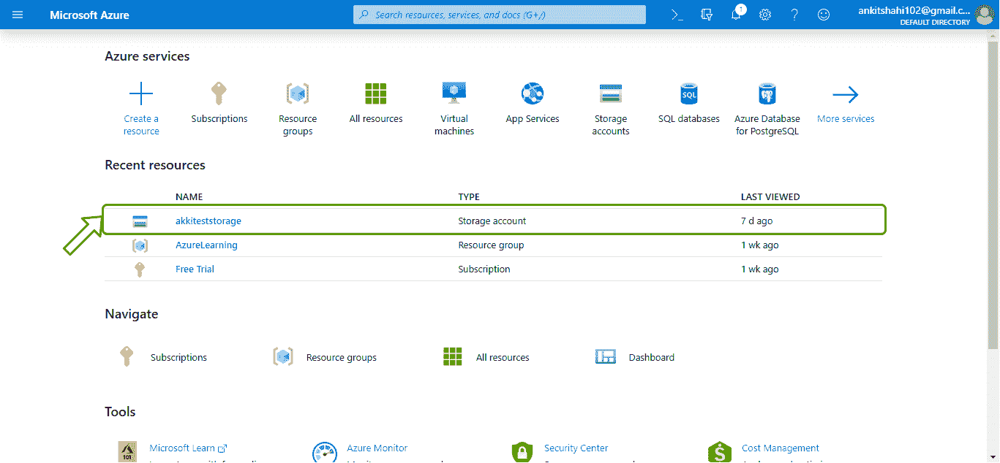

**第二步:**点击“容器”框，如下图所示。

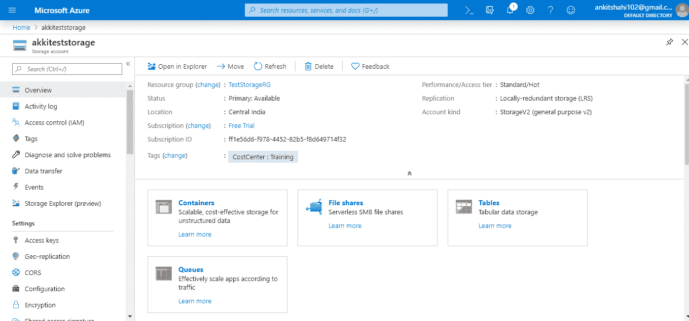

**第三步:**现在，点击“+容器”选项卡，它会将你重定向到“容器表单”窗口。

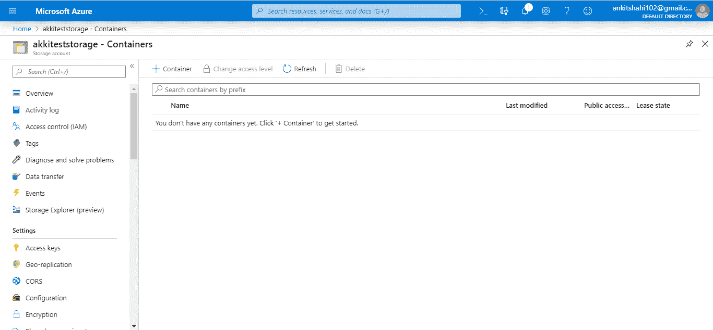

**第四步:**这里需要给容器分配一个名称，名称要小写。就访问级别而言，您可以从中选择任何一个。我们在这里选择 blob。然后点击，确定。

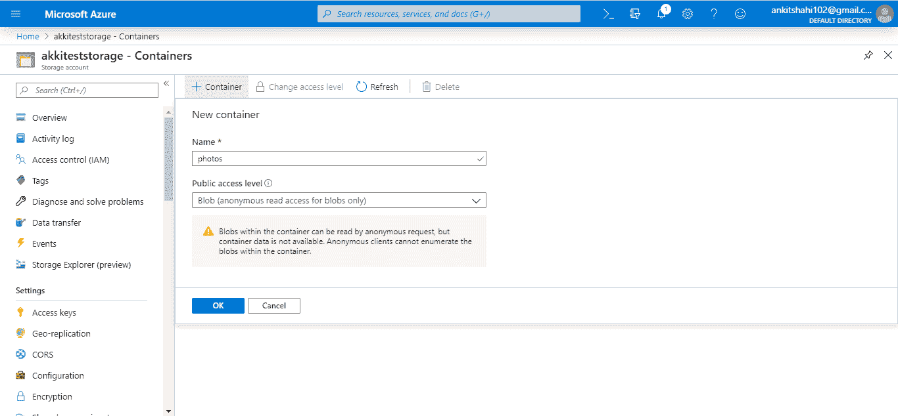

**第五步:**现在，我们的容器已经成功创建。

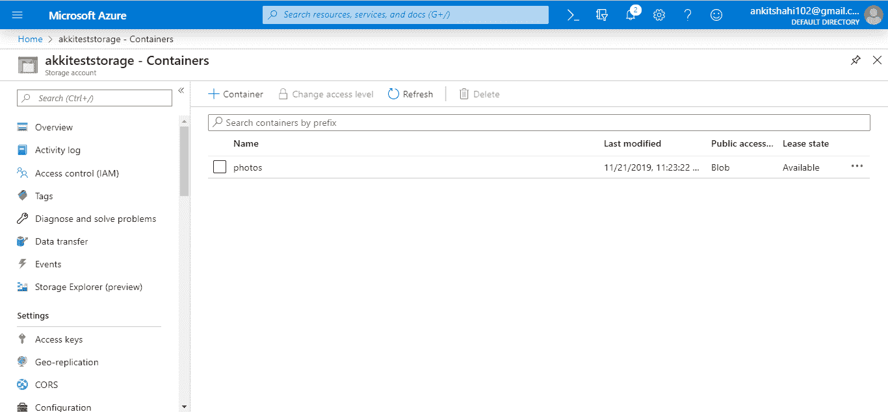

**第 6 步:**所以，如果你点击上下文菜单，你可以看到容器属性和你可以用来访问容器的 URL，最后修改 Etag，和 Lease 状态。

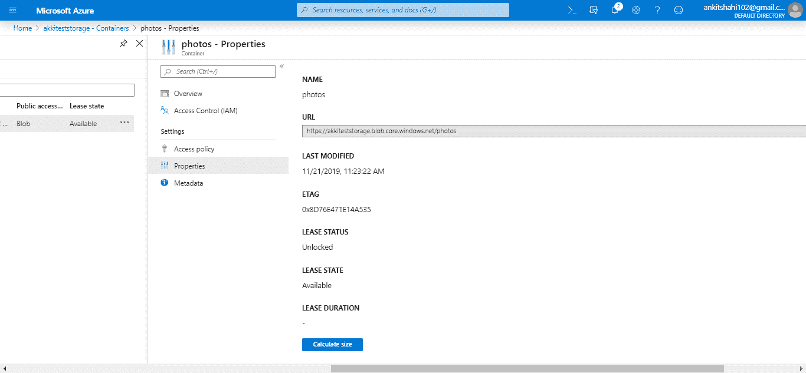

正如我们之前讨论的，我们可以在容器级别和 blob 级别拥有元数据，因此我们可以在容器中添加键值对。

**第七步:**现在，让我们点击容器，将一个 blob 上传到这个容器中。

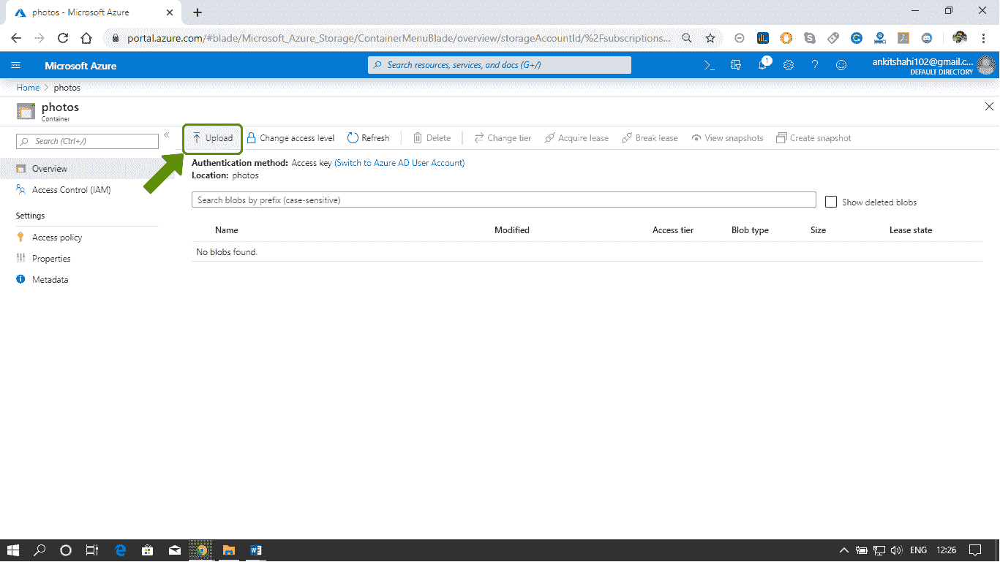

**第 8 步:**点击选择文件选项，浏览要上传到容器中的文件。

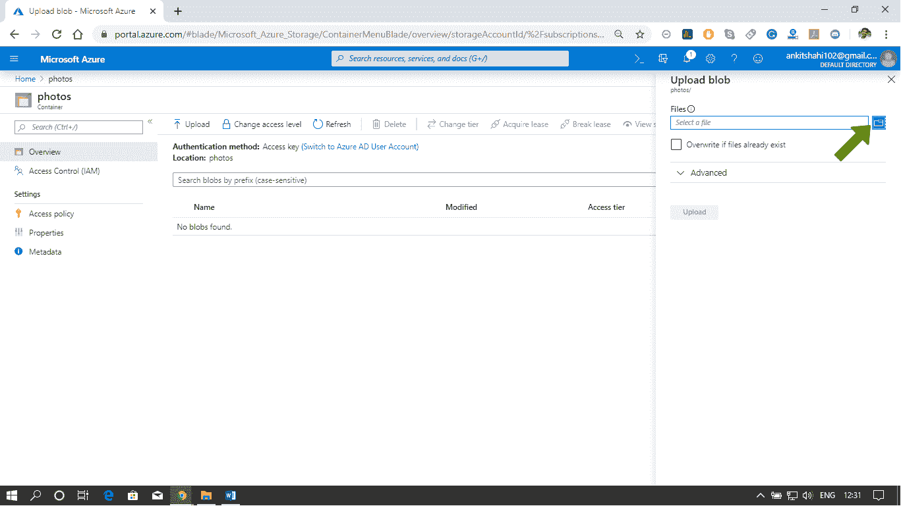

**第 9 步:**我们在这里选择了一个 JPEG 文件，如果点击高级选项，我们可以指定 blob 类型。如果我们上传一个大文件，我们可以定义它。因此上传性能将显著提高，因为每个块将并行上传。因此，我们正在减少上传的延迟。最后，点击上传按钮。

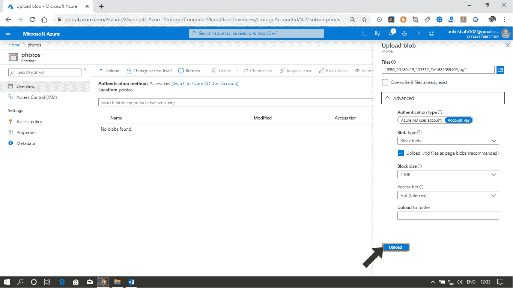

**步骤 10:** 上传完成后会出现通知。如下图所示。

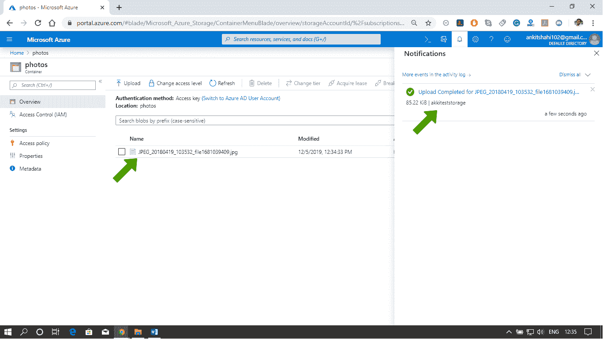

**步骤 11:** 如果文件没有自动出现，请刷新门户查看文件。之后，我们可以在这里看到访问层，blob 类型。如果我们点击菜单抽屉，我们可以看到查看/编辑 blob、下载 blob、blob 属性和 URL，我们可以使用它们来访问这个 blob。我们可以创建/查看这个特定文件的快照。

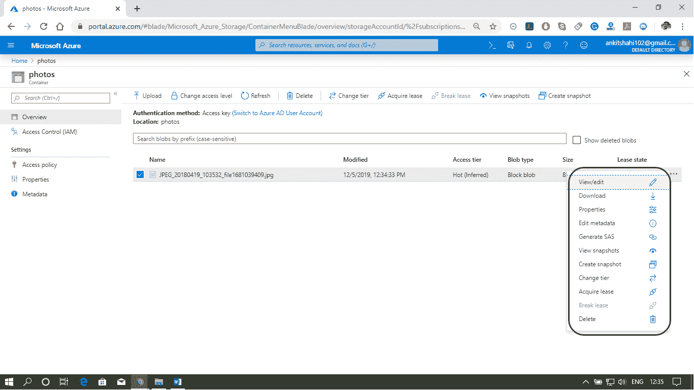

这就是我们如何在存储帐户中创建一个容器并查看与之关联的属性。此外，我们可以使用 Azure 门户将博客上传到该容器中。

* * *