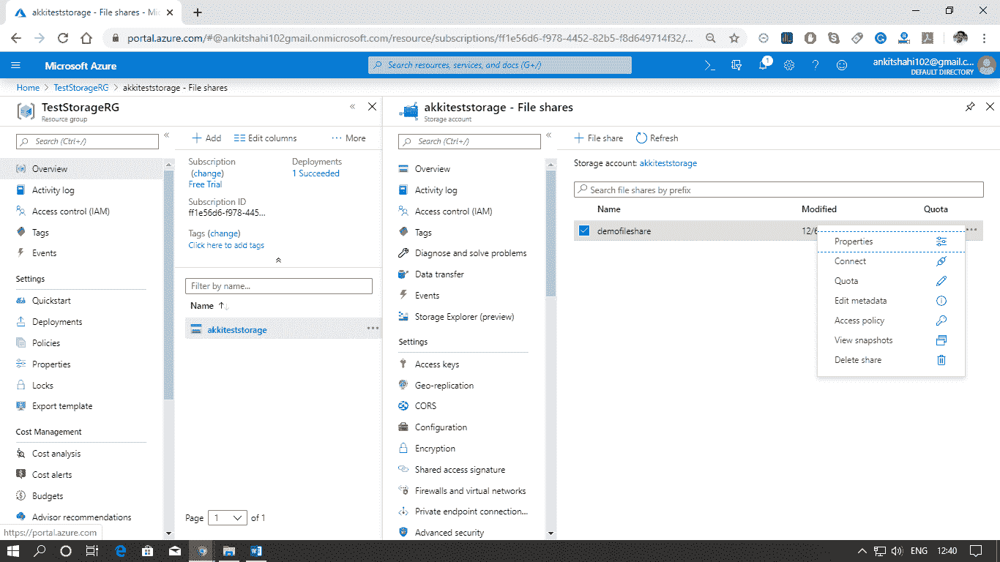

# Azure 文件存储服务

> 原文：<https://www.javatpoint.com/azure-file-storage-service>

Azure 文件存储主要可以用于我们想要在两台服务器之间或跨用户共享驱动器的情况。在这种情况下，我们将使用 Azure 文件存储。在 Azure 文件存储结构中，我们首先需要拥有的是一个 Azure 存储帐户。Azure 文件存储是在 Azure 存储帐户的保护下提供的。一旦我们创建了一个 Azure 存储帐户，我们将创建一个文件共享。

我们可以在一个存储帐户中创建无限数量的文件共享。一旦我们创建了文件共享，我们就可以创建目录，就像文件夹一样，然后我们可以将文件上传到其中。一旦我们创建了文件共享，我们就可以将它装载到任何虚拟机上，无论它是在 Azure 中还是在外部。

与 Azure 文件存储相关的一些概念:

*   **存储帐户:**对 Azure 存储服务的所有访问都是通过存储帐户完成的。当我们可能有 Azure fie 存储、blob 存储、表和队列时，我们需要记住可伸缩性和性能目标。所有这些服务可能在存储帐户下共享相同的性能目标，因此存储帐户的相同限制将由所有服务共享。
*   **共享:**文件存储共享是 Azure 中的 SMB 文件共享。目录和文件必须在父级共享中创建，因此我们不能直接在存储帐户中创建目录。我们需要文件存储共享，首先创建，然后我们可以创建目录上传。一个帐户可以包含无限数量的共享，一个共享可以存储无限数量的文件，文件共享的总容量高达 5 TB。但是，如果我们需要超过全部容量，那么我们可以创建另一个文件共享。
*   **目录:**是可选的目录层次结构。
*   **文件:**共享中的一个文件。一个文件的大小可能高达 1 TB。
*   **URL 格式:**对于使用文件 REST 协议进行的 Azure 文件共享请求

### 文件存储数据访问方法

Azure 文件提供了两种内置的、方便的数据访问方法，您可以单独使用，也可以组合使用来访问您的数据:

*   ***直接云访问:*** Windows、MacOS 或 Linux 可以使用行业标准的服务器消息块(SMB)协议或通过 File REST API 挂载任何 Azure 文件共享。但是如果我们使用 SMB 协议，那么我们需要注意两件事。首先，如果我们在 Azure 中的虚拟机上装载文件共享，那么操作系统中的中小型企业客户端必须至少支持中小型企业 2.1。其次，如果我们希望在内部系统(如用户的工作站)上装载文件共享，那么工作站支持的中小型企业客户端必须至少是启用了加密的中小型企业 3.0。如果我们在内部数据中心安装 Azure 文件共享，那么它应该是 SMB 客户端的 3.0 最低版本，但是如果我们在 Azure 中安装虚拟机，它可以是 2.1。
*   ***Azure 文件同步:*** 通过 Azure 文件同步，*共享*可以复制到内部或 Azure Windows 服务器。我们的用户可以通过 Windows Server 访问文件共享，例如 SMB 或 NFS 共享。任何经常访问的文件的同步将保留在服务器端点中，任何不经常访问的数据将被移动到 Azure 文件共享中。这样，我们可以加快向用户交付数据的速度，同时节省存储空间。

### 数据传输方法

当我们创建 Azure 文件共享时，我们的内部数据中心已经有了一个大文件共享。然后借助下面的选项，我们可以传输那些文件。

*   ***Azure 文件同步:*** 作为 Azure 文件共享(“云端点”)和 windows 目录命名空间(“服务器端点”)之间首次同步的一部分，Azure 文件同步将把现有文件共享中的所有数据复制到 Azure 文件。
*   ***Azure 导入/导出:*** 如果我们有万亿字节的数据，我们需要将这些数据传输到 Azure 文件中。如果我们开始使用 Azure 文件同步来移动数据，它可能会消耗所有带宽，或者可能是一个耗时数月的缓慢过程。在这种情况下，您可以使用 Azure 导入/导出。微软将为您提供一个硬盘，用于移动硬盘中的所有数据，并将该硬盘运回微软，微软将从硬盘中加载数据并将其放入 Azure 数据中心。
*   ***Robocopy:***Robocopy 是一款知名的复制工具，附带 windows 和 windows Server。我们可以通过装载本地共享文件，然后在 robocopy 命令中将装载位置用作目的地，来使用它将数据传输到 Azure 文件中。
*   ***AzCopy:*** 这是一个命令行实用工具，我们可以用它来将数据复制到 Azure 文件中和从 Azure 文件中复制数据。它也可以用于 blob 存储，你可以用简单的命令使用 Azcopy。它提供了出色的性能，可用于 Windows 和 Linux。

### 在 Azure 中创建文件存储

**第一步:**我们进入 Azure 存储账号，然后向下滚动，点击文件。

**第二步:**点击+文件共享。

**步骤 3:** 提供文件共享的名称和配额，然后您将收到文件共享创建成功的通知。

**第 4 步:**单击文件共享属性，您可以在其中看到网址以及您分配的配额和使用量。

**第五步:**第二个选项是连接，这里可以看到 PowerShell 命令和普通命令在 Windows 电脑上连接这个文件共享。

下图中也给出了其他选项。

**第 6 步:**点击文件共享并打开，可以看到访问控制选项卡。您可以使用活动目录来控制对 Azure 文件共享的访问。它当前处于预览状态。

**步骤 7:** 要用 windows 虚拟机装载此文件共享，请单击连接。

**步骤 8:** 打开命令行，复制“连接”窗口中给出的命令。如果该命令成功执行，您的文件共享将与虚拟机一起装载。

* * *