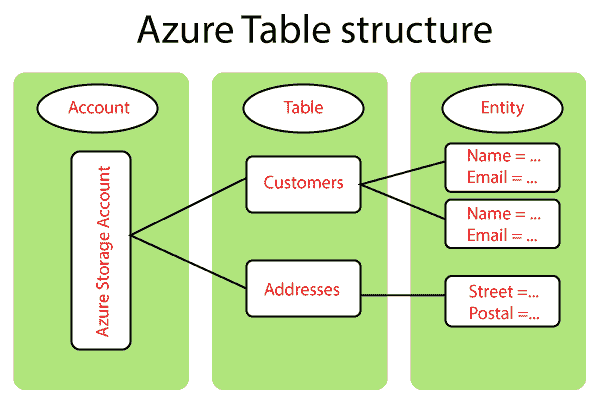

# Azure 表和队列存储

> 原文：<https://www.javatpoint.com/azure-table-and-queue-storage>

Azure Table 存储用于存储大量结构化数据。这项服务是一个 NoSQL 数据存储，它接受来自 Azure 云内外的经过身份验证的呼叫。它非常适合存储结构化和非关系数据。

如果您想要存储关系数据，那么您不应该使用 Azure 数据库。与关系数据库不同，关系数据库中的表有固定数量的列，表中的每一行都应该在 Azure 表中有这些列，Azure 表是一个 NoSQL 数据存储。每个表可以有实体，每个实体可以有不同的属性。因此，通常不会对属于表的对象强制实施模式。

**表存储的典型用途包括:**

*   表存储用于存储能够服务于网络级应用的结构化数据的 TBs。
*   它用于存储不需要复杂联接、外键或存储过程的数据集，并且可以反规范化以实现快速访问。
*   它用于使用聚集索引快速查询数据。
*   有两种访问数据的方式，一种是使用 OData 协议，另一种是使用 WCF 数据服务的 LINQ 查询。NET 库。

## 天蓝色表格结构

我们需要首先创建一个存储帐户，因为 Azure 表存储是在存储帐户下提供的，然后在该存储帐户中有表。例如，您可以创建雇员表、地址表，并且每个表都将包含实体，并且实体还将在雇员表中包括像姓名电子邮件这样的键值对。

然而，Azure 表的一个关键区别是 NoSQL 数据存储和关系数据库。这些实体可以有不同的模式，因此第一个实体可以有名称、电子邮件，第二个实体也可以有名称、电子邮件和电话号码。

## Azure 表存储概念

*   **账户:**对 Azure 存储服务的每次访问都是通过存储账户完成的，对 Azure Cosmos DB 的所有访问都是通过 Table API 账户完成的。因此，Azure 中有两种类型的表存储服务。第一个是 Azure 表存储，第二个是高级版本，在 Cosmos 的 DB 下。因此，如果您正在寻找具有低延迟的出色性能，那么请选择 Cosmos 的 DB，尤其是在处理任务关键型应用程序时。如果您可以在性能上妥协，但如果您想优化成本，那么就选择表存储。
*   **表:**是实体的集合。我们知道，表不会将模式放在实体上，这意味着单个表可以包含具有不同属性集的实体。
*   **实体:**它是一组属性，类似于数据库行。Azure 存储的实体大小可以是 1MB。但是如果我们使用的是高级版本，也就是 Azure Cosmos DB，它的大小可以是 2MB。
*   **属性:**这是一个名称-值对，其中每个实体最多可以包含 252 个属性来存储数据，除了用户属性之外，这意味着您添加的任何功能。还有一些系统属性指定了分区键、行键和时间戳。所以每个实体都会有这三个属性作为默认值。而且我们在查询数据的时候，可以根据分区键和行键携带数据，在单个分区下，这个行键应该是唯一的。因此，当我们查询数据时，我们使用分区键和行键来查询数据。一般来说，当我们从单个分区获取实体时，速度会很快，因为所有属于单独分区的对象都将存储在 Azure 中后台的一个服务器中。

当你找到一个查询时，只需要去一个服务器取数据，但是如果你的查询包含 2-3 个分区的数据，那么这个问题就会去后台的多个服务器，从而影响查询的性能。因此，在设计这种桌子储物时，我们需要牢记这一点。

有两个接入点

*   **Azure 表存储:**如果我们使用 Azure 表存储，那么我们可以有 http://<storage account>. table . core . windows . net/<表>
*   **Azure Cosmos DB Table API:** 如果我们使用高级版本，那么我们需要使用 http:// < storageaccount >

## 表存储查询

查询从表中检索数据，因为一个表只有一个索引。查询性能通常与分区键和行键属性有关。

下面是一个从服务器检索数据的示例查询:

<account>. windows . core . net/registrations(partition key = " 2011 纽约市马拉松 _Full "，RowKey="1234_Ankit_M_55 ")</account>

## 蔚蓝队列存储服务

这是一个队列服务，但是在 Azure 中有一个更高级的队列服务版本，它是一个服务总线队列。

*   它是一种在云中存储大量消息的服务，可以使用 HTTP 和 HTTPS 从世界任何地方访问这些消息。
*   队列包含一组消息。队列名称必须全部小写。
*   单个队列消息的大小最高可达 64KB。邮件在队列中最多可以保留 7 天
*   网址格式为 http://<storage account="">. queue . core . windows . net/</storage>
*   当从队列中检索消息时，它将保持 30 秒不可见。需要从队列中显式删除消息，以避免被另一个应用程序拾取。

* * *