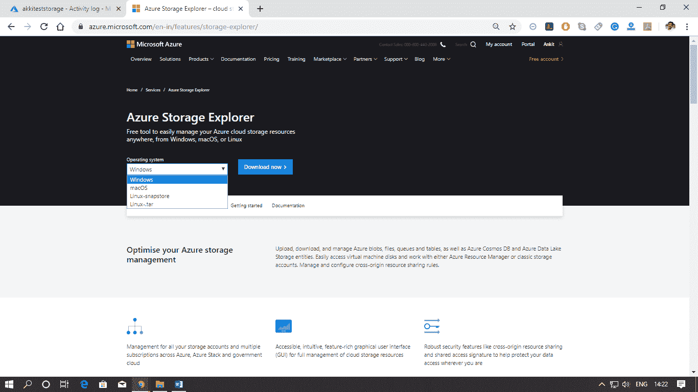
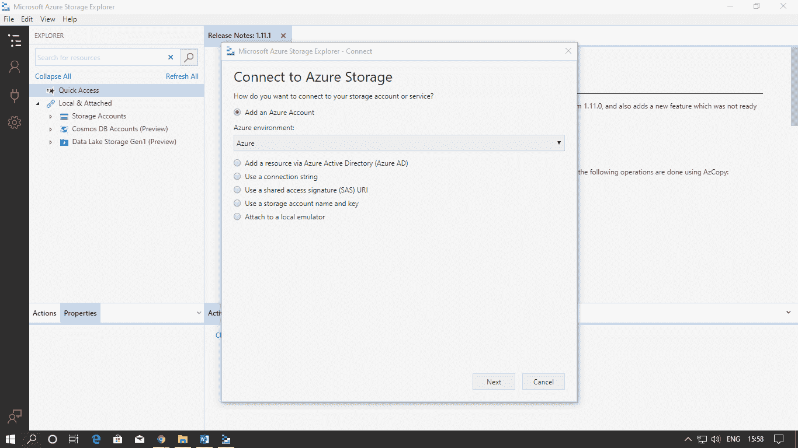
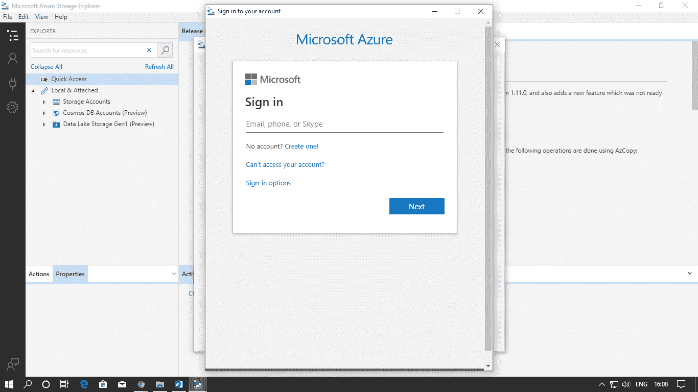
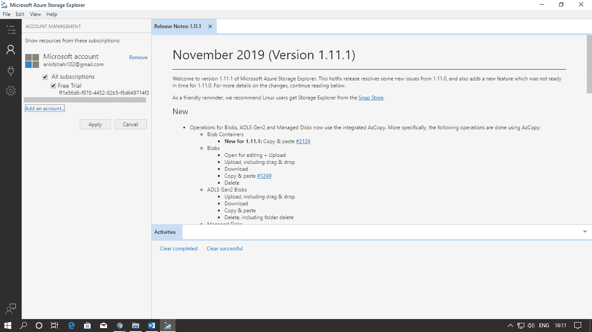
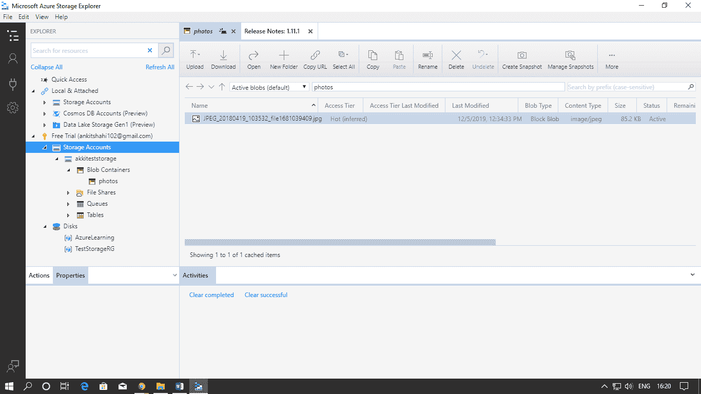

# Azure 存储资源工具

> 原文：<https://www.javatpoint.com/azure-storage-resource-tool>

**Azure 存储资源管理器:**它是一个独立的应用程序，使我们能够在 Windows、MacOS 和 Linux 上高效地处理 Azure 存储数据。它提供了几种连接到存储帐户的方法。例如-

*   我们可以连接到与我们的 azure 订阅相关的存储帐户。
*   我们可以连接到从其他 Azure 订阅共享的存储帐户和服务
*   我们可以通过使用 Azure 存储模拟器来连接和管理本地存储。

**我们还可以连接其他服务。**

*   宇宙数据库(Cosmos DB)
*   数据湖商店

**Microsoft Azure 存储仿真器:**它提供了一个本地环境，该环境为开发目的而仿真 Azure Blob、Queue 和 Table 服务。使用存储模拟器，我们可以在本地针对存储服务测试我们的应用程序，而无需创建 Azure 订阅或承担任何成本。它是微软 Azure 软件开发工具包的一部分。我们还可以使用独立安装程序安装存储模拟器。

它使用本地 Microsoft SQL Server 实例和本地文件系统来模拟 Azure 存储服务。默认情况下，存储模拟器使用 Microsoft SQL Server 2012 Express LocalDB 中的数据库。

Visual studio 云和服务器资源管理器

**服务器浏览器:**

*   服务器资源管理器中的 Azure 存储节点显示本地存储模拟器帐户和其他 Azure 存储帐户中的数据。
*   要查看存储模拟器帐户的资源，请展开“开发”节点。
*   要查看存储帐户中的资源，请在服务器资源管理器中展开存储帐户的节点，您可以在其中看到 Blobs、队列和表节点。

**云探索者:**

*   云资源管理器使我们能够查看我们的 Azure 资源和资源组。我们可以检查它们的属性，并在 Visual Studio 中执行关键的开发人员诊断操作。

基于 Azure Storage 资源开发一些解决方案或应用，可以使用***【Azure Storage 客户端库】*** 。

*   我们可以使用连接字符串连接到 Azure Storage 帐户，然后使用客户端库的类和方法来处理 blob、表、文件或队列存储。
*   在开始开发之前，安装 NuGet 包 Windows Azure 存储。

***管理应用编程接口***

*   使用管理应用编程接口创建和管理 Azure 存储帐户和连接密钥。
*   安装 NuGet 包

**以下是使用存储资源管理器管理 Azure 存储资源的步骤。**

**步骤 1:** 您必须下载并安装适合您的操作系统的存储资源管理器。

**第二步:**首次安装并打开存储资源管理器时，会出现如下画面。单击“下一步”继续。

**步骤 3:** 输入您的登录凭据，将您的 Azure 帐户与存储资源管理器连接。

**第 4 步:**添加 Azure 帐户后，您可以选择希望从哪个订阅中查看存储帐户。然后点击应用。

**第五步:**这里可以看到两个节点，本地和连接，另一个是选中的存储账号。你可以看到容器、斑点等。这里。

如果您想采取一些措施，您可以采取步骤复制块容器、托管共享策略、设置公共访问级别、获取租约等。

* * *