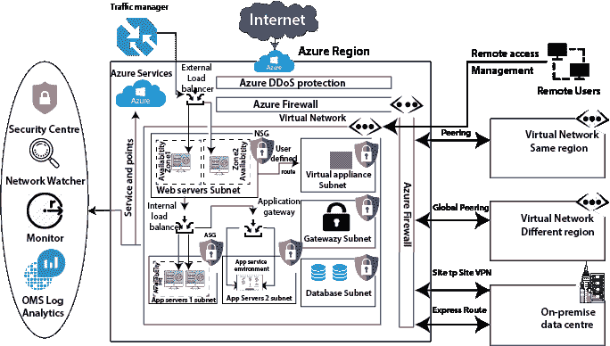

# Azure 网络服务

> 原文：<https://www.javatpoint.com/azure-network-service>

Azure 网络服务最基本的构建模块是虚拟网络。使用虚拟网络，我们可以在 Azure 上部署我们的隔离网络。我们可以使用子网将虚拟网络分成多个部分。例如，网络服务器子网、应用服务器 1 子网、应用服务器 2 子网、数据库子网、网关子网、虚拟设备子网等。这些是典型的例子，但是我们可以根据我们的需求创建不同类型的子网。

一旦我们创建了子网，我们就可以在这些子网中部署不同类型的 Azure 服务。我们可以将虚拟机部署到这些子网中。但是除了虚拟机，我们还可以部署一些专门的环境。即一些能够在虚拟网络中实现的平台即服务环境。例如，在一个应用服务环境中，我们可以部署在自己的子网中。类似地，有一种叫做**的托管 SQL** 实例，也有托管集成环境，所有这些环境我们都可以在虚拟网络中部署。

我们可以在虚拟设备子网(如防火墙)中部署不同类型的设备。

**服务保护:**部署完所有这些服务之后，我们需要对这些服务进行保护。Azure 提供了几种保护策略。

**DDoS 防护:**DDoS 防护将保护我们在虚拟网络中的工作负载免受 DDoS 攻击。DDoS 保护有两层。一个是基本的，免费，自动启用。如果我们需要高级功能，那么我们可以选择 DDoS 标准层。

**防火墙:**当我们需要网络安全时，我们使用防火墙。Azure 提供防火墙服务，您可以集中管理入站和出站防火墙规则。我们可以创建网络防火墙规则、应用防火墙规则、入站 SNAT 规则、出站 DNAT 规则等。

**网络安全组:**如果你觉得防火墙对你来说成本太高，那么我们可以使用网络安全组。我们可以使用网络安全组过滤入站和出站流量。我们可以在两个级别连接网络安全组，一个在子网级别，另一个连接到虚拟机。

**应用安全组:**微软引入应用安全组，将与一个应用相关的所有服务器放在一个应用安全组中，并在网络安全组入站和出站规则中使用该应用安全组。应用安全组的主要目的是简化 NSG 的规则创建。

## 服务可用性

我们必须确保我们的应用程序高度可用，并且能够抵御区域性故障、数据中心故障和机架故障。Azure 提供了一些服务，使我们的应用程序高度可用；这些是:

**流量管理器:**微软 Azure 流量管理器控制不同地区服务端点的用户流量分布。流量管理器支持的服务端点包括 Azure 虚拟机、网络应用、云服务等。它使用 DNS 根据流量路由方法和端点的健康状况将客户端请求定向到正确的端点。

**负载均衡器:**负载均衡器用于在 web 服务器或应用服务器池之间平均分配流量。负载平衡器有两种类型，一种是位于虚拟网络外部的外部负载平衡器，另一种是位于虚拟网络内部的内部负载平衡器。

**应用网关:**利用应用网关，我们可以实现基于 URL 路径的路由、多站点托管等。

**可用性区域:**通过将我们的虚拟机部署到不同的可用性区域，我们可以将应用流量路由到位于不同可用性区域的虚拟机，以防任何区域内的数据中心出现故障。

## 沟通

创建虚拟网络背后的基本思想是使用默认系统路由实现工作负载之间的通信。这些系统路由将由 Azure 自动部署。但是我们也可以覆盖这些系统路由并配置用户定义的路由；那么，我们也可以这样做。

**对等:**为了实现两个虚拟网络之间的通信，我们可以建立对等。我们可以在同一个区域内用虚拟网络进行对等。如果我们在另一个地区有一个 Azure 虚拟网络，那么我们可以使用全局对等。对于内部数据中心，我们有两个选择，一个是站点到站点的虚拟专用网络，它将通过互联网建立。但是对于私人连接，我们必须使用快速路线。

**监控:**一旦我们从网络角度部署了所有服务，我们就需要开始监控它们。Azure 提供了一些服务来监控流量。

**安全中心:**它是一个中央安全监控工具，使用它我们可以查看您的整体部署的安全得分，以及 Azure 根据我们应用的安全策略生成的任何建议。无论是网络还是部署在虚拟网络上的服务。

* * *