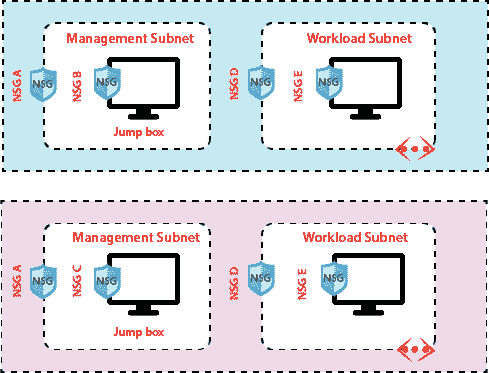
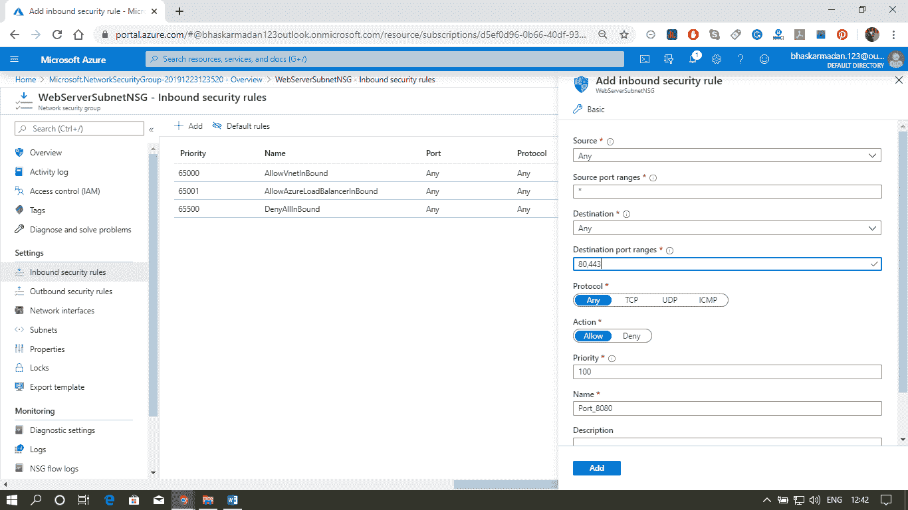
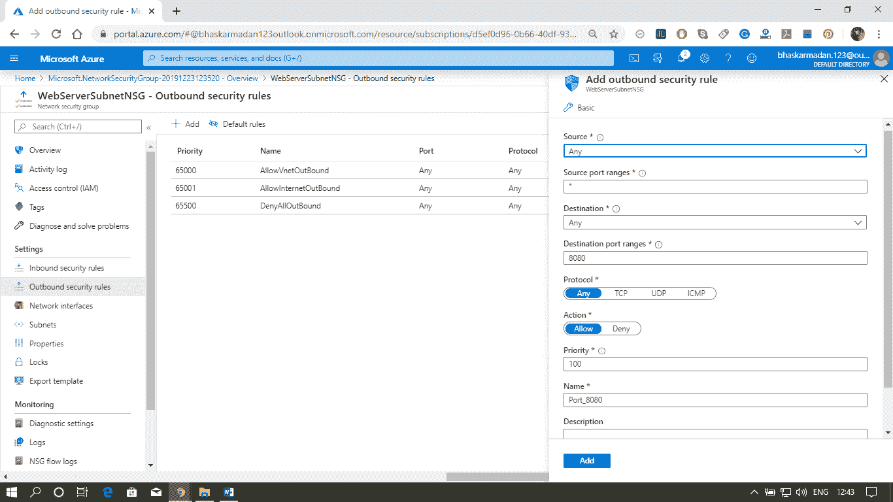
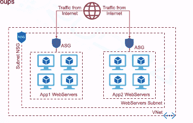
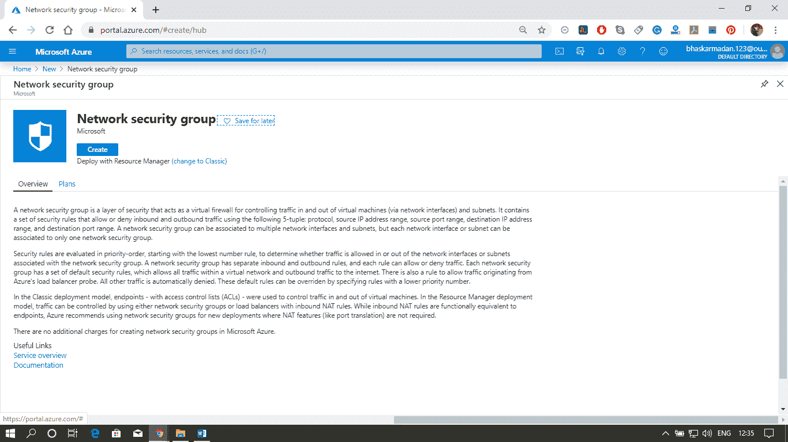
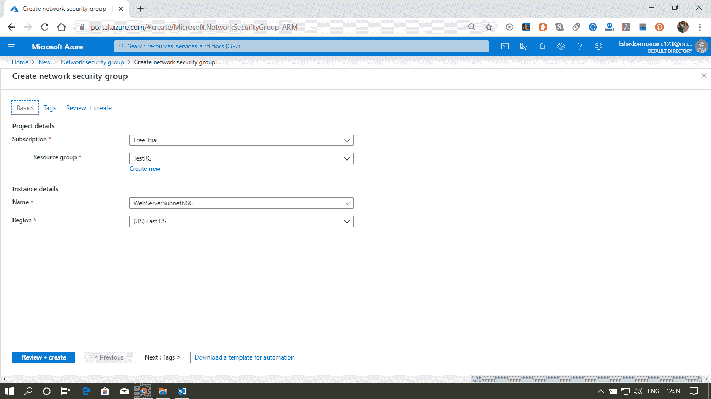
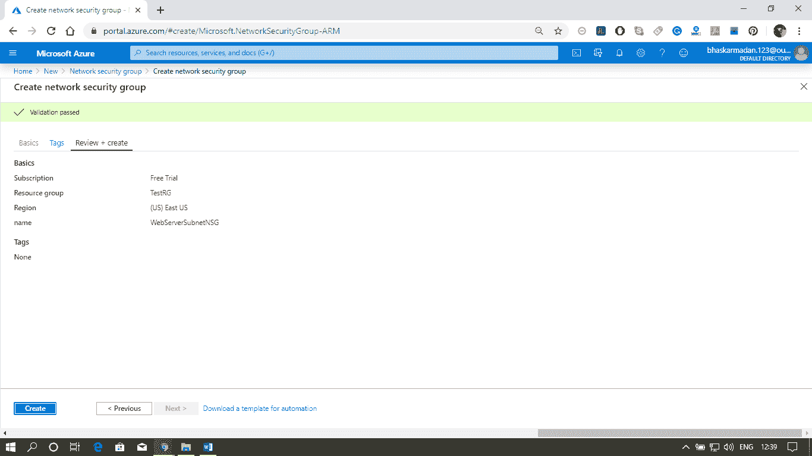
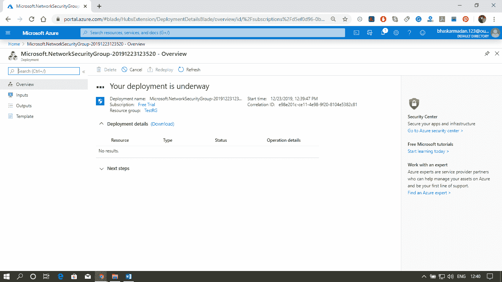
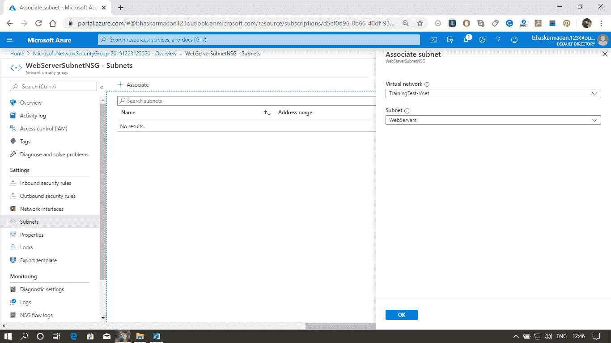

# Azure网络安全

> 原文：<https://www.javatpoint.com/azure-network-security>

网络安全组由安全规则组成，这些规则允许或拒绝进出我们将在 Azure 虚拟网络中托管的不同类型 Azure 资源的入站/出站网络流量。我们可以在不同的级别应用网络安全组。例如:

## 安全规则属性:

**名称:**网络名称在网络安全组中应该是唯一的。

**优先级:**安全规则按优先级顺序处理，编号越低优先级越高。

**来源或目的地:**(IP 地址、CIDR(无类域间路由)块、服务标签或应用安全组)在规则中指定多个单独 IP 地址和范围的能力称为增强安全规则。

**协议:** TCP、UDP 等。

**端口范围:**我们可以指定单个或一系列端口

**操作:**允许或拒绝

## 服务标签

服务标签代表一组 IP 地址前缀，有助于最小化安全规则创建的复杂性。我们不能创建我们的服务标签，也不能指定标签中包含哪个 Ip 地址。Microsoft 管理服务标签包含的地址前缀，并在地址更改时自动更新服务标签。

之前，如果我们希望允许从我们的虚拟机到 Azure 服务的通信，我们需要配置 IoT 出站规则，因为微软正在为每个服务提供 IP 地址列表，您需要在我们的 NSG 规则中配置这些 IP 地址列表，以允许从我们的虚拟机到该特定服务的出站连接，如果微软正在更改地址，您需要更改您的规则。

使用服务标签将大大简化您的 NSG 规则，例如:

**存储:**该标签表示 Azure 存储服务的 IP 地址空间。如果为该值指定存储，则允许或拒绝流量进入存储。

**SQL:** 该标签表示 Azure SQL 数据库、用于 MySQL 的 Azure 数据库、用于 PostgreSQL 的 Azure 数据库以及 Azure SQL 数据仓库服务的地址前缀。

**Azure CosmosDB:** 这个标签表示 Azure Cosmos 数据库服务的地址前缀。

**AzureKeyVault:** 这个标签表示 AzureKeyVault 服务的地址前缀。如果为该值指定 AzureKeyVault，则允许或拒绝 AzureKeyVault 的流量。

**EventHub:** 这个标签表示 Azure EventHub 服务的地址前缀。如果为该值指定事件中心，则允许或拒绝事件中心的流量。

## 默认规则

有些默认规则是在我们创建 NSG 时默认创建的。默认规则有两种类型。

**入站安全规则**

*   **允许从虚拟网络内的任何资源进行通信**
*   **允许从 Azure 负载平衡器到网络中任何虚拟机的任何流量。**
*   **denyarlinbound:**默认情况下，虚拟网络中的虚拟机可以相互通信，Azure 负载均衡器也可以与虚拟网络内的虚拟机通信。

**出站安全规则**

*   **允许通过虚拟网络内的任何资源进行流量传输**
*   **允许网络出站:**允许从虚拟网络中的任何资源向互联网发起流量。
*   **DenyAllOutBound:** 默认情况下，虚拟网络中的虚拟机可以相互通信，Azure 负载平衡器也可以与虚拟网络中的虚拟机进行交互。

## 应用安全组

应用程序安全组使您能够将网络安全配置为应用程序结构的自然扩展，从而允许您对虚拟机进行分组并基于这些组定义网络安全策略。例如-

## 在子网和虚拟机级别配置 NSG

**步骤 1:** 点击创建资源按钮，输入网络安全组。然后选择网络安全组，并单击创建按钮。

**步骤 2:** 现在，您已进入网络安全组创建页面。选择资源组，填写名称，选择区域，然后单击查看+创建。

**步骤 3:** 您的 NSG 创建完毕，现在我们将这个 NSG 与子网相关联。

**第 4 步:**点击子网，然后点击添加关联。选择要与此 NSG 关联的虚拟网络和子网。

**第五步:**最后点击确定按钮。您的 NSG 现在与子网相关联。

* * *