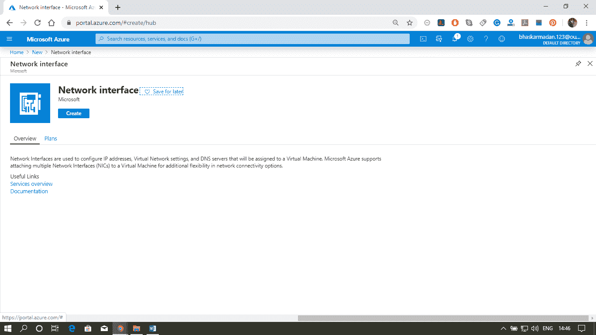
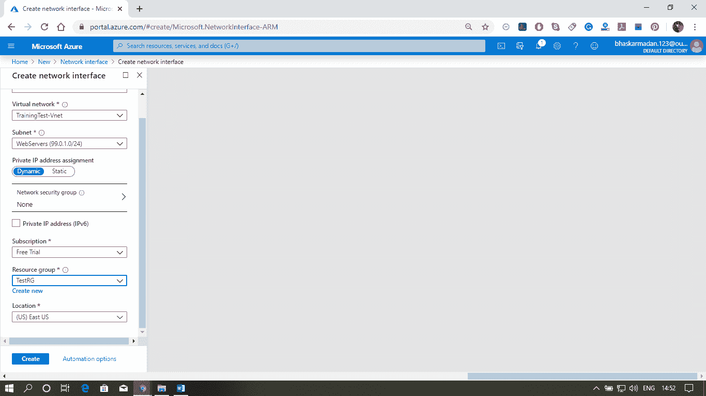
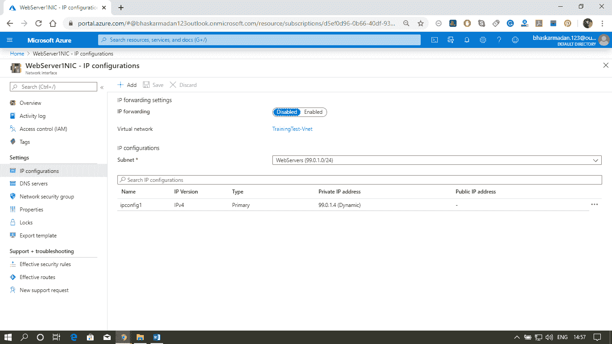
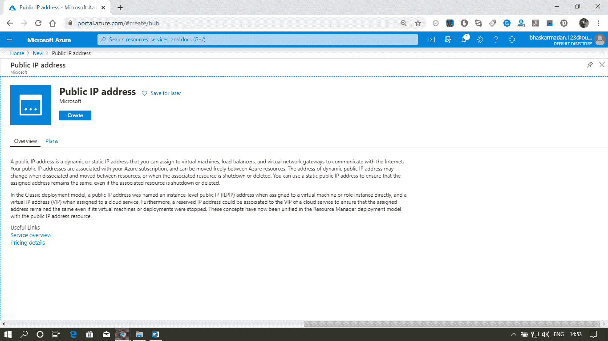
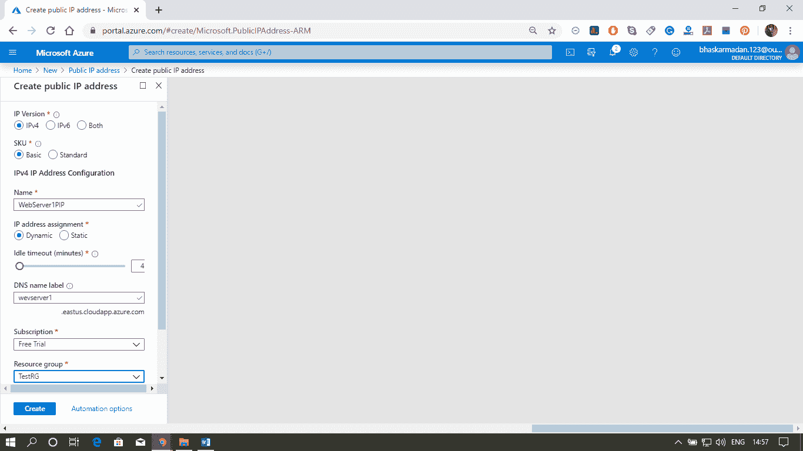
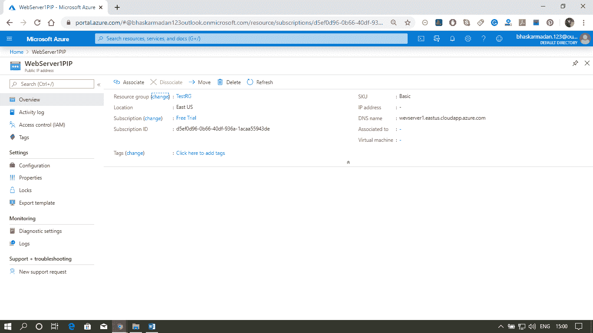

# Azure 网络接口

> 原文：<https://www.javatpoint.com/azure-network-interface>

网络接口是虚拟机和底层软件网络之间的互连。Azure 虚拟机(虚拟机)连接有一个或多个网络接口(网卡)。任何网卡都可以分配一个或多个静态或动态的公共和私有 IP 地址。

配置网络接口

**虚拟网络&子网:**我们可以将网络接口连接到虚拟网络和子网，一旦我们将网卡部署到虚拟网络中，我们就不能更改它。

**IP 配置:**将在网卡级别分配公有和私有 IP 地址。主要&次要知识产权配置

**NSG &路由:**我们可以对一个网络接口应用零个或一个网络安全组以及一个或多个路由。

**IP 转发:**必须为连接到虚拟机的每个网络接口启用此设置。

**DNS 服务器-** 我们可以指定 Azure DHCP 服务器分配给哪个 DNS 服务器一个网络接口。

## IP 地址

它是一个唯一的参考，用于标识使用互联网协议通过网络进行通信的每台计算机。

有两种方法可以定义 IP 地址:

| 私有 IP 寻址 | 公共 IP 寻址 |
| 私有 IPv4 地址使虚拟机能够与虚拟网络或其他连接网络中的其他资源进行通信。 | 当我们将公共 IP 地址分配给支持公共 IP 地址的 Azure 资源时，这使得从互联网到资源的入站通信成为可能，像 Azure 虚拟机和使用可预测 IP 地址到互联网的出站连接这样的资源被称为公共 IP 地址。 |
| 当我们选择动态地址时，Azure 会自动从您选择的子网的地址空间中分配下一个可用地址。 | 当公共 IP 地址资源将与其关联的资源分离时，动态地址被释放。 |
| 当我们选择静态地址时，我们必须从您选择的子网的地址空间中手动分配一个可用的 IP 地址。 | 创建公共 IP 地址时，会将静态 IP 地址分配给机器。 |

## 主机名解析

我们可以为公共 IP 资源指定一个 DNS 域名标签，这将为 domainnamelabel.location.cloudapp.azure.com 创建到 Azure 管理的 DNS 服务器中的公共 IP 地址的映射。

**内部域名系统主机名解析(针对虚拟机)**

默认情况下，所有 Azure 虚拟机都配置有 Azure 管理的域名系统服务器，除非您想要显式设置自定义域名系统服务器，并且这些 Azure 管理的域名系统服务器为驻留在同一虚拟网络中的虚拟机提供内部名称解析。所以如果我们想把 RDP 从一个虚拟机转移到另一个虚拟机，你实际上可以在东西私有 IP 地址中使用机器的名称。

## 为一个虚拟机配置多个网卡和 IP 地址

**第一步:**点击创建资源按钮，输入网络界面。然后点击网络接口并创建。

**第 2 步:**现在，填写所需的详细信息并点击创建。

**步骤 3:** 您的网络接口将被创建并准备嵌入。

**第四步:**再次进入首页，创建一个公共 IP 地址。

**第 5 步:**现在，填写所需的详细信息并点击创建。

**第 6 步:**现在，您已经准备好了网卡和 IP 地址供虚拟机使用。

* * *