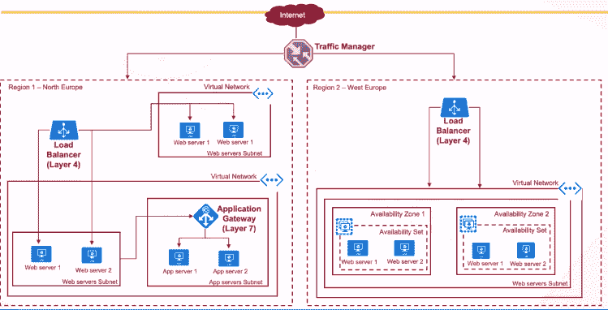

# Azure 可用性区域和集合

> 原文：<https://www.javatpoint.com/azure-availability-zones-and-sets>

如果我们想将任务关键型应用程序迁移到 Azure 中，并且由于应用程序的性质，关键要求之一是使应用程序能够抵御合理的故障、数据中心故障，甚至机架故障。因此，为了使该应用程序在任何情况下都高度可用，我们使用了 Azure 服务，该服务可以在使应用程序对合理的故障具有弹性方面满足需求。

**流量管理器:**我们可以使用流量管理器来监控位于不同区域的端点，如果任何一个端点不再可达，那么所有的流量都可以路由到其他区域端点。它包含不同的路由方法，如优先级权重、性能、地理位置等。

**Azure 负载平衡器:**我们可以使用 Azure 负载平衡器来平衡我们的 web 服务器或应用服务器之间的流量。它提供了第 4 层负载平衡，也就是说，如果我们使用源 IP、源端口、目的 IP、目的端口和协议，我们可以使用它们来配置负载平衡器中的规则，以在一种形式的 web 服务器之间负载平衡流量。

**应用网关:**如果我们想要基于基于 URL 的路由来负载均衡流量，或者我们可以说我们想要在同一个公共 IP 地址上托管多个站点等东西，那么我们可以使用应用网关。

为了提供高可用性，Azure 提供了两个更重要的特性。

**可用性区域:**这是一个高可用性产品，可保护您的应用程序和数据免受数据中心故障的影响。通常，每个 Azure 区域都由位于不同物理位置的多个数据中心组成。当您将服务部署到 Azure 中时，您可以选择要将服务部署到哪个可用性区域。

**可用性设置:**它在机架级别工作。这是数据中心内虚拟机的逻辑分组，允许 Azure 了解如何构建应用程序来提供冗余和可用性。可用性集由两个域组成，一个是故障域，另一个是更新域。

*   **故障域:**它是共享公共电源和网络交换机的底层硬件的逻辑组，类似于内部数据中心内的机架。因此，如果我们将所有虚拟机部署到同一个故障域中，那么任何硬件故障都会淘汰该特定机架或故障域中的所有虚拟机。
*   **更新域:**它是底层硬件的逻辑组，可以同时进行维护或重启，因为 Azure 会做基础设施管理。
*   **托管磁盘故障域:**对于使用 Azure 托管磁盘的虚拟机，当使用托管可用性集时，虚拟机将与托管磁盘故障域保持一致。这种对齐可确保连接到虚拟机的所有受管磁盘都属于同一受管磁盘故障域。

* * *