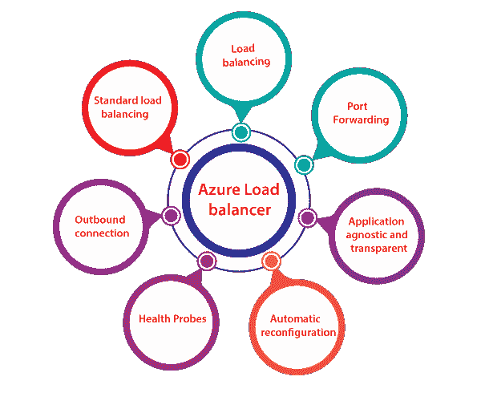
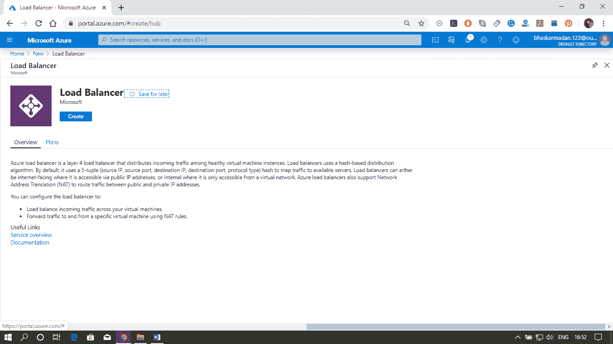
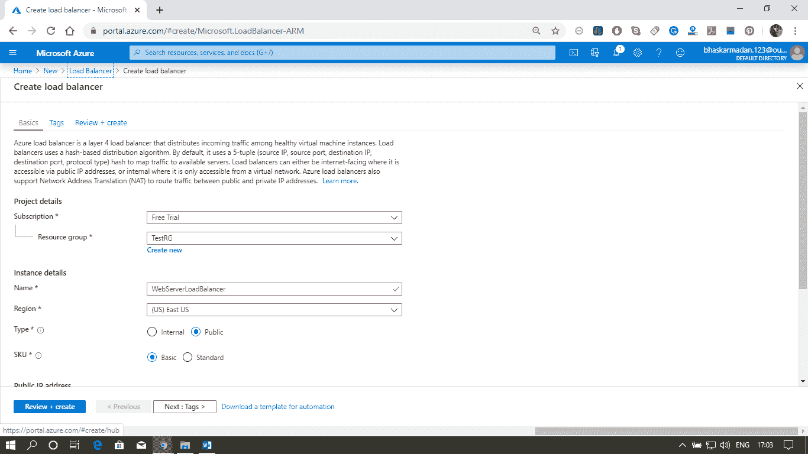
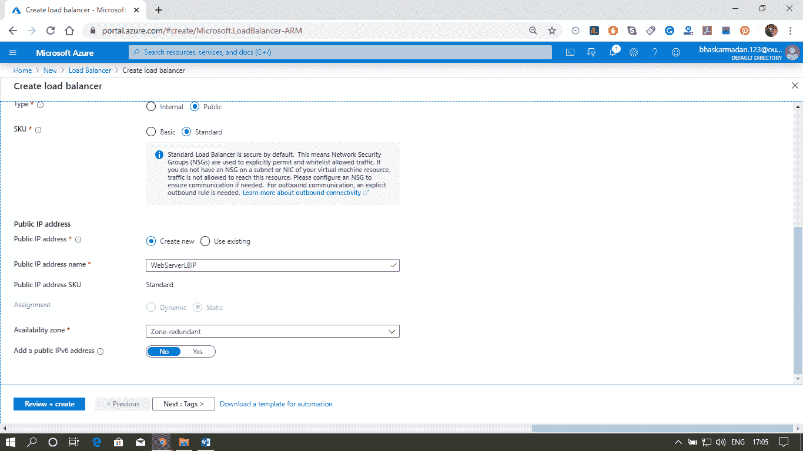
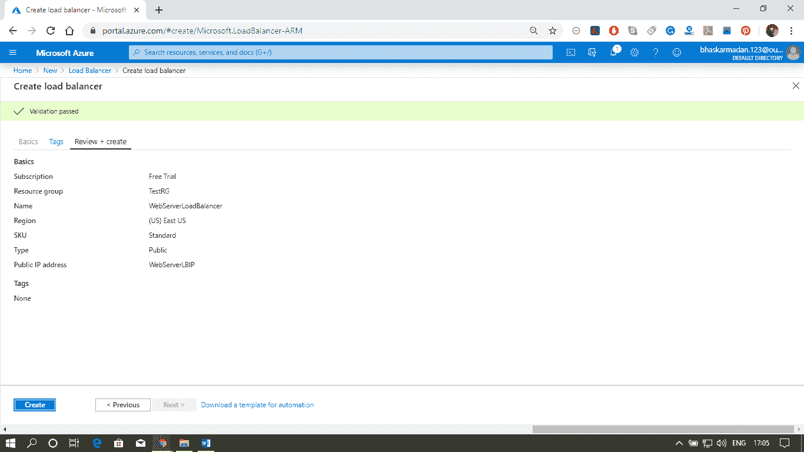
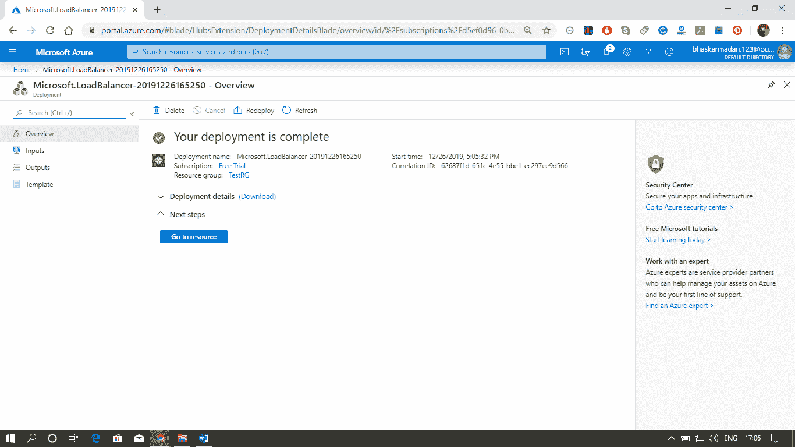

# Azure 负载平衡器

> 原文：<https://www.javatpoint.com/azure-load-balancer>

负载平衡器用于将传入流量分配给虚拟机池。它会停止将流量路由到池中出现故障的虚拟机。通过这种方式，我们可以使我们的应用程序能够抵御该虚拟机池中的任何软件或硬件故障。

## Azure 负载平衡器的功能

*   **负载均衡:** Azure 负载均衡器使用由源 IP、源端口、目的 IP、目的端口和协议组成的 5 元组哈希。我们可以根据流量来源的源端口和源 IP 地址，在负载平衡器中配置负载平衡角色。
*   **端口转发:**如果我们有一个 web 服务器池，负载均衡器也有端口转发能力，我们不想为该池中的每个 web 服务器关联公共 IP 地址。如果我们要进行任何维护活动，您需要进入那些在网络服务器上有公共 IP 地址的网络服务器。
*   **应用不可知且透明:**负载均衡器不直接与 TCP 或 UDP 或应用层交互。我们可以基于网址或多站点托管来路由流量，然后我们可以去应用网关。
*   **自动重新配置:**当我们向上或向下扩展实例时，负载平衡器可以重新配置自己。因此，如果我们向后端池中添加更多虚拟机，负载平衡器将自动重新配置。
*   **运行状况探测:**如前所述，负载平衡器可以识别后端池中的任何故障虚拟机，并停止将流量路由到该特定故障虚拟机。它将认识到，使用健康探测器，我们可以配置一个健康探测器来确定后端池中实例的健康状况。
*   **出站连接:**从我们虚拟网络内部的私有 IP 地址到互联网上的公共 IP 地址的所有出站流量都可以转换为负载平衡器的前端 IP。

## 负载平衡器的配置元素

*   **前端 IP 配置:**是传入流量最初会到达的 IP 地址，Azure 负载均衡器可以有一个或多个前端 IP 地址。它们有时也被称为虚拟入侵防御系统。
*   **后端地址池:**这些是流量最终将到达的虚拟机池。
*   **负载均衡规则:**负载均衡规则简单来说就是前端 IP 配置和后端地址池之间的映射。
*   **探测器:**探测器使我们能够跟踪虚拟机实例的运行状况。如果运行状况探测文件，虚拟机实例将自动退出循环。
*   **入站&出站 NAT 规则:**定义通过前端 IP 流入并分配到后端 IP 的入站流量的 NAT 规则。出站规则将虚拟机私有 IP 传输到负载平衡器公共 IP。

## 创建 Azure 负载平衡器

**步骤 1:** 转到 Azure 门户，点击创建资源。然后，键入负载平衡器，并单击它。

**步骤 2:** 您现在已经进入负载平衡器创建页面。如下图所示，填写所有必需的详细信息。点击查看+创建。

**第 3 步:**您将被重定向到审核页面。检查所有详细信息，然后单击创建。

您的负载平衡器现在已创建。

* * *