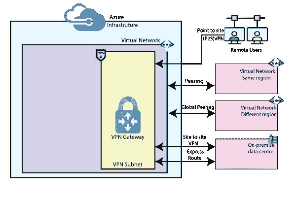

# 蔚蓝虚拟网络连接

> 原文：<https://www.javatpoint.com/azure-vnet-connectivity>

在典型的 IT 环境中，我们往往有多个虚拟网络，而且这些不同虚拟网络中的工作负载也需要相互通信。因此，我们将讨论一些连接场景，我们可以使用这些场景来实现各种虚拟网络中工作负载之间的通信。

### 凝视

虚拟网络对等使我们能够连接同一地区或跨地区的两个虚拟网络。如果两个虚拟网络都在 Azure 中，并且也在同一个区域内，那么您可以使用对等网络。因此，这些虚拟机中的工作负载可以相互通信。

*   对等虚拟网络中不同虚拟机之间的流量直接从微软主干基础设施路由，而不是通过网关或公共互联网。
*   我们可以部署中心辐射网络，其中虚拟中心网络可以承载基础架构组件，如虚拟网络设备或虚拟专用网网关。
*   然后，每个辐条虚拟网络都可以与集线器虚拟网络对等。流量可以流经虚拟集线器网络中的虚拟网络设备或虚拟专用网网关。
*   当虚拟网络对等时，我们还可以将对等虚拟网络中的网关配置为内部网络的中转点。

### 全局对等

如果我们在 azure 中有一个存在于不同地区的虚拟网络，那么我们可以使用全局对等。虚拟网络对等和全局虚拟网络对等都支持网关传输。

**站点到站点 VPN:** 如果我们有一个内部虚拟网络，并且我们可能有其他云提供商中存在的其他虚拟网络。要使用内部数据中心网络连接到我们在 Azure 中的虚拟网络，我们可以使用站点到站点虚拟专用网络。

**快速路线:**如果我们有业务需求，我们的内部数据中心和虚拟网络之间的连接应该在专用通信通道上，那么您可以使用快速路线。

### 对等时要记住的要点:

*   同一订阅中只允许在虚拟网络设备之间进行对等。
*   允许在同一 AD 租户下的不同订阅中的 VNets 之间进行对等。
*   位于不同 AD 租户的不同订阅中的 VNets 之间的对等也是允许的。

## 虚拟专用网网关

虚拟专用网网关是一种特定类型的虚拟网络网关，用于通过公共互联网在 Azure 虚拟网络和内部位置之间发送加密流量。虚拟专用网网关在虚拟网络的两端充当中间人。如果这些虚拟网络中的工作负载需要相互通信，它们将通过两个虚拟网络的 VPN 网关之间的加密通信通道进行通信。

当我们计划在 Azure 中部署 VPN 网关时，我们可以配置与之相关的设置数量:

*   **网关 SKU:**我们需要根据工作负载类型、吞吐量、功能和服务级别协议来选择满足我们要求的 SKU。
*   **区域冗余网关:**当我们使用区域冗余网关时，我们可以从区域弹性中获益，从而在 Azure 上访问您的任务关键型、可扩展的服务。
*   **连接类型:**连接类型可以是 IPsec、Vnet2Vnet、ExpressRoute、VPNClient。
*   **VPN 类型:**我们选择的 VPN 类型取决于我们要创建的连接拓扑和 VPN 设备。它可以是基于策略的虚拟专用网络或基于路由的虚拟专用网络。
*   **网关子网:**在创建 VPN 网关之前，您必须创建一个名为“Gateway subnet”的网关子网，并且不要在该子网中部署任何其他东西。
*   **本地网络网关:**本地网络网关通常代表您的内部位置，即 VPN 设备和地址前缀。
*   **连接拓扑:**站点到站点、多站点、点对点、虚拟网络到虚拟网络和快速路由。
*   **监控和警报:**监控关键指标并配置警报。

* * *