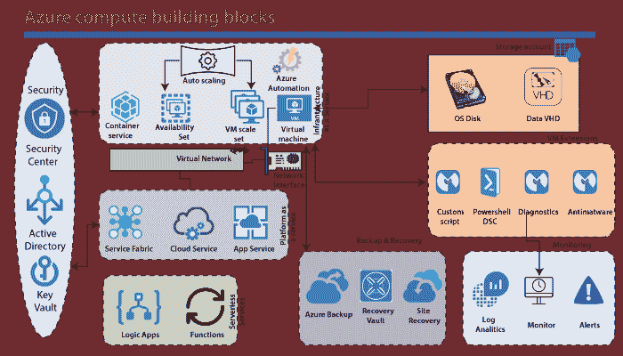

# 蔚蓝计算服务

> 原文：<https://www.javatpoint.com/azure-compute-service>

这里的计算这个词指的是运行我们的应用程序的计算资源的宿主模型。Azure 计算服务可以大致分为三类。

*   基础设施即服务
*   平台即服务
*   无服务服务

最基本的构建模块是 Azure 虚拟机。使用 Azure 虚拟机，我们可以在 Azure 云中部署不同的服务，如 Windows、Linux。当我们实现一个虚拟机时，每个虚拟机都将有一个相关的操作系统和数据磁盘。

### Azure 计算选项

以下是 Azure 中可用的主要计算选项:

*   **虚拟机:**它是一项 IaaS 服务，允许我们在虚拟网络(VNet)内部署和管理虚拟机。
*   **应用服务:**是托管网络应用、移动应用后端、RESTful APIs 或自动化业务流程的托管 PaaS 产品。
*   **服务架构:**它是一个可以在任何环境下运行的平台，包括 Azure 或内部部署。它是一个跨机器集群的微服务的协调者
*   **Azure Kubernetes 服务:**它管理一个托管的 Kubernetes 服务，用于运行容器化应用程序。
*   **Azure 容器实例:**它提供了在 Azure 中运行容器的最快和最直接的方法，而无需调配任何虚拟机，也无需采用高级服务。
*   **Azure 功能:**这是一个托管的 FaaS 服务。
*   **Azure Batch:** 是运行大规模并行和高性能计算(HPC)应用的托管服务。
*   **云服务:**是运行云应用的托管服务。它使用 PaaS 托管模型。

当您部署任何虚拟机时，例如运行一些脚本等..为此，Azure 提供了几个扩展，如自定义脚本、PowerShell DSC，代表所需的状态配置。您可以使用诊断扩展来收集从该虚拟机发出的所有日志。此外，我们可以在该虚拟机上安装反恶意软件软件，以防止病毒等。

使用应用服务，我们可以部署网络应用、移动后端服务、应用编程接口应用等。如果我们需要部署一个基于微服务的应用程序，那么我们可以使用服务结构。

在无服务器服务中，我们有 Azure 功能和逻辑应用。使用它，我们可以在云上部署代码片段并触发它们，而不用担心底层基础架构。

与 Azure 计算服务相关的三项关键服务是:

**Azure 安全中心:**用来了解你的虚拟机的安全态势。我们可以定义策略，并根据策略从 Azure 虚拟机收集信息并识别威胁。它将提供相关的建议。

**活动目录:**用于控制谁可以访问虚拟机或扩展集或可用性集，或者实际上是 Azure 中的任何其他 Azure 服务。

**密钥库:**用于在 Azure 中安全存储证书密钥或任何敏感信息。

* * *