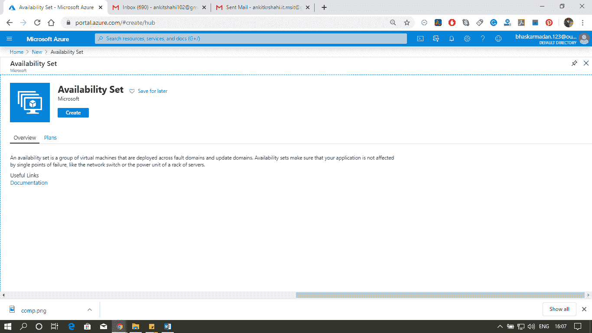
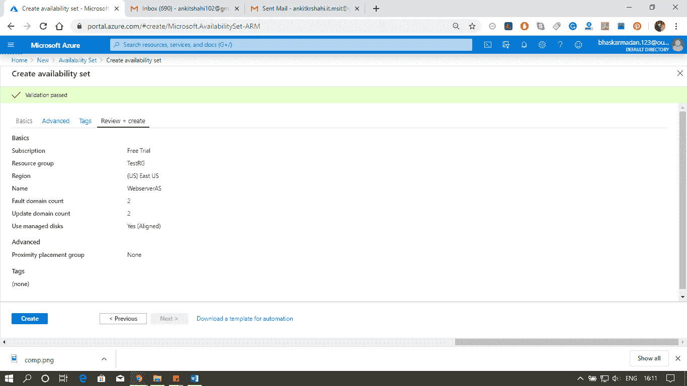
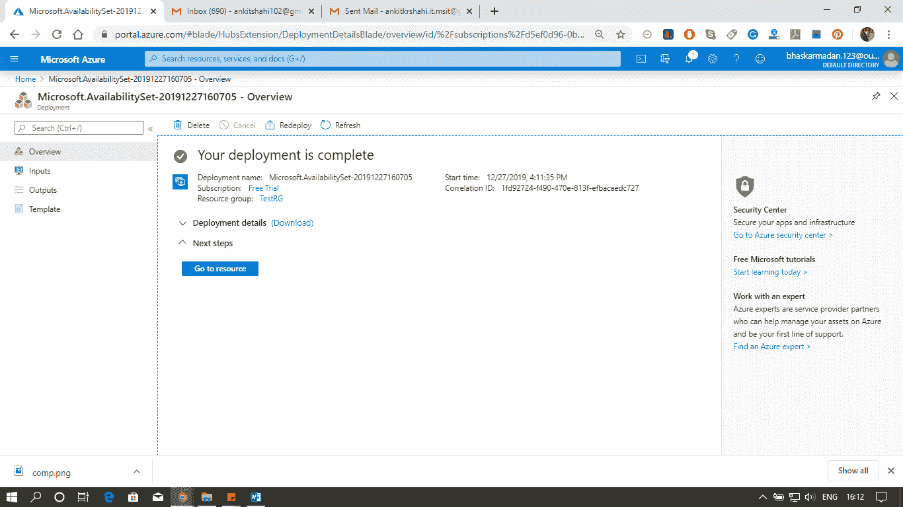
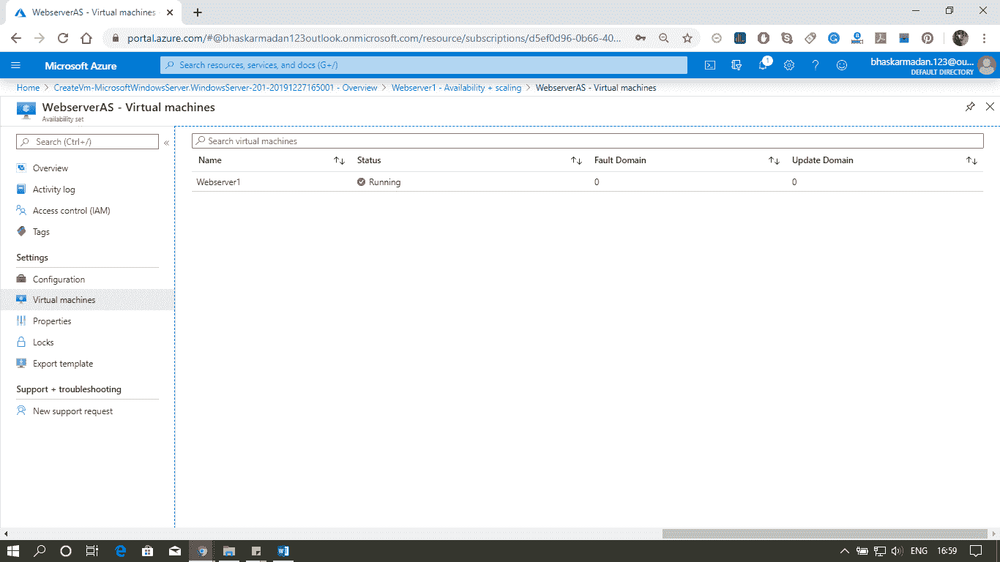

# Azure 虚拟机存储

> 原文：<https://www.javatpoint.com/azure-vm-storage>

### 虚拟机使用的磁盘

*   **操作系统磁盘:**在 Azure 中，每个虚拟机都会有一个操作系统磁盘。
*   **临时磁盘:**每个虚拟机包含一个临时驱动器。临时磁盘为应用程序和进程提供短期存储。
*   **数据磁盘:**数据磁盘是连接到虚拟机的 VHD，用于存储应用程序数据或我们需要保留的其他数据。

### 性能等级

*   **标准存储:**它由硬盘支持，在提供经济高效的存储的同时，仍然保持高性能。它非常适合开发和测试、非关键访问和非频繁访问，因为每个磁盘的最大吞吐量和 IOPS 分别为 60MB/s 和 500。
*   **高级存储:**它由固态硬盘支持，为运行输入/输出密集型工作负载的虚拟机提供高性能、低延迟的磁盘支持。每个磁盘的最大吞吐量和 IOPS 分别为 250MB/s 和 7500。

### Azure 中的磁盘类型

*   **非托管磁盘:**这是虚拟机使用的传统类型的磁盘。我们可以创建存储帐户，并在您创建磁盘时指定存储帐户。没有超过服务协议(20，000 IOPS)的可扩展性目标。
*   **托管磁盘:**托管磁盘处理存储帐户的创建/管理。我们不必担心存储帐户的可扩展性限制。微软总是建议我们为新虚拟机使用 Azure 托管磁盘。

### 磁盘加密

*   **存储服务加密:** Azure 存储服务加密提供静态加密并保护我们的数据，以满足我们的组织安全和合规承诺。默认情况下，对于每个有托管磁盘可用的区域中的所有托管磁盘、快照和映像，都会启用该选项。
*   **Azure 磁盘加密:** Azure 磁盘加密允许您加密 IaaS 虚拟机使用的操作系统和数据磁盘。对于 Windows，驱动器使用行业标准的 BitLocker 加密技术进行加密。对于 Linux，磁盘是使用 DM-Crypt 技术加密的。

### 虚拟机可用性

*   **可用性集:**可用性集是数据中心内虚拟机的逻辑分组，允许 Azure 服务了解我们的应用程序是如何构建的，以提供冗余和可用性。可用性集由两个额外的分组组成，这两个分组可以防止硬件故障，并允许安全地应用更新。
    *   **故障域-** 它是共享公共网络交换机和电源的底层硬件的逻辑组，类似于内部数据中心内的机架。
    *   **更新域:**它是底层硬件的逻辑组，将进行维护或同时重新启动。
    *   **托管磁盘故障域:**对于使用 Azure 托管磁盘的虚拟机，当使用托管可用性集时，虚拟机将与托管磁盘故障域保持一致。这种对齐可确保连接到虚拟机的所有受管磁盘都在同一受管磁盘故障域内。
*   **可用性区域:**它是 Azure 色区域中一个物理上独立的区域。在 Azure 区域内，每个支持三个可用性区域。所有可用性区域都有相同数量的电源、网络和冷却，并且与 Azure 区域内的其他可用性区域分开。

### 存储可用性

*   **Azure 托管磁盘**
    *   **本地冗余存储(LRS):** 我们将在同一设施内拥有相同数据的三份拷贝。因此，如果数据中心出现故障，我们很可能会丢失数据。
*   **基于存储帐户的磁盘**
    *   本地冗余存储(LRS):它使用该设施维护三个副本。
    *   分区冗余存储(ZRS):它跨设施维护三个副本。
    *   地理冗余存储(GRS):副本将在成对的区域中维护。例如，如果我们的磁盘在美国中部，那么副本也将保存在美国东部。
    *   读访问地理冗余存储(RA-GRS):拷贝将可用于不同区域的只读访问。

### 创建可用性集

我们将在这里看到 Azure 如何将您的虚拟机平均分配到该可用性集的不同故障和更新域中。

**第 1 步:**单击新建，然后输入可用性集，并按回车键。现在，点击创建。

**步骤 2:** 您当前位于可用性集创建页面。如下图所示，填写所有必需的详细信息，然后单击创建。

**步骤 3:** 现在单击转到资源打开可用性集。

**第 4 步:**点击虚拟机。您添加到此可用性集中的任何虚拟机都将显示在此处。

这就是如何让 web 服务器场容忍计划外停机和计划内停机。

* * *