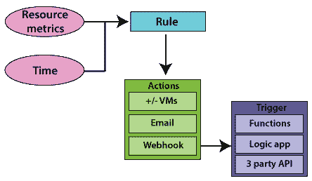
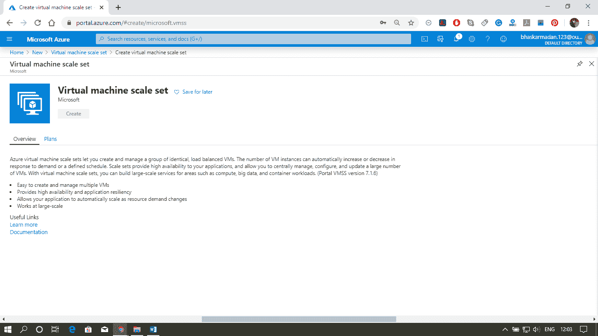
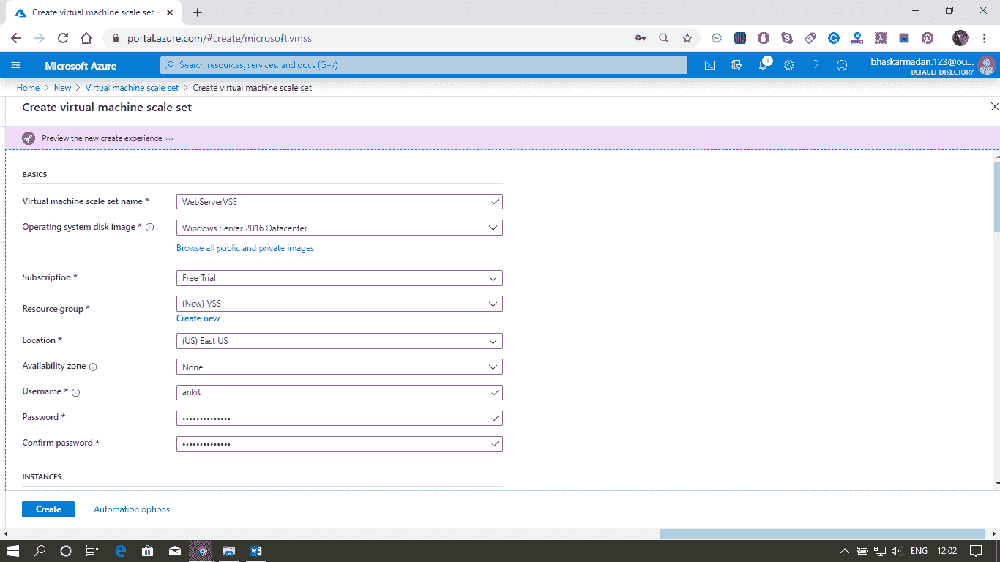

# Azure 虚拟机扩展集和自动扩展

> 原文：<https://www.javatpoint.com/azure-virtual-machine-scale-set-and-auto-scaling>

### 虚拟机规模集

扩展集是 Azure 计算资源，可用于部署和管理相同的虚拟机。它们旨在支持虚拟机自动扩展。可以使用 Azure 门户、JSON 模板和 REST APIs 创建虚拟机规模集。要增加或减少扩展集中的虚拟机数量，我们可以更改容量属性并重新部署模板。虚拟机扩展集在 VNET 内部创建，扩展集中的单个虚拟机没有分配公共 IP 地址。

我们部署的任何属于虚拟机扩展集的虚拟机都不会分配公共 IP 地址。因为有时候，虚拟机扩展集会有一个前端平衡器来管理负载，并且有一个公共的 IP 地址。我们可以使用该公共 IP 地址，并连接到虚拟机扩展集中的底层虚拟机。

### 虚拟机自动扩展

Autoscale 使我们能够根据服务负载动态分配或移除资源。您可以根据该范围内的一组规则，指定要运行的实例的最大数量和最小数量，并添加或删除虚拟机。

自动缩放的第一步是选择度量或时间。因此，它可以是基于度量的自动缩放，也可以是基于计划的自动缩放。这些指标可以是 CPU 利用率等。，时间可以像晚上 6 点到早上 6 点，我们要减少服务器的数量。我们可以有一个基于时间表的自动缩放。如果我们要根据负载来达到，那么我们可以使用基于度量的自动缩放。

自动缩放的下一步是用条件定义规则。例如，如果 CPU 利用率高于 80%，则派生一个新实例。而一旦条件满足，我们就可以进行一些行动。这些操作可以是添加或删除虚拟机，也可以是向系统管理员发送电子邮件等。我们需要选择它是基于时间的自动缩放还是基于度量的，并且我们需要选择度量。我们定义了规则以及当满足该规则中的条件时需要触发的操作。

### 水平和垂直缩放

*   **水平扩展:**虚拟机实例数量的增加或减少。它会自动水平缩放，有时称为横向扩展或纵向扩展。
*   **垂直扩展:**在这种情况下，我们保持相同数量的虚拟机，但使虚拟机或多或少地强大。功率以内存、CPU 速度、磁盘空间等衡量。它受到同一区域内较大硬件可用性的限制，通常需要虚拟机启动和停止。这有时被称为放大或缩小。以下是实现垂直缩放的步骤。
    1.  设置 Azure 自动化帐户
    2.  将 Azure 自动化垂直扩展运行手册导入我们的订阅。
    3.  在我们的网络中添加一个网络钩子。
    4.  向我们的虚拟机添加警报。
*   我们还可以扩展网络应用和云服务。

### 自动缩放的指标

*   **计算指标:**可用的指标将取决于安装的操作系统。对于 windows，我们可以有处理器、内存和逻辑磁盘指标。对于 Linux，我们可以有处理器、内存、物理&等网络接口指标。
*   **Web Apps 指标:**包括 CPU &内存百分比、磁盘& HTTP 队列长度和接收/发送的字节数。
*   **存储/服务总线指标:**我们可以按存储队列长度进行扩展，即存储队列中的消息数量。存储队列长度是一个特定的指标，应用的阈值是每个实例的消息数。

### 实现自动缩放的工具

*   我们可以使用 **Azure 门户**创建一个比例集，并基于一个指标启用自动缩放。
*   我们可以使用**资源管理器模板**来调配和部署虚拟机规模集。
*   **ARM 模板**可以使用 Azure CLI、PowerShell、REST 进行部署，也可以直接从 Visual Studio 进行部署。

### 扩展 Azure 虚拟机

**步骤 1:** 转到 Azure Marketplace 并输入虚拟机规模集。然后点击创建。

**第二步:**我们需要给这个音阶集命名。并填写所有其他所需的详细信息，如下图所示。然后点击创建。

**步骤 3:** 现在，您的虚拟机扩展集已成功部署。要查看 VMSS，您可以转到资源。

**第 4 步:**现在，点击缩放。提供自动缩放设置名称。并选择资源组。

**第五步:**向下滚动，你会发现两种自动缩放的方法。首先，点击“添加规则？用于基于度量的自动缩放。如果 CPU 利用率的平均百分比超过 70%，我们将扩展我们的虚拟机。

**第 6 步:**现在，选择基于时间和日期的缩放，需要更多空间时可以在其中进行缩放。最后一件事是通知，只要自动缩放被触发，您就会收到通知。

* * *