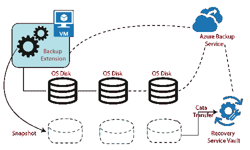
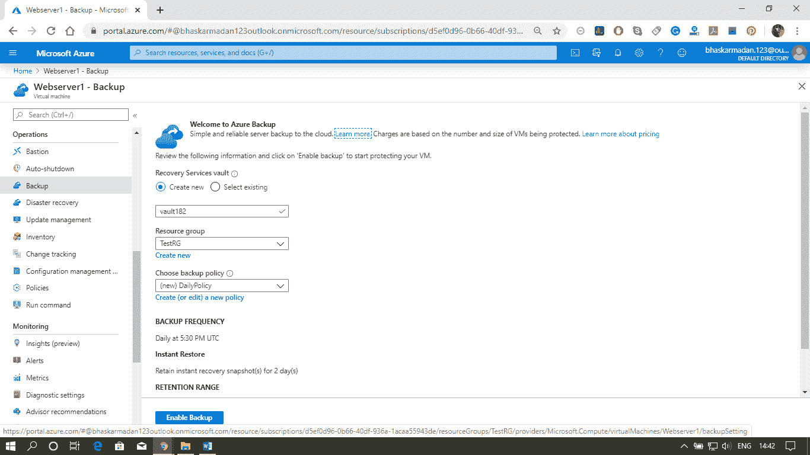
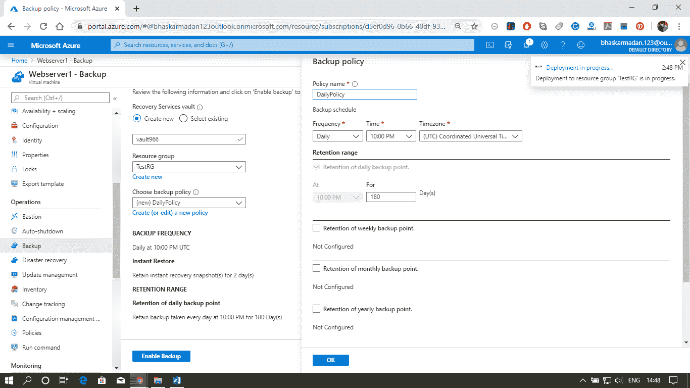
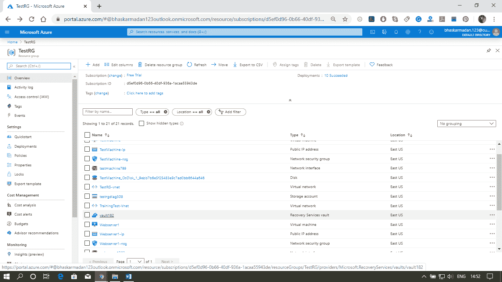
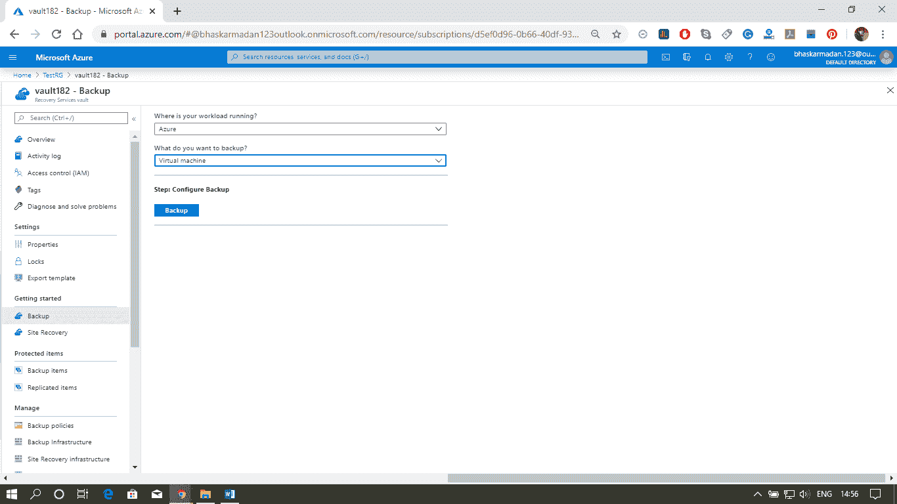

# Azure 备份

> 原文：<https://www.javatpoint.com/azure-backup>

Azure Backup 是微软 Azure 提供的一项服务，用于通过微软云备份和恢复我们的数据。Azure Backup 用可靠、安全且具有成本竞争力的基于云的解决方案取代了我们现有的内部或外部备份解决方案。它不仅用作云存储来将我们的数据备份到云中，而且我们还可以使用我们现有的本地光盘来备份数据。

因此，Azure 备份结合了内部存储和云存储，可以与这种异构存储环境协同工作。每当 Azure 备份使用本地存储时，我们都不会为此付费。只有当数据在云中备份时，您才会被收取费用。

### Azure 备份的优势

*   自动存储管理
*   无限制缩放
*   多个存储选项
*   应用程序一致备份
*   长期保留

### Azure 备份服务的工作

使用 Azure 备份时，我们首先要做的是定义备份策略。该策略描述了需要备份的频率以及需要备份的目标。之后，我们还会确定需要存储数据的目的地，在大多数情况下，这将是 recovery services vault。数据备份不会存储在存储帐户中，而是存储在恢复服务保管库中，这也是一种在线存储工具，我们可以在其中保存所有虚拟机的备份。

### Azure 备份服务的组件

| 成分 | 保护什么？ | 后备存储器 | 备份频率 |
| Azure 备份代理 | 仅文件、文件夹、系统状态窗口。 | 恢复服务保险库 | 每天三次备份 |
| 系统中心 | 文件、文件夹、卷、虚拟机、应用程序、工作负载 | 恢复服务存储库、本地磁盘、磁带 | 每天两次 RSV 备份，SQL Server 每 15 分钟一次，其他工作负载每小时一次 |
| Azure 备份服务器 | 文件、文件夹、卷、虚拟机、应用程序、工作负载 | 恢复服务保险库，本地磁盘 | 每天两次 RSV 备份，SQL Server 每 15 分钟一次，其他工作负载每小时一次 |
| Azure IaaS 虚拟机备份 | 虚拟机、所有磁盘 | 恢复服务保险库 | 每天一次备份 |

### 如何使用 Azure 备份进行虚拟机备份

**步骤 1:** 进入虚拟机，点击备份。单击备份后，将出现以下窗口。

**步骤 2:** 根据您的要求配置备份策略，点击启用备份。

**步骤 3:** 现在，转到资源组，单击您创建的恢复服务存储库，如下所示。

**第 4 步:**如果您想从恢复服务库中进行备份并选择不同的设置，那么您可以单击备份，然后选择工作负载的运行位置。

* * *