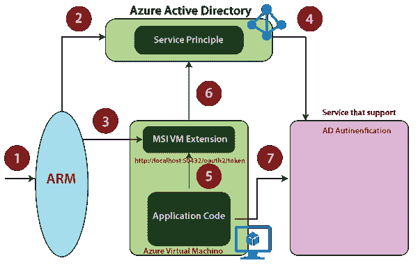

# Azure 虚拟机安全性

> 原文：<https://www.javatpoint.com/azure-virtual-machine-security>

有许多服务可以保护我们的虚拟机。

### 活动目录

*   通过使用 Azure 活动目录，我们可以控制不同用户或用户组对虚拟机的访问。当我们创建一个虚拟机时，我们可以为其分配一个用户，当我们将用户分配给虚拟机时，我们还会将一个特定的规则与他们相关联。该角色定义了用户对我们的虚拟机的访问级别。
*   该目录中的用户、组和应用程序可以管理 Azure 订阅中的资源。
*   它通过在特定范围内为用户、组和应用程序分配适当的 RBAC 角色来授予访问权限。角色分配的范围可以是订阅、资源组或单个资源。
*   Azure RBAC 有三个适用于所有资源类型的基本角色:
    *   **所有者:**他们拥有对所有资源的完全访问权，包括将访问权委托给其他人的权利。
    *   **贡献者:**他们可以创建和管理所有类型的 Azure 资源，但不能授予其他人访问权限。
    *   **读者:**他们只能查看现有的 Azure 资源。

### Azure 安全中心

Azure 安全中心识别潜在的虚拟机配置问题和目标安全威胁。其中可能包括缺少网络安全组的虚拟机、未加密的磁盘以及暴力远程桌面协议(RDP)攻击。

我们可以使用安全策略自定义我们希望从安全中心看到的建议。

*   设置数据收集
*   设置安全策略
*   查看虚拟机配置运行状况
*   修复配置问题
*   查看检测到的威胁

### 托管服务标识

它是 Azure 新推出的。以前，每当我们将应用程序部署到虚拟机中时，通常会在该应用程序文件夹的配置文件中有用户 id 和密码。但是，如果有人能够访问该虚拟机，他们也可以访问配置文件并查看该文件。为了进一步提高应用程序代码的安全性和应用程序代码访问的服务的安全性，我们可以使用托管服务标识。

### 其他安全功能

*   **网络安全组:**过滤进出虚拟机的流量。
*   **针对 Azure 的微软反恶意软件:**我们可以在 Azure 虚拟机上安装，以保护我们的机器免受任何恶意软件的攻击。
*   **加密:**我们可以启用 Azure 磁盘加密。
*   **密钥库和 SSH 密钥:**我们可以使用密钥库来存储证书或任何敏感密钥。
*   **策略:**我们可以使用它应用的所有安全相关策略。

* * *