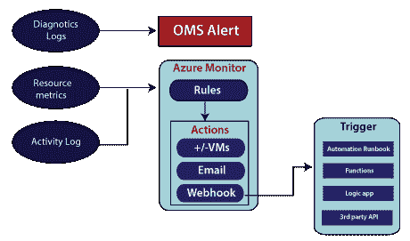
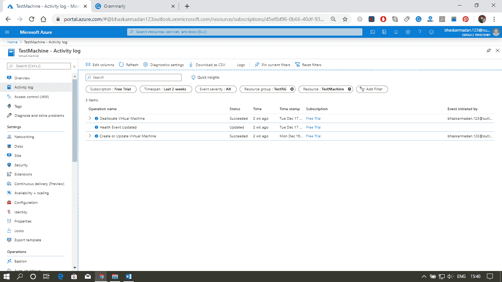
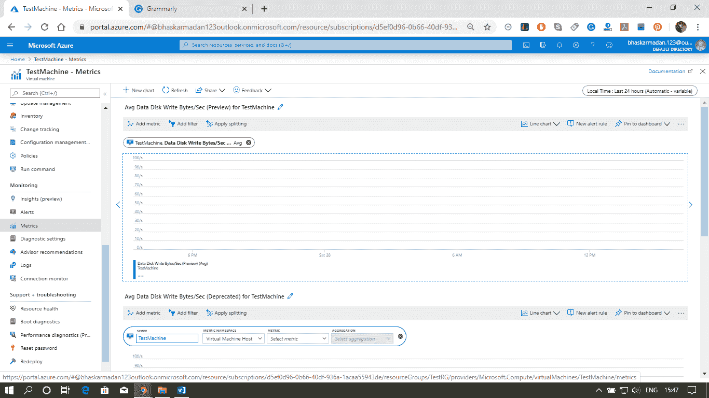
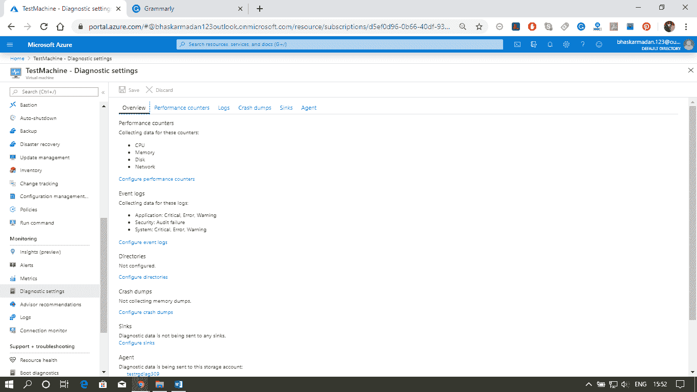
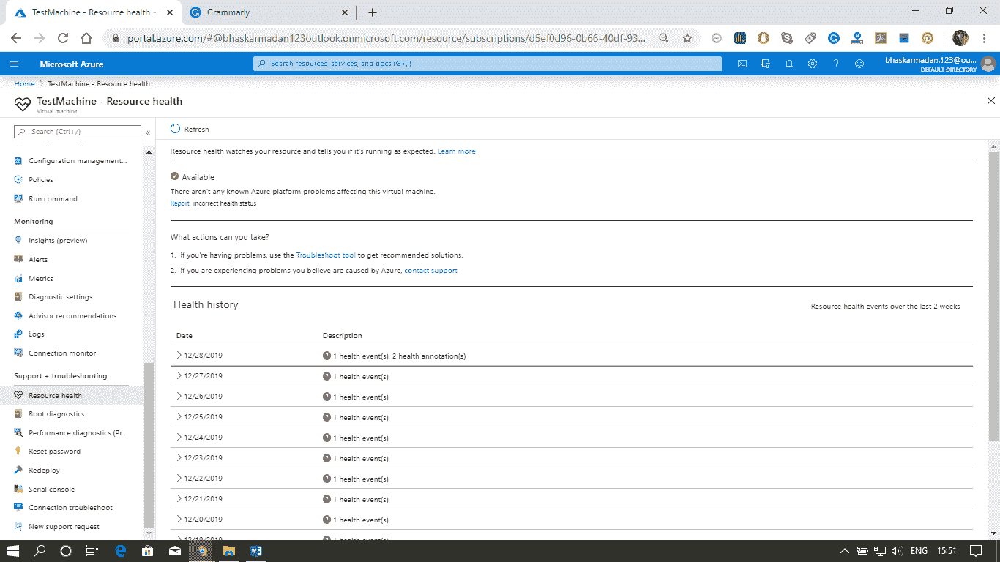

# 蔚蓝虚拟机监控

> 原文：<https://www.javatpoint.com/azure-vm-monitoring>

有不同的 Azure 服务可用于监控我们的 Azure 虚拟机。

**诊断和度量**

*   使用活动日志，我们可以监视和审计虚拟机上执行的操作。例如-启动虚拟机、停止虚拟机、重新映像等。
*   使用 Azure 监视器观察虚拟机的基本指标。您将在资源部分看到这些指标的仪表板形式。但是如果您转到 Azure monitor，您可以监视 Azure 中任何资源的所有基本指标，包括虚拟机。
*   启用引导诊断的集合，并使用 Azure 门户查看它。
*   启用来宾操作系统诊断数据的收集，并使用 OMS(操作管理速度)进行分析。
*   我们可以使用 Azure 门户、Azure CLI、Azure PowerShell 和 REST APIs 中的指标来设置和监控诊断数据的收集

### 警报

Azure 提供了获得警报的全面能力。我们可以从三个信息来源得到警告。

*   **活动日志**

*   **资源指标**

*   **诊断日志**

谈到诊断日志，我们可以使用 OMS 警报基于诊断日志发出警报。在资源度量和活动日志的情况下，我们将使用 Azure 监视器。azure 显示器是一个基本的，但如果我们与其他显示器进行比较，它是全面的。但是，与 OMS 相比，Azure 监视器是我们可以用于资源指标和活动日志的基本监视器。

假设，如果有人停止了虚拟机，我们希望得到警报，或者其中一台虚拟机的 CPU 利用率超过 90%，那么我们希望得到警报。我们可以在 Azure 监视器中定义这些规则。一旦满足了规则中的条件，我们就可以采取一些措施。我们可以触发 azure 自动化 Runbook，Azure 函数，逻辑 app，或者第三方 API。

### 健康监测

**蔚蓝服务健康**

*   当 Azure 服务中的问题影响您的服务时，它会提供及时和个性化的信息。
*   它帮助您为即将到来的计划维护做准备。

**天青资源健康**

*   当 Azure 问题影响您的资源时，资源运行状况可帮助您诊断并获得支持。
*   它可以用来查看您的 Azure 资源当前和过去的运行状况。
*   当您在 Azure 服务问题上需要帮助时，它会提供技术支持。

### 高级监控

*   **运营管理套件(OMS):** 它包括跨云和内部资产的监控、警报和警报补救功能。
*   **日志分析:**它收集由我们的云和内部环境中的资源以及其他监控工具生成的数据，以提供跨多个资源的分析。
*   **网络观察器:**它监控我们的虚拟机及其相关资源，因为它们与存在的网络相关。

* * *