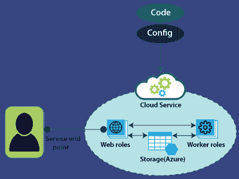

# Azure 云服务

> 原文：<https://www.javatpoint.com/azure-cloud-service>

云服务是一种平台即服务，旨在支持可扩展、可靠且运行成本更低的网络应用。使用云服务，我们可以将 web 应用程序部署到 Azure 中。我们对虚拟机有更多的控制。我们可以在使用 Azure 云服务的虚拟机上安装定制软件，并且我们可以远程访问它们。

使用云服务，我们不创建虚拟机。相反，我们提供了一个配置文件，告诉 Azure 我们想要创建多少个实例、实例的大小以及平台将为我们创建它们。

云服务能够检测任何出现故障的虚拟机和应用程序，并在出现故障时准备启动新的虚拟机或应用程序实例。云服务应用程序不应该在自己虚拟机的文件系统中维护状态。

## 云服务角色

**Web 角色:**它通过 IIS 自动部署并托管我们的 app。

**工作角色:**不使用 IIS，独立运行我们的 app。如果我们想要运行任何连续的沐浴，那么我们可以使用工作角色，并且网络角色和工作角色都将与存储交互以获得应用程序包等。

为了部署这些 web 角色和 Worker 角色，我们将提供与这些 Web 应用程序相关的配置和代码。

## 云服务组件

云服务由三个关键组件组成。

*   ServiceDefenition.csdef 文件指定 Azure 用来配置云服务的设置。例如-站点、端点、证书等。
*   ServiceConfiguration.cscfg 包含将用于确定云服务设置配置的值。例如，实例数量、实例类型、端口等。
*   Service package.cspkg 用于将应用程序部署为云服务。首先，它需要使用 CSPacK 命令行工具进行打包。CSPacK 生成一个应用程序包文件，可以使用门户将其上传到 Azure 中。

## 使用 Azure 门户创建云服务

**步骤 1:** 点击创建资源，然后输入云服务。

**第二步:**之后，点击它，然后点击创建。

**第三步:**填写域名，选择资源组和位置。

**第 4 步:**现在，点击创建。您的云服务将被创建。

**第 5 步:**要查看云服务，请点击进入资源。

**第六步:**现在，转到 Visual Studio，创建一个新的云服务项目。这里可以看到基本的配置设置，如下图所示。

**步骤 7:** 要将该云服务发布到 Azure 中，右键单击文件名。然后点击发布。

**第 8 步:**选择您的套餐，然后单击下一步。

**第 9 步:**填写所有需要的详细信息，然后点击发布。

**步骤 10:** 现在，转到 Azure 门户，单击您创建的资源组。您现在可以看到您的 web 角色已发布，如下图所示。

* * *