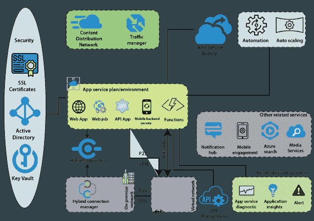
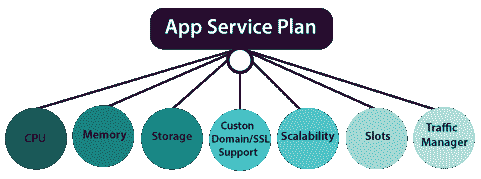
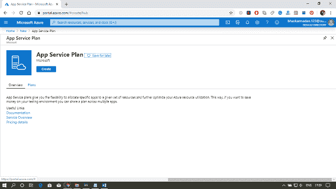
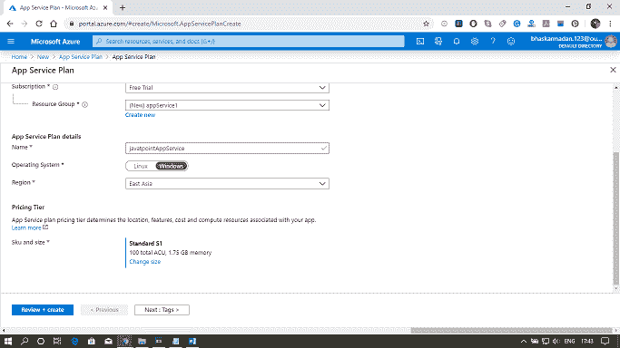
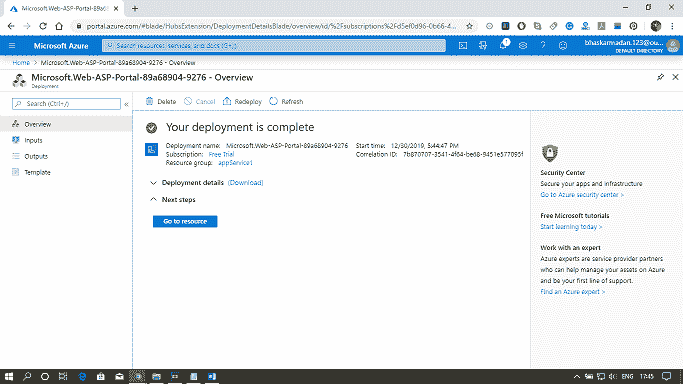

# Azure 应用服务

> 原文：<https://www.javatpoint.com/azure-app-services>

Azure 应用服务最基本的构建模块是应用服务计划或应用服务环境。

应用服务中有两种类型的托管环境。应用服务计划和应用服务环境。应用服务环境是应用服务计划的一个更复杂的版本，与应用服务计划相比，它具有更多的功能。在这些应用程序中，我们可以托管几个应用程序，如网络应用程序、网络作业、批处理、应用程序接口和移动后端服务，这些都可以从我们的移动前端使用。

其他相关服务与应用服务计划中的这些应用密切相关。这些相关服务是一个通知中心，我们可以使用它将通知推送到移动设备中。我们可以使用移动参与来执行移动分析。

除了这些相关的服务之外，还有一个服务，在涉及到 API 的时候非常重要，那就是 API 管理。当我们向外界公开应用程序接口时，应用程序接口管理可以充当我们的应用程序接口应用程序的包装器。它附带了许多功能，如节流、安全，如果我们想将我们的 API 商品化并向外界销售，这将是有益的。

启用应用程序服务计划中的应用程序与虚拟网络中虚拟机上安装的应用程序之间的通信。我们有两种方法可以做到。一种方法是在应用程序服务计划中的应用程序和虚拟网络之间建立点对点虚拟专用网络，应用程序可以通过虚拟网络相互通信。第二种方式是如果我们有应用服务环境。因为它会自行部署到虚拟机中，所以该应用服务环境中的应用可以与虚拟网络中虚拟机上安装的应用无缝通信。

最后，还有两件重要的事情。第一个是安全，第二个是监控，以保护和控制应用服务环境。

## 应用服务计划

应用服务计划表示我们可以在同一订阅和地理区域的多个应用之间共享的一组功能和容量。单个或双应用程序可以配置为在相同的计算资源上运行。

**每个应用服务计划定义:**

*   地区(美国西部、美国东部等。)
*   虚拟机实例的数量
*   虚拟机实例的大小(小型、中型、大型)
*   定价层
    *   *共享计算:*免费和共享这两个基本层，在与其他 App Service 应用运行相同的 Azure VM 上运行一个应用，包括不同客户的应用。
    *   *专用计算:*基本、标准、高级和 PremiumV2 层在固定的 Azure 虚拟机上运行应用程序。
    *   *隔离:*该层在专用的 Azure 虚拟网络上运行专用的 Azure 虚拟机，在计算隔离的基础上为您的应用程序提供网络隔离。
    *   *消费:*仅适用于功能类应用。它根据工作负载动态扩展功能。

## 环境特征

*   开发框架:App Service 支持多种开发框架，包括 ASP.NET、经典 ASP、node.js、PHP 和 Python——所有这些都作为 IIS 中的扩展运行。
*   文件存取
    *   *本地驱动器* -操作系统驱动器(D:\驱动器)、应用程序驱动器和用户驱动器(C:\驱动器)
    *   *网络驱动器* -每个客户的订阅在数据中心内的特定 UNC 共享上有一个保留的目录结构。
*   网络访问:应用程序代码可以使用基于 TCP/IP 和 UDP 的协议进行出站网络连接，以访问暴露外部服务的互联网端点。

## 网络应用概述

Azure 应用服务网络应用是一种托管网络应用的服务。应用服务网络应用的关键特征。

*   多种语言和框架
*   DevOps 优化
*   安全性和合规性
*   应用程序模板
*   Visual Studio 集成

## 在 Azure 门户中创建应用服务计划

**第一步:**点击*新建资源*，搜索 App Service Plan 创建。

**第二步:**填写所有需要的细节，选择 SKU 尺寸，如下图所示。然后点击创建。

**第三步:**将创建您的应用服务计划。现在，您可以根据自己的需求对其进行探索和修改。

* * *