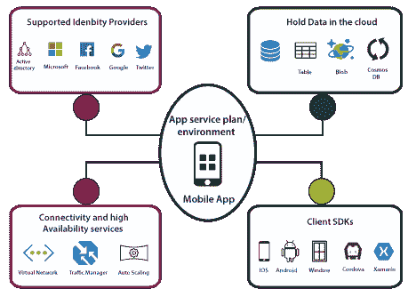

# Azure移动应用

> 原文：<https://www.javatpoint.com/azure-mobile-app>

我们可以使用 Azure Mobile 应用程序在 Azure 上部署我们的移动后端服务。通过在 Azure 上实现我们的移动后端服务，我们的移动后端将能够与不同的 Azure 服务进行通信。我们可以利用 Azure 移动应用程序提供的各种功能。

## 功能和服务

**数据存储:**我们的移动后端可以存储或者访问 Azure SQL 数据库 Azure 表存储、Azure Blob 存储、Cosmos DB 的数据。此外，我们还可以在手机应用中添加离线同步功能。

**客户端开发:**一旦我们将移动后端服务托管在 Azure 上，就必须有一种方法来消费这些服务。为此，微软根据平台提供了几个客户端软件开发工具包。

**认证和授权:**我们可以将我们的手机 app 与不同的认证提供商进行整合。因此，我们可以与 Azure 活动目录、微软、脸书、谷歌和推特进行集成。我们可以在没有任何代码的情况下集成这项服务。

**连接性:**与虚拟网络中托管的应用程序的连接性。我们的移动应用将能够使用点对点虚拟专用网络连接到虚拟网络，或者通过将我们的移动应用后端服务托管到应用服务环境中，该环境将自动连接到虚拟网络。

**可用性服务:**即使在数据中心出现故障时，我们也可以使用流量管理器来提供更高的恢复能力。随着越来越多的用户开始使用我们的应用程序，我们还可以使用自动扩展来扩展我们的移动后端服务。

**通知中心:**使用通知中心，我们可以启用到不同平台的推送通知，并且我们还可以使用移动参与，使用它我们可以了解用户对我们的应用程序做了什么。

**如何创建移动应用后端开发**

**第一步:**登录 Azure 门户，创建新的 Azure 移动应用后端。

**第二步:**配置手机应用后端。

**步骤 3:** 定义一个表控制器。

**步骤 4:** 创建数据传输对象(DTO)类。

**步骤 5:** 在 Mobile DbContext 类中配置表引用。

**步骤 6:** 创建一个表控制器。

**步骤 7:** 定义自定义的 API 控制器。

**移动客户端开发**

**第一步:**基于移动 OS，下载客户端 SDK。

**步骤 2:** 在客户端代码中引用 MicrosoftAzureMobile (IOS)。

**步骤 3:** 创建 MSClient (IOS)引用并开始从表中访问数据。

**步骤 4:** 对于自定义 API，使用 MSClient.invokeAPI 调用自定义 API。

## 移动离线数据同步

移动离线数据同步是 Azure 移动应用程序的客户端和服务器软件开发工具包功能，它使创建无需网络连接即可工作的应用程序成为可能。

**同步表**

*   为了访问“/tables”端点，Azure Mobile 客户端 SDK 提供了一个接口，如 MSTable。但是，如果客户端设备没有网络连接，这将失败。
*   为了支持离线使用，我们的应用程序应该改为使用同步表 API，如 MSSyncTable。所有的 CRUD 操作都将在本地商店进行。

本地存储是客户端设备(Windows、Xamarin 和 Android)上的数据持久层。它基于 SQLite，而在 iOS 上，它基于核心数据。在离线同步中，同步可以是推送、拉取、隐式推送或增量同步。

* * *