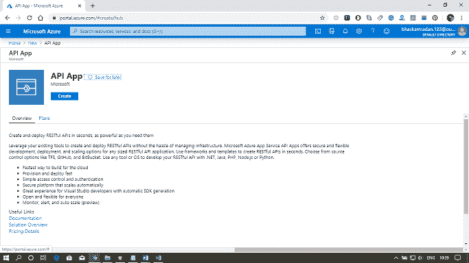
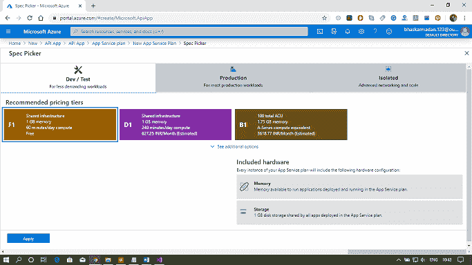
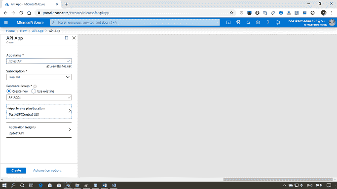
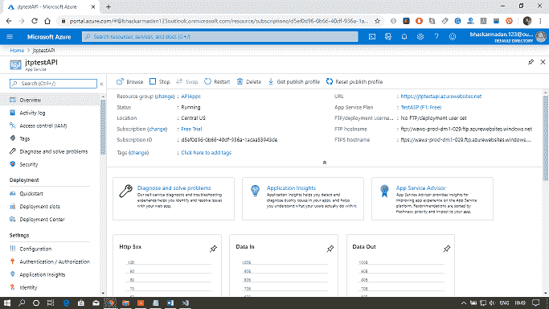
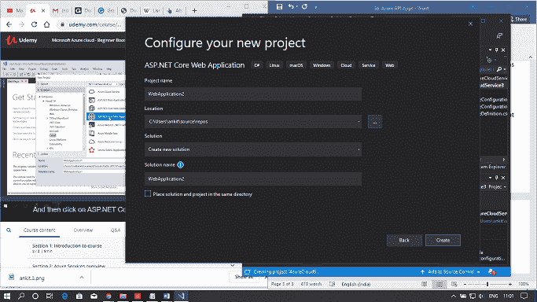
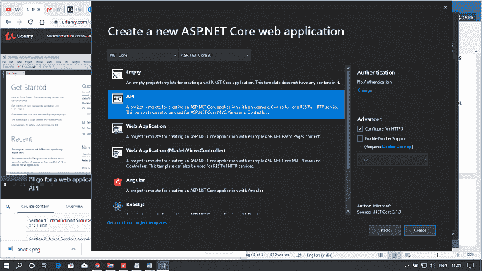
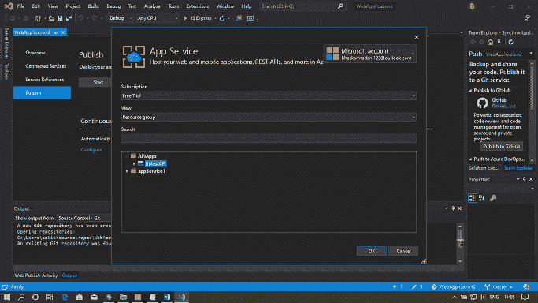
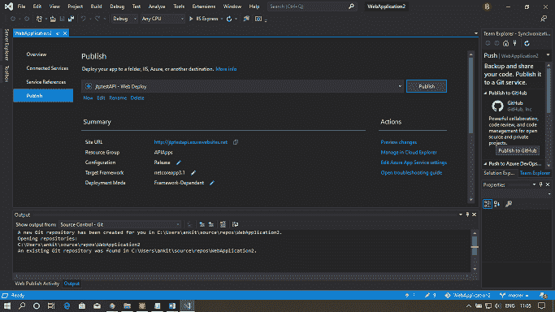

# 天青应用程序和应用程序接口管理

> 原文：<https://www.javatpoint.com/azure-api-apps-and-api-management>

应用编程接口应用程序的特性使得在云中和内部开发、托管和使用应用编程接口变得容易。在 Azure API 应用程序中托管 API 的优势在于，我们将获得企业级安全性和简单的访问控制、自动生成 SDK，以及与 Logic Apps 的无缝集成。逻辑应用程序是您可以在 Azure 中构建的系统工作流。作为工作流的一部分，每个活动都需要与不同系统公开的功能进行交互。通过将这些接口托管在 Azure 中，也可以很容易地与逻辑应用程序集成。

## 应用编程接口应用的特性

*   **自带已有 API 原样:** API 可以用 App Service 支持的任何语言框架开发，如 C#、Java、PHP、Node.js 等。
*   **轻松消费:**有对斯瓦格 API 的集成支持。通过启用 swagger，我们使其他人可以很容易地使用我们的 API，并且我们还将为开发人员提供优秀的 API 可见性。
*   **简单访问控制:**保护 API 应用程序免受未经身份验证的访问，而无需更改您的代码。
*   **Visual Studio 集成**
*   **与逻辑应用的集成**

## 应用编程接口管理

*   应用编程接口管理就是管理应用编程接口。我们可以在应用编程接口上放置一个应用编程接口管理前端来监控和限制使用，操纵输入和输出，将几个应用编程接口合并到一个端点，等等。被管理的应用编程接口将被托管在任何地方。
*   应用编程接口应用程序是托管应用编程接口，而应用编程接口管理是管理应用编程接口。让？让我们看看 API 管理是如何工作的。

在很高的层次上，首先，当 http 或 https 请求到来时。它将涉及到应用编程接口管理和基于应用编程接口位置的应用编程接口管理。然后，它会将该请求转发给 Azure 应用程序接口或内部应用程序。但是当它转发该请求时，它可以进行节流，还可以监控和操作输入和输出。

### 应用编程接口管理门户

*   API 管理门户是开发人员了解 API、查看和调用操作以及订阅产品的地方。
*   开发人员门户中的内容通过发布者门户进行修改，发布者门户可从 Azure 门户访问。要到达那里，请从我们的应用编程接口管理实例的服务工具栏中单击发布者门户。
*   开发人员门户的仪表板可以通过添加自定义内容、自定义样式和添加我们的品牌来进行自定义。

### 应用编程接口管理概念

API 管理概念是我们需要记住的至关重要的事情。

*   **应用编程接口和操作:**每个应用编程接口代表开发人员可用的一组操作(可能是 CRUD 操作)。
*   **产品:**API 就是这样浮出水面给开发者看的。每个产品可以包含多个 API。
*   **组:**用于管理 API 的可见性，所以我们可以有三种类型的组。
    *   管理员组成员可以管理应用编程接口管理服务实例，创建开发人员使用的应用编程接口、操作和产品。
    *   开发商？组成员是使用 API 构建应用程序的经过身份验证的客户。
    *   来宾是未经身份验证的开发人员门户用户。客人是我们的潜在客户，他们会来消费/跟踪。他们将查看 API，看看它是否符合他们的要求。
*   **策略:**是 API 管理非常强大的能力，允许发布者通过配置改变 API 的行为，比如吞吐量。

## 使用 Azure 门户创建应用编程接口

**步骤 1:** 点击创建资源。之后，在应用编程接口应用程序中键入并点击创建。

**步骤 2:** 现在，为你的 API 应用分配一个名称，并选择资源组。然后，根据您的需求选择服务架构。

**第三步:**最后，点击创建。

**第 4 步:**您的 API 应用将成功创建。

## 使用 Visual Studio 发布应用编程接口

**第一步:**在 Visual Studio 中创建新的 web app 项目。如下图所示。

**第二步:**点击发布，然后点击选择现有。之后，点击发布。

**步骤 3:** 您的网络应用程序已成功发布到 Azure 门户网站。

* * *