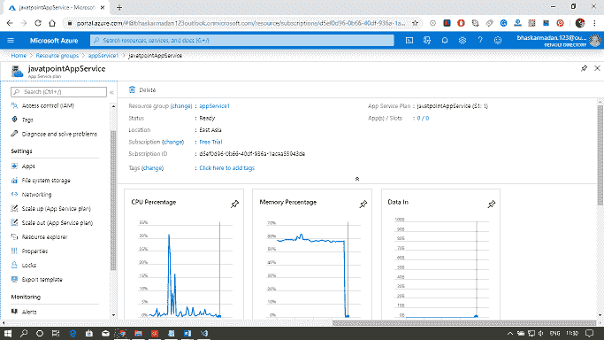
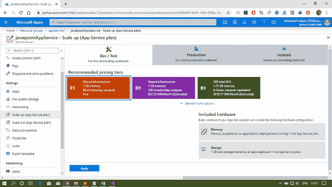
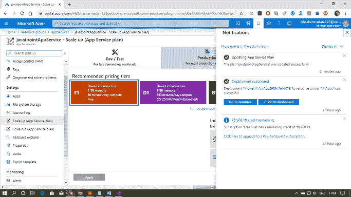

# Azure 应用服务备份

> 原文：<https://www.javatpoint.com/azure-app-service-backup>

应用服务备份和扩展比虚拟机备份和扩展简单得多。应用内备份和恢复功能服务让我们能够快速创建应用备份。这个应用程序服务的备份也将包含应用程序配置、文件内容，以及可选的连接到我们应用程序的数据库。我们可以在应用服务的同时提供支持。应用服务将包含以下备份信息:

*   应用程序配置
*   文件内容
*   数据库连接到我们的应用程序

我们有几种方法可以进行备份:

*   用手
*   基于调度的自动化
*   部分备份

备份将存储在存储帐户中。在恢复方面，我们可以使用备份按需将带有链接数据库的应用程序恢复到以前的状态，或者我们可以使用该应用程序备份创建一个新的应用程序。备份及其恢复仅适用于在标准层和高级层运行的应用程序。

## 缩放比例

我们可以通过两种方式扩展应用服务。

**扩展:**这意味着我们可以获得更多的 CPU、内存、磁盘空间，以及一项额外的功能，如专用虚拟机、自定义域、证书、分段插槽、自动扩展和许多其他功能，这些功能基于我们在扩展应用服务计划时选择的定价层。

**横向扩展:**这意味着我们将增加运行我们应用程序的虚拟机实例数量，以便我们可以根据定价层横向扩展到任意数量的实例。但是，如果我们在一个隔离的层中使用应用服务环境，那么我们可以扩展到 100 个实例。

除此之外，关于缩放，我们需要记住的另一件重要的事情是自动缩放。我们可以通过多种方式扩展我们的应用服务。

*   自动地
*   用手
*   预设矩阵
*   预定的

## 使用 Azure 门户扩展应用服务

**步骤 1:** 打开您已经创建的应用服务或创建一个新的应用服务。

**第二步:**现在，点击左侧工具栏上的放大。

**步骤 3:** 选择定价等级，然后点击应用。

**第 4 步:**它已成功部署，同样，您可以根据一些预定义的条件向外扩展并将其设置为自动扩展。

* * *