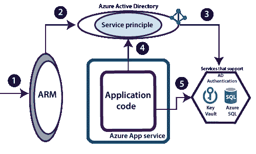
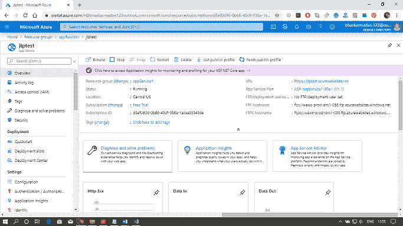
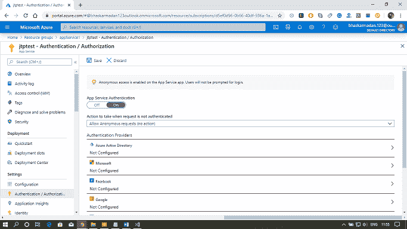
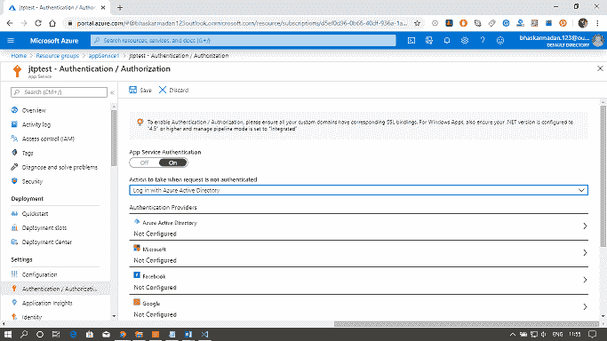
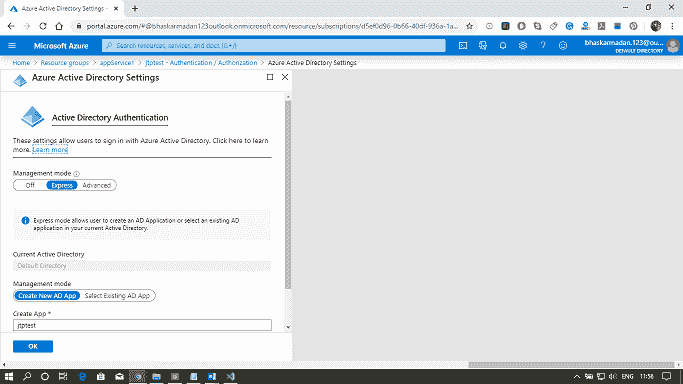
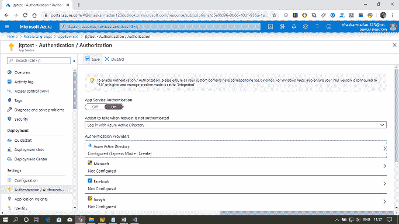

# Azure 应用服务安全性

> 原文：<https://www.javatpoint.com/azure-app-service-security>

**认证和授权:**每个 app 服务都附带一个认证和授权模块，为我们的 App 处理几件事情。

*   它将向指定的提供商(如脸书、谷歌、推特、Azure 活动目录等)认证用户。
*   它将存储、验证和刷新令牌。
*   它还管理经过身份验证的会话。
*   它将身份信息注入请求头。

## 身份验证和授权的工作原理

首先，来自客户端浏览器的请求将到达应用服务前端。然后，该请求将被转发到身份验证和授权模块。认证模块将包括所有的授权和认证逻辑，包括令牌管理和会话管理等。，它位于 web 应用程序代码之外。这就是为什么我们不需要在 web 应用程序之间更改代码，就可以在 Azure 中为我们的应用程序启用身份验证和授权。在跟踪方面，我们可以使用环境变量稍微影响一下身份验证和授权逻辑。

身份验证和授权模块为我们的应用程序处理几件事:

*   使用指定的提供程序验证用户
*   验证、存储和刷新令牌
*   管理经过身份验证的会话
*   将身份信息注入请求头
*   日志记录和跟踪

## 其他安全领域

对于应用服务，我们还需要了解其他安全领域，我们可以利用这些领域。

*   **ISO、SOC、PCI 投诉:**如果我们在处理信用卡信息，底层环境是 PCI 兼容的，但同时你要从应用层角度去争取 PCI 的兼容。但是，从环境的角度来看，微软 Azure 应用服务是符合 PCI 的
*   **IP 地址白名单:**如果我们想将触发限制在我们的 app 服务上，形成一个特定的可信 IP 地址，那么我们可以在 Azure 门户中为我们的 App 服务白名单。
*   **SSL 通信:**为了在传输时加密数据，我们可以启用 SSL 通信。

## 托管服务标识

此服务最近被添加到 Azure。我们在这里要做的是为我们的应用程序创建一个身份，并为该身份提供对不同服务的访问。通过这样做，我们不需要存储任何用户标识密码来访问某些 Azure 服务。我们通常会去 Azure 门户网站，告诉 ARM 为您的 Azure 应用服务创建托管服务标识。当我们触发它时，Azure 活动目录中会创建一个服务原则。

示例-如果我们想从 Azure 密钥库中访问一个秘密。通过提交该令牌并在 Azure 密钥库中定义适当的访问策略，我们的应用程序代码将能够在运行时检索秘密并使用该秘密来访问内部资源。

## 应用服务环境安全性

如果我们使用的是应用服务环境，那么我们将在安全性方面获得额外的好处。

*   **网络安全组:**我们可以与网络安全组关联，并使用网络安全组控制进入我们的 App 服务的流量。
*   **网络应用防火墙:**它是应用网关的一项功能，为您的网络应用提供集中保护，防止常见漏洞和漏洞。web 应用程序防火墙基于 OWASP 核心规则集 3.0 或 2.2.9 中的规则

## 为网络应用程序启用 Azure 活动目录身份验证

**第一步:**打开你的 API App，点击认证/授权。

**第二步:**点击显示开关开/关的切换按钮。打开它。

**步骤 3:** 现在选择当请求未通过“使用 Azure Active Directory 登录”身份验证时要采取的操作

**步骤 4:** 现在，用快速模式配置 Azure Active Directory。之后，点击创建，然后点击保存。

* * *