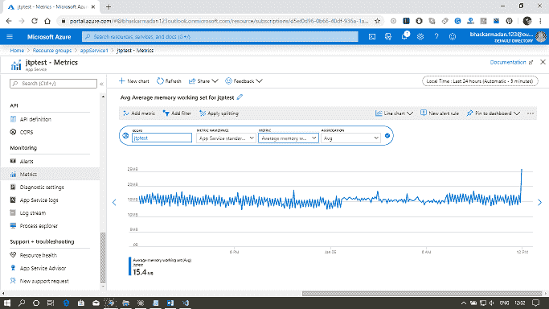
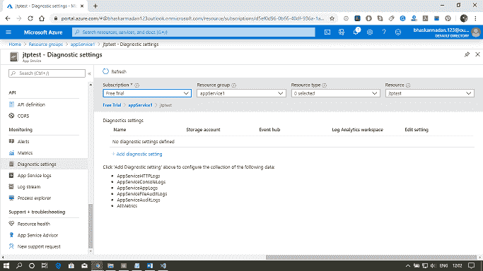
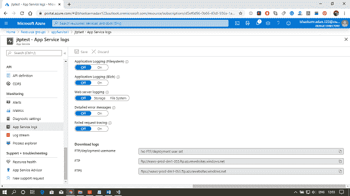

# Azure 应用服务监控

> 原文：<https://www.javatpoint.com/azure-app-service-monitoring>

微软提供不同的功能来监控我们的应用服务。

## 定额

应用程序服务中托管的应用程序在它们可以使用的资源上受到某些限制。边界由与应用程序相关联的应用程序服务计划定义。当我们创建应用服务计划时，我们通常会选择定价级别和规模。根据规模和定价层，我们将被分配一定数量的 CPU 和一定数量的内存。免费或共享应用的配额如下。

*   中央处理器(短)
*   中央处理器(日)
*   记忆
*   带宽
*   文件系统-适用于基本、标准和高级计划

根据我们在订阅中创建的应用服务计划数量，适用于托管在基本、标准和高级计划上的应用的唯一配额是文件系统。

## 韵律学

指标提供关于应用或应用服务计划行为的信息。因此，度量是在两个级别提供的。

*   一个是应用程序服务计划级别，包括中央处理器和内存百分比、数据输入和输出、磁盘队列长度和 HTTP 队列长度。
*   在应用程序级别提供的第二级指标，包括平均响应时间、平均内存工作集、CPU 时间、数据输入和输出等。所有这些指标都是必不可少的。当我们寻求应用洞察时，有很多可用的指标，这是一种高级监控工具，我们可以使用它来监控网络应用。

粒度和保留

*   分钟粒度:这些指标保留 30 小时。
*   小时粒度:这些指标保留 30 天。
*   日粒度:这些指标保留 30 天。

但是，如果我们使用应用洞察，那么这种保留将会急剧增加。

## 诊断学

App service web 应用程序为记录来自 web 服务器和 web 应用程序的信息提供了诊断功能。这些在逻辑上分为 web 服务器诊断和应用程序诊断。

**Web 服务器诊断:**在这里，我们可以有一个详细的错误日志，是任意的 Http 400，上面的错误都会被记录下来。我们还可以查看日志。第二件事是失败的请求跟踪，它基本上包含用于处理我们的请求的 IIS 组件的跟踪。第三个是网络服务器日志。这些是我们收到多少 Http 请求的总体指标，并且来自一个特定的 IP 地址。

**应用诊断:**它允许我们捕捉网络应用产生的信息。因此，如果我们使用系统诊断跟踪，所有信息都将由应用程序诊断提供。

诊断信息可以存储在文件系统或 Azure 存储中。

## 流日志

在应用程序的开发过程中，以接近实时的方式查看日志信息通常很有用。我们可以使用 Azure PowerShell 或 Azure 命令行界面将日志信息流式传输到我们的开发环境中。

这些是我们需要用来流式传输日志文件的基本命令。

*   使用 Azure PowerShell 进行流式传输
    *   get-AzureWebSiteLog-Name web app Name-Tail
    *   get-AzureWebSitelog-Name web app Name-Tail-消息错误
*   使用 Azure 命令行界面进行流式传输
    *   az webapp 日志尾名-web app name-资源组 myResourceGroup
    *   az webapp 日志尾-名称 web app name-资源-组 my resourcegroup-筛选器错误

* * *