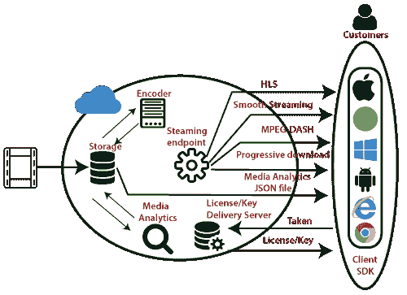
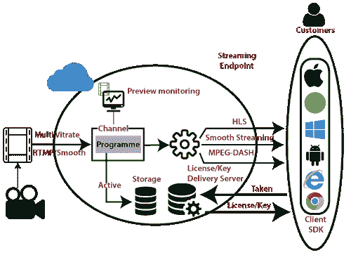

# Azure媒体服务

> 原文：<https://www.javatpoint.com/azure-media-service>

它是一个可扩展的基于云的平台，使开发人员能够构建可扩展的媒体管理和交付应用程序。例如，如果我们想开发一个像 DailyMotion 这样的应用程序，那么我们可以通过使用微软 Azure 媒体服务来实现。

Azure 媒体服务基于 REST APIs，使我们能够安全地上传、存储、编码和包装视频或音频内容，以便向各种客户端进行点播和直播。这些客户端可以是电视、电脑和移动设备。

## 媒体服务概念

*   **资产:**资产包含数字文件和关于这些文件的元数据。这些文件可以是音频、视频或图像等。
*   **资产文件:**包含媒体文件的元数据。
*   **访问策略:**它定义了访问资产的权限和持续时间。
*   **定位器:**它提供了一个入口点来访问资产中包含的文件。
*   **作业:**用于处理一个音频/视频演示。
*   **频道:**负责处理直播流内容。它提供了一个输入端点，该端点被提供给实时代码转换器。
*   **程序:**它使我们能够控制直播流中片段的发布和存储。
*   **流媒体端点:**它代表一种传递内容的流媒体服务。

## 媒体服务的架构

*   **按需交付:**在这种情况下，首先我们将高质量的媒体文件上传到资产中，然后我们将其编码为一组读取 MP4 文件的自适应位。之后，我们配置资产交付策略。资产交付政策告诉媒体服务，我们希望如何使用哪种协议交付我们的资产。现在，我们将通过创建按需定位器来发布资产，并流式传输发布的内容。

*   **直播:**我们可以使用各种直播协议播放直播内容。我们可能会将我们的流编码成一个采用的位读取流。我们也可以预览我们的直播流。最后，我们可以通过常见的流协议(如 Smooth、HLS 等)来传递内容。

## 蓝色搜索

Azure Search 是一种云搜索即服务，它使我们能够使用简单的 REST API 或向应用程序添加强大的搜索体验。NET 软件开发工具包，而不需要管理搜索基础设施。

### 天蓝色搜索的特点

*   强大的查询
*   多语言支持
*   搜索建议
*   点击高亮显示
*   多面导航

以上是与 Azure 搜索相关的不同功能。以防万一，如果我们想要一个基于云的搜索引擎，我们可以嵌入到我们的网络应用程序中。Azure 提供了一项名为 Azure Search 的服务。

* * *