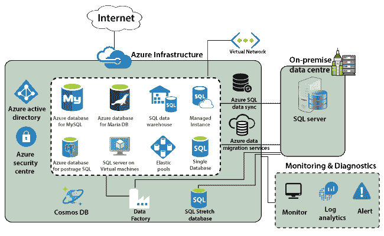

# Azure 数据库服务

> 原文：<https://www.javatpoint.com/azure-database-service>

Azure 中可用的基本构建块是 SQL 数据库。微软在 Azure 上以多种方式提供这种 SQL 服务器和 SQL 数据库。我们可以部署单个数据库，也可以部署多个数据库作为共享弹性池的一部分。

## Azure数据库服务架构

微软推出了一个面向内部客户的托管实例。因此，如果我们的内部数据中心中有一些 SQL 数据库，并且我们希望将该数据库迁移到 Azure 中，而没有任何复杂的配置或模糊性，那么我们可以使用托管实例。因为这主要面向希望以最少的努力和优化的成本将其内部数据库提升并共享到 Azure 中的内部客户。我们还可以利用我们内部数据中心的许可。

微软将负责维护修补和相关服务。但是，如果我们想为 SQL server 使用 IaaS 服务，那么我们可以在 Azure 虚拟机上部署 SQL Server。如果数据依赖于底层平台，并且我们想要登录到 SQL server，在这种情况下，我们可以在虚拟机上使用 SQL Server。

我们可以在云上部署一个 SQL 数据仓库。Azure 为不同类型的数据库提供了许多其他数据库服务，如 MySQL、Maria DB 以及 PostgreSQL。一旦我们将数据库部署到 Azure 中，我们需要将数据迁移到其中或将数据复制到其中。

**用于数据迁移的 Azure 数据库服务**

Azure 中可用的服务，我们可以使用这些服务将数据从我们的内部 SQL Server 迁移到 Azure 中。

**Azure 数据迁移服务:**用于将数据从我们现有的 SQL server 和内部数据中心内的数据库迁移到 Azure 中。

**Azure SQL 数据同步:**如果我们想将内部数据库中的数据复制到 Azure 中，那么我们可以使用 Azure SQL 数据同步。

**SQL Stretch 数据库:**用于将冷数据迁移到 Azure 中。SQL 扩展数据库与其他数据库产品有点不同。它作为一个混合数据库工作，因为它将数据分为不同的类型——热的和冷的。热数据将保存在内部数据中心，冷数据将保存在 Azure 中。

**数据工厂**

它用于 ETL 转换、提取加载等。使用数据工厂，我们甚至可以从内部数据中心提取数据。我们可以进行一些转换，并将其加载到 Azure SQL 数据库中。数据工厂是一个在云上提供的 ETL 工具，我们可以使用它来连接到不同的数据库，提取数据，转换数据，并加载到一个目的地。

**安全**

Azure 中存在的所有数据库都需要得到保护，我们还需要接受来自已知来源的连接。为此，所有这些数据库服务都带有防火墙规则，在这些规则中，我们可以配置允许连接的特定 IP 地址。我们可以定义这些防火墙规则来限制连接数，并减少表面攻击区域。

**宇宙 DB**

Cosmos DB 是一个 NoSQL 数据存储，可在 Azure 中使用，它被设计为全球可扩展，并且具有极高的可用性和极低的延迟。微软用宇宙数据库保证读写延迟。例如，如果我们有任何应用程序，如物联网、游戏，我们从遍布全球的不同用户那里获得大量数据，那么我们将选择宇宙数据库。因为宇宙数据库设计为全球可扩展和高可用性，因此我们的用户将体验到低延迟。

最后，有两件事，一是我们需要确保所有服务的安全。为此，我们可以将所有这些服务与 Azure Active Directory 集成，并管理来自 Azure Active Directory 的用户。为了监控所有这些服务，我们可以使用安全中心。也有一个单独的监控工具，但是 Azure 安全中心将继续监控所有这些服务，并在出现问题时提供建议。

* * *