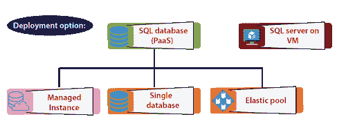
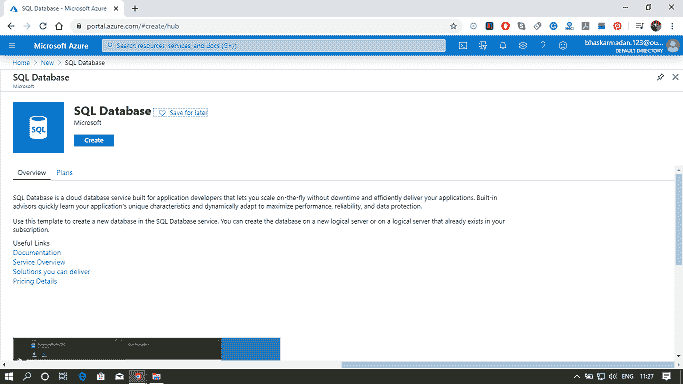
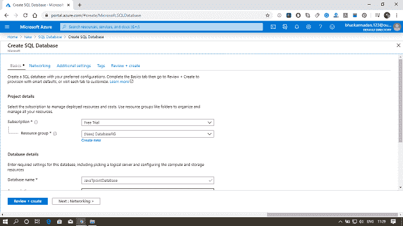
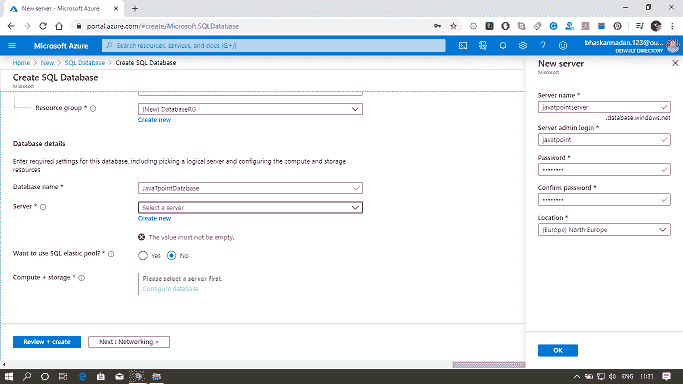
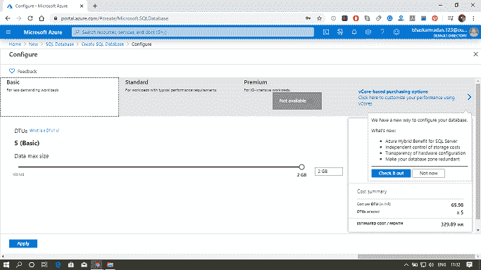
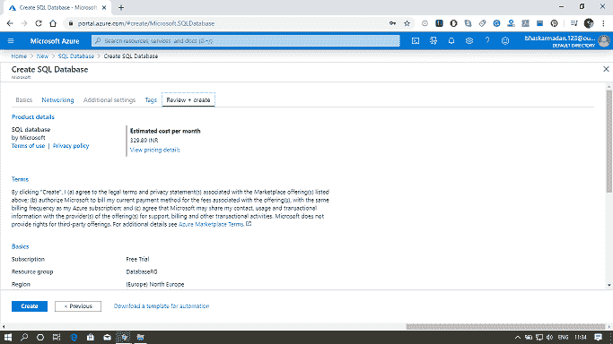
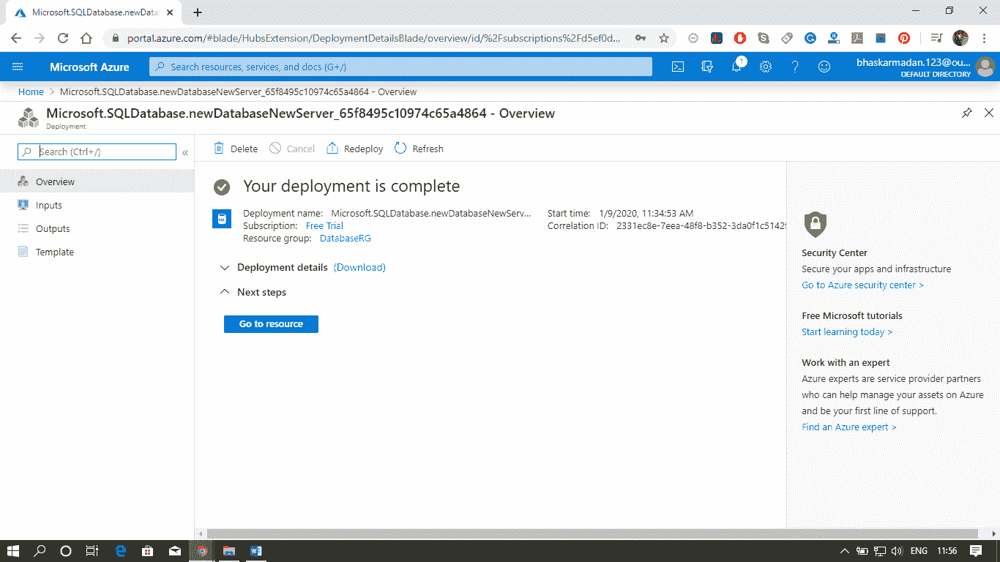

# 蓝色数据库

> 原文：<https://www.javatpoint.com/azure-sql-database>

SQL 数据库是微软在数据库领域的旗舰产品。它是一个通用的关系数据库，支持像关系数据这样的结构——JSON、空间和 XML。Azure 平台完全管理每个 Azure SQL 数据库，并保证没有数据丢失和高百分比的数据可用性。Azure 自动处理修补、备份、复制、故障检测、潜在的底层硬件、软件或网络故障、部署错误修复、故障转移、数据库升级和其他维护任务。

有三种方法可以实现我们的 SQL 数据库

*   **托管实例:**这主要针对内部客户。在这种情况下，如果我们的内部数据中心已经有了一个 SQL server 实例，而您希望将它迁移到 Azure 中，同时对我们的应用程序进行最小的更改并实现最大的兼容性。那么新的将用于托管实例。
*   **单个数据库:**我们可以在 Azure 上部署单个数据库，通过逻辑服务器管理它自己的一组资源。
*   **弹性池:**我们可以部署一个数据库池，通过逻辑服务器管理一组共享资源。

我们可以将 SQL 数据库部署为基础架构即服务。这意味着我们希望在 Azure 虚拟机上使用 SQL 服务器，但在这种情况下，我们负责管理该特定 Azure 虚拟机上的 SQL 服务器。

### 采购模式

我们有两种方法可以在 Azure 上购买 SQL Server。

*   **VCore 采购模式:**基于 VCore 的采购模式使我们能够独立扩展计算和存储资源，匹配内部性能，并优化价格。它还允许我们选择一代硬件。它还允许我们为 SQL Server 使用 Azure 混合优势来节省成本。最适合重视灵活性、控制力和透明度的客户。
*   **DTU 模型:**它基于对计算、存储和 IO 资源的捆绑度量。计算的大小用单个数据库的数据库事务单位和弹性池的弹性数据库事务单位来表示。这种模式最适合想要简单、预配置资源选项的客户。

### Azure数据库服务层

*   **通用/标准模型:**它基于计算和存储服务的分离。这种体系结构模型依赖于 Azure Premium Storage 的高可用性和可靠性，它透明地复制数据库文件，并保证在底层基础架构发生故障时零数据丢失。
*   **业务关键/高级服务层模型:**它基于一组数据库引擎进程。SQL 数据库引擎进程和底层 mdf/ldf 文件都放在同一个节点上，本地连接的固态硬盘存储为我们的工作负载提供了低延迟。高可用性是使用类似于 SQL Server 始终在线可用性组的技术实现的。
*   **超大规模服务层模型:**它是基于 vCore 的采购模型中最新的服务层。该层是一个高度可扩展的存储和计算性能层，它利用 Azure 体系结构来扩展存储，并为 Azure SQL 数据库计算超出通用和关键业务服务层可用限制的资源。

### SQL 数据库逻辑服务器

*   它充当多个单一或池数据库登录、防火墙规则、审核规则、威胁检测策略和故障转移组的中央管理点。
*   在我们可以创建 Azure SQL 数据库之前，它必须存在。服务器上的所有数据库都是在与逻辑服务器相同的区域内创建的。
*   SQL 数据库服务不保证数据库相对于其逻辑服务器的位置，也不公开实例级访问或功能。
*   Azure 数据库逻辑服务器是数据库、弹性池和数据仓库的父资源。

### 弹性水池

*   对于扩展和管理多个数据库来说，这是一个简单且经济高效的解决方案。弹性池中的数据库位于单个 Azure SQL 数据库服务器上，并以固定价格共享一组资源。
*   我们可以基于基于 DTU 的采购模式或基于 vcenter 的采购模式来配置资源池。
*   池的大小始终取决于池中所有数据库所需的聚合资源。它确定以下选项:
    *   数据库在池中使用的最大资源。
    *   数据库在池中使用的最大存储字节数。

### 使用 Azure 门户创建 Azure SQL 数据库

**第一步:**点击*创建资源*并搜索 SQL 数据库。然后点击创建。

**第二步:**填写所有需要的细节。

**第三步:**选择一台服务器或新建一台，如下图所示。

**第 4 步:**现在，点击计算+存储选择定价层，如下图所示。

**第 5 步:**之后，点击查看+创建，为你的应用程序创建 SQL 数据库。

**第 6 步:**您的 SQL 数据库现在已经创建，现在单击前往资源为您的数据库配置附加设置。

* * *