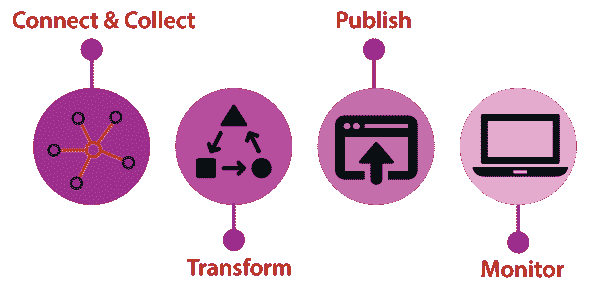
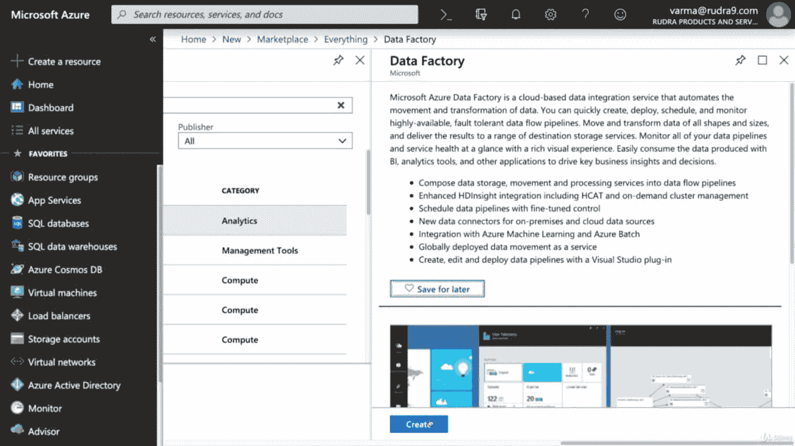
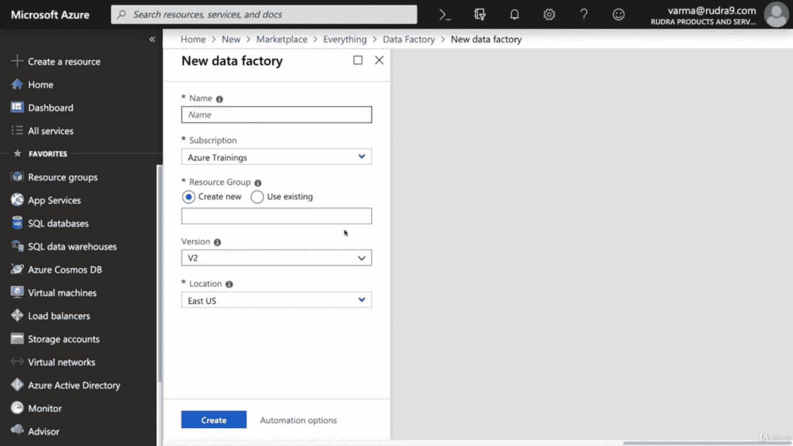
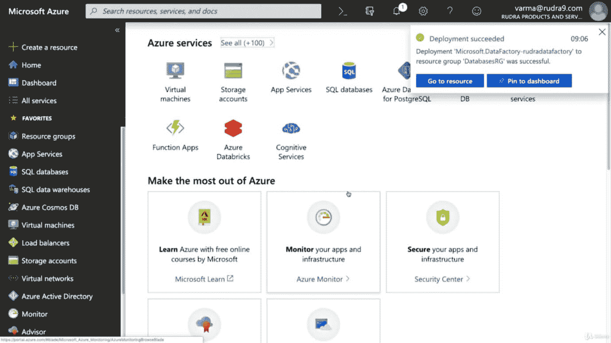
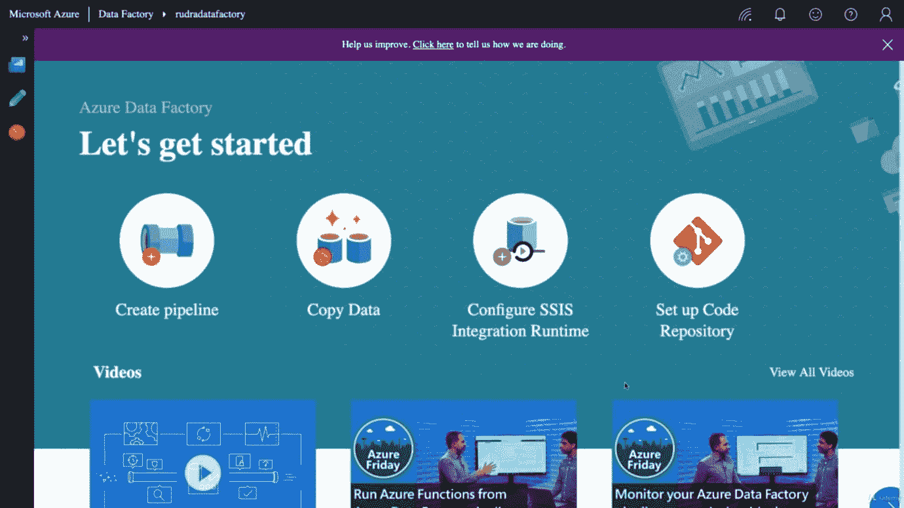

# Azure 数据工厂

> 原文：<https://www.javatpoint.com/azure-data-factory>

Azure 数据工厂是一项基于云的数据集成服务，允许我们在云中创建数据驱动的工作流，用于编排和自动化数据移动和数据转换。数据工厂是云上一个完美的 ETL 工具。数据工厂旨在云中提供提取、转换和加载过程。ETL 过程通常包括四个步骤:

1.  **连接&收集:**我们可以使用数据管道中的复制活动来移动内部和云源数据存储中的数据。
2.  **转换:**一旦数据出现在云中的集中式数据存储中，就可以使用计算服务(如 HDInsight Hadoop、Spark、Data Lake Analytics 和机器学习)来处理或转换收集的数据。
3.  **发布:**将原始数据细化为业务就绪的可消耗形式后，加载到 Azure 数据仓库、Azure SQL 数据库、Azure Cosmos DB 等。
4.  **Monitor:** Azure 数据工厂通过 Azure 门户上的 Azure Monitor、API、PowerShell、日志分析和健康面板，内置了对管道监控的支持。

## 数据工厂的组件

数据工厂由四个关键元素组成。所有这些组件共同提供了一个平台，在这个平台上，您可以用移动和转换数据的结构形成一个数据驱动的工作流。

*   **管道:**一个数据工厂可以有一个或多个管道。它是执行一个工作单元的活动的逻辑分组。管道中的活动一起执行任务。例如，管道可以包含一组活动，这些活动从 Azure blob 中获取数据，然后在 HDInsight 集群上运行 Hive 查询来对数据进行分区。
*   **活动:**表示流水线中的一个处理步骤。例如，我们可以使用复制活动将数据从一个数据存储复制到另一个数据存储。
*   **数据集:**它表示数据存储中的数据结构，数据结构指向或引用我们希望在活动中用作输入/输出的数据
*   **链接服务:**它就像连接字符串，定义了数据工厂连接外部资源所需的连接信息。链接服务可以是数据存储和计算资源。链接服务可以是数据存储的链接，也可以是计算机资源的链接。
*   **触发器:**它表示确定何时需要禁用管道执行的处理单元。我们还可以将这些活动安排在某个时间点执行，并且可以使用触发器来禁用某个活动。
*   **控制流:**它是管道活动的编排，包括按顺序链接活动、分支、在管道级别定义参数，以及在按需或从触发器调用管道时传递参数。我们可以使用控制流对某些活动进行排序，还可以定义需要为每个活动传递哪些参数。

### 使用 Azure 门户创建 Azure 数据工厂

**步骤 1:** 单击创建资源并搜索数据工厂，然后单击创建。

**步骤 2:** 提供数据工厂的名称，选择资源组，并选择要部署数据工厂的位置和版本。

**第三步:**填写完所有细节后，点击创建。

Azure 数据工厂有一个完全不同的门户，如下图所示。

* * *