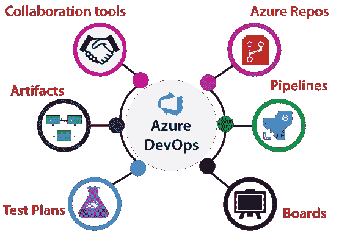
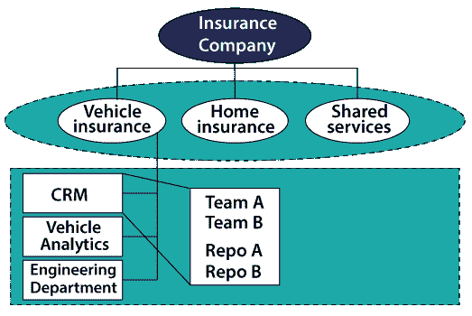
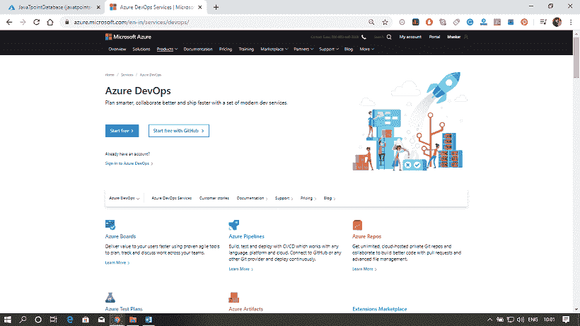
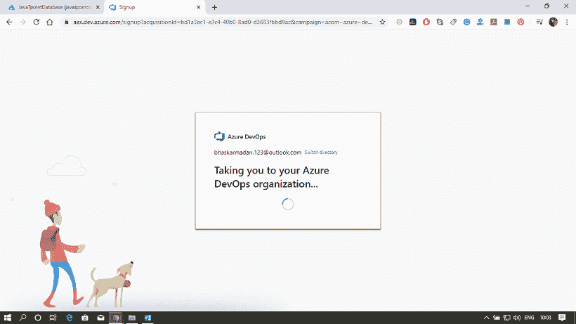
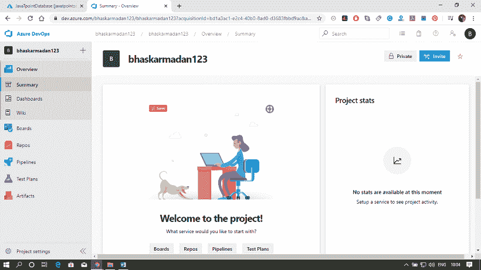
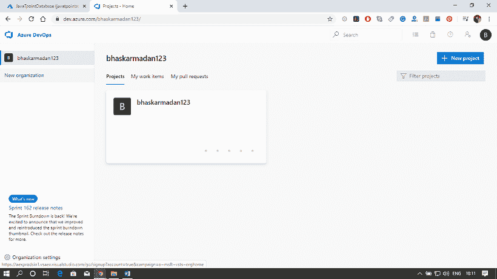
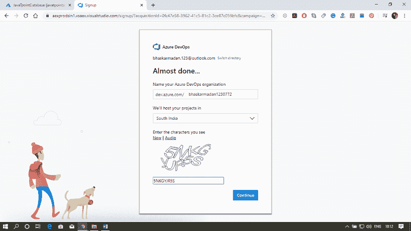
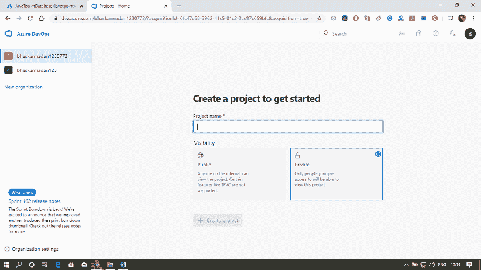
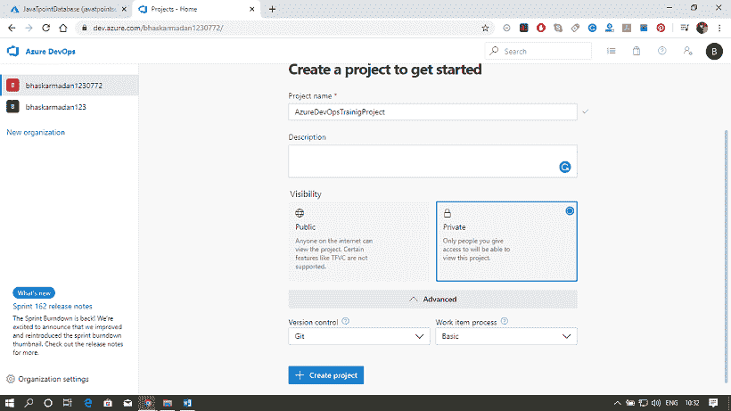
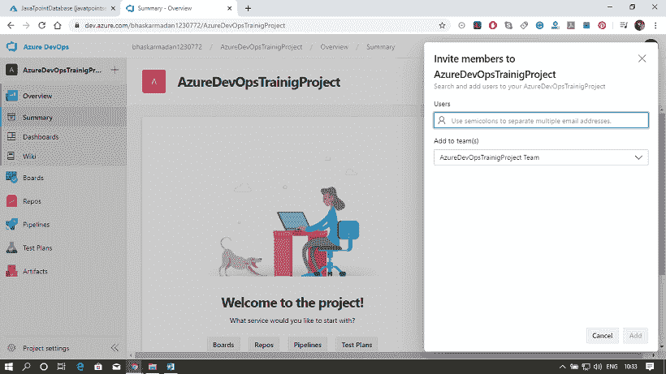

# Azure DevOps

> 原文：<https://www.javatpoint.com/microsoft-azure-devops>

Azure DevOps 提供开发人员服务，以支持团队规划工作、协作代码开发、构建和部署应用程序。

*例如-* 我们有一个非常简单的应用程序，只有开发人员可以对该应用程序进行更改。一旦更改完成，应用程序将被提交测试，一旦测试成功，它将被发布到生产中。然而，如果我们的应用程序是一个具有多个模块的非常复杂的应用程序，并且我们有不同的开发人员致力于增强应用程序中的各种模块。然后，合并不同开发人员所做的更改，并通过测试最终构建应用程序并将应用程序部署到生产环境中，这将变得非常复杂。开发人员越多，过程就越复杂；正是这种复杂性可以使用 Azure DevOps 来解决。我们可以使用 Azure DevOps 将基础设施和代码都部署到 Azure 中。

## Azure 开发平台的服务

Azure DevOps 有许多服务，我们可以利用这些服务来管理我们的代码开发、构建应用程序、部署应用程序，以及让我们的开发人员进行协作。

*   **Azure Repository:** 它是一套我们可以用来管理代码的版本控制工具。我们可以使用 Git 存储库或 team foundation 版本控制来对我们的代码进行源代码控制。在 Azure 存储库中，我们可以创建多个分支，每个分支代表一个版本的代码，并且我们可以向特定的开发人员提供对特定分支的访问。
*   **Azure 管道:**是全功能的持续集成和持续交付服务。它与我们首选的 Git 提供商合作，可以部署到大多数主要的云服务，其中也包括 Azure 服务。使用 Azure 管道，我们可以定义一个构建管道来构建我们的代码，还可以定义一个发布管道来将代码发布到特定的目的地。
*   **Boards:** 它提供了一套丰富的功能，包括对 Scrum 和看板的本机支持、可定制的仪表板和集成报告。我们可以创建不同的活动，跟踪活动，并且我们可以在不同的桶之间移动活动，如敦桶、积压桶、进行中桶等。
*   **测试计划:**它提供了基于浏览器的测试管理解决方案，具备计划的手动测试、探索性测试等所需的所有功能。
*   **工件:**这一点非常重要，因为我们大部分的应用都会对不同的包有一定的依赖，比如 NuGet 包、npm、Maven 包等。它还支持通用包，可以存储任何文件或文件集。
*   **协作工具:**它包括一个可定制的团队仪表板，带有可配置的小部件，用于共享信息进度和趋势。我们可以创建维基包来共享信息，也可以配置一些通知。

## DevOps 的结构

**组织:**Azure DevOps 中的组织是组织和连接相关项目组的机制。例如，业务部门、区域部门或其他企业结构。

**项目:**一个项目在 Azure DevOps 中包含以下一组特性:

*   敏捷规划的板和积压
*   持续集成和部署的管道。
*   它包含版本控制、源代码管理和工件的存储库。
*   它在整个项目生命周期中保持持续的测试集成。

## Azure 开发门户

Azure DevOps 门户是一个集中式门户，我们可以在其中管理所有 Azure DevOps 服务。我们需要在 Azure 门户上创建一个帐户来利用所有的设施。出于培训目的，我们将接受免费服务。要创建 Azure 门户、组织和项目，请仔细遵循以下步骤。

**第一步:**前往[https://Azure.microsoft.com/en-in/services/devops/](https://Azure.microsoft.com/en-in/services/devops/)点击 ***开始免费*** 。

**第二步:**之后会要求你填写细节和区域。填写详细信息，然后单击下一步。

**步骤 3:** 您的 Azure DevOps 帐户已创建。现在，我们将创建一个组织，并在组织内部创建一个项目。

**第四步:**点击 ***新组织*** 。

**第 5 步:**为您的组织提供一个名称，并选择您希望托管您的组织的位置。

**第 6 步:**您的组织已经创建。在这里，您将看到“创建项目”页面。

**第 7 步:**为您的项目提供一个名称。之后，点击 ***高级、*** 然后选择版本控制和工作项流程。

**第八步:**最后，点击 ***创建项目*** 按钮。您的项目已经创建。现在，您可以邀请成员参加您的项目。

* * *