# Azure DevOps 存储库

> 原文：<https://www.javatpoint.com/azure-devops-repository>

Azure Repository 是一组我们可以用来管理代码的版本控制工具。如果我们对版本控制是全新的，那么版本控制使我们能够跟踪我们在代码中所做的更改。市场上有很多软件可以对我们的代码进行版本控制。我们可以使用版本控制系统来跟踪每个开发人员所做的每个变更，安全地合并它们，测试变更，并将变更发布到产品中。

Azure Repos 中有两种类型的版本控制。

*   **Git:** 是分布式版本控制。
*   **Team Foundation 版本控制:**是集中的版本控制。

## 蓝色休息概念

1.  **存储库:**存储库是我们代码的位置，由版本控制管理。它支持 Git 和 TFVC，因此我们可以在单个项目中创建多个存储库，并为每个存储库创建不同的分支。
2.  **分支:**分支是一个轻量级的引用，它保存了提交的历史记录，并提供了一种将某个特性或错误修复的更改与我们的主分支和其他工作隔离开来的方法。
3.  **分支策略:**它是 Git 工作流的重要组成部分。我们用它们来帮助保护关键的分支是我们作为主人的发展。
4.  **拉取和克隆:**通过克隆创建现有 Git repo 的完整本地副本。pull 命令用远程存储库中的代码更新本地存储库中的代码。
5.  **推送和提交:**提交是保存到我们本地存储库中的一组更改。我们可以通过推送将这些更改共享给远程存储库。
6.  **Fork:**Fork 是存储库的完整副本，包括所有文件提交和(可选的)分支。
7.  **Git:** Git 是一个分布式版本控制系统。我们的本地代码副本是一个完整的版本控制存储库，使离线或远程工作变得容易。
8.  **通知:**使用通知，每当工作项、代码审查、拉取请求、源代码控制文件和构建发生任何变化时，我们都会收到一封电子邮件。
9.  **项目:**项目提供了一个场所，一群人可以在这里计划、跟踪进度，并协作构建软件解决方案。
10.  **团队:**一个团队对应一组选定的项目成员。有了团队，组织可以对工作进行子分类，以便更好地关注他们在项目中跟踪的所有工作。

## 将 ARM 部署项目发布到 DevOps 中

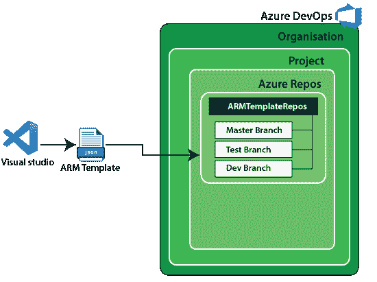

**第一步:**打开 Visual Studio，点击 ***新建项目*** 。

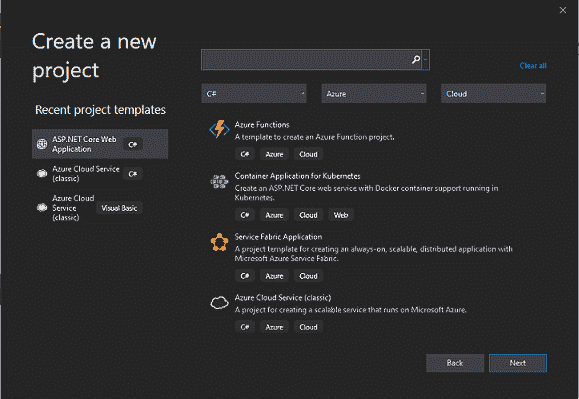

**第二步:**现在，搜索 ***Azure资源群*** 。然后选择它并点击下一步。

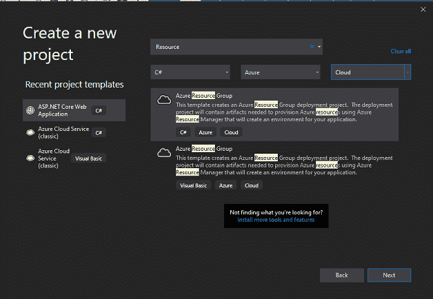

**第三步:**配置你的新项目，点击 ***创建*** 。

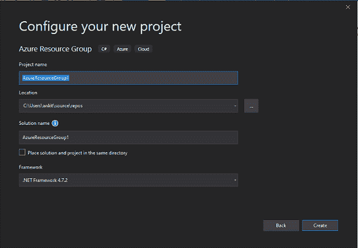

**第 4 步:**从 Visual Studio 中可用的 Azure 模板中选择**网络应用程序**。

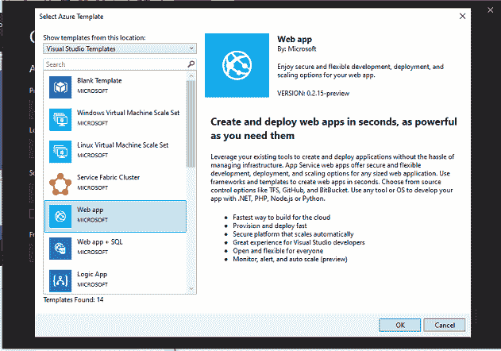

**第五步:**点击*网站. json 文件，*然后你会在左侧的文件浏览器中找到可用的资源。

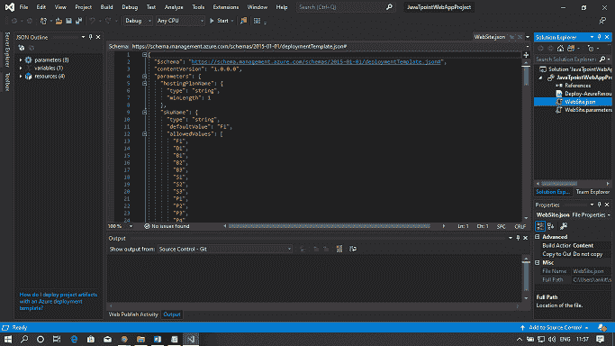

**步骤 6:** 现在，从文件中删除*【appinsight component】*资源。因为我们现在不需要这项服务。

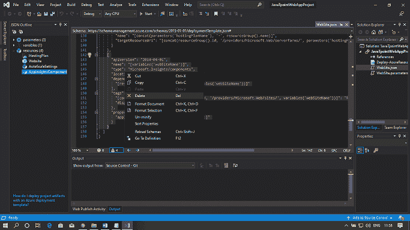

**第 7 步:**要将此代码发布到 Azure DevOps 门户，请将此解决方案添加到源代码管理中。然后右键单击解决方案，然后单击 ***将解决方案添加到源代码管理*** 。

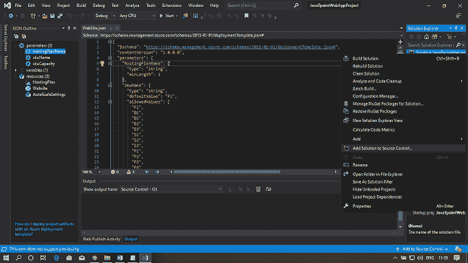

**步骤 8:** 新的 git 存储库已经创建。您可以在输出窗口中看到该消息。

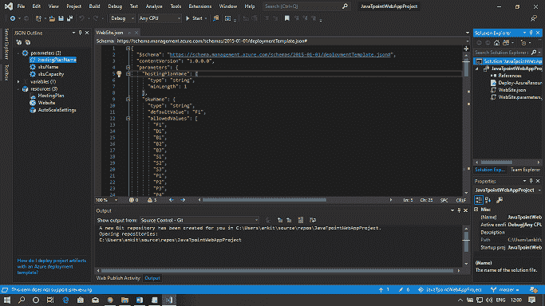

**第九步:**点击如下图所示的 ***团队资源管理器*** ，然后在下拉菜单中右键选择同步。

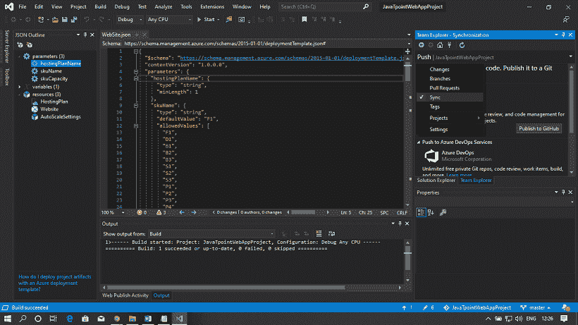

**第十步:**现在，点击 ***发布 Git Repo*** 按钮，在 Azure DevOps 组织中发布该项目。

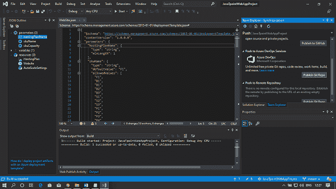

**第 11 步:**在 Azure DevOps 门户中选择要将这个 git 存储库推送到的项目和存储库。最后，点击 ***发布知识库*** 。

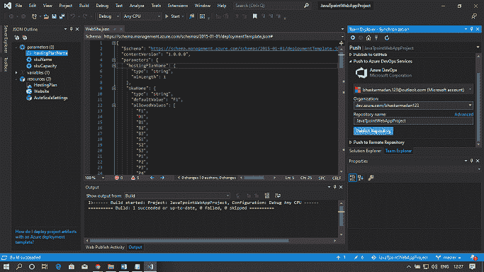

**第 12 步:**要查看您的存储库，请打开 Azure DevOps 门户。浏览您在发布过程中选择的组织。单击“重新发布”查看文件。

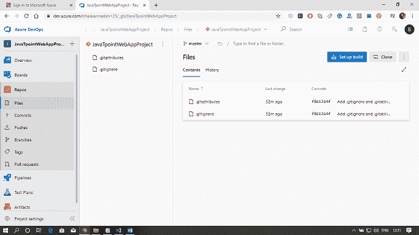

**步骤 13:** 要查看与您的存储库相关联的分支，请单击分支。这里我们现在只有一个分支，这是默认的主分支。

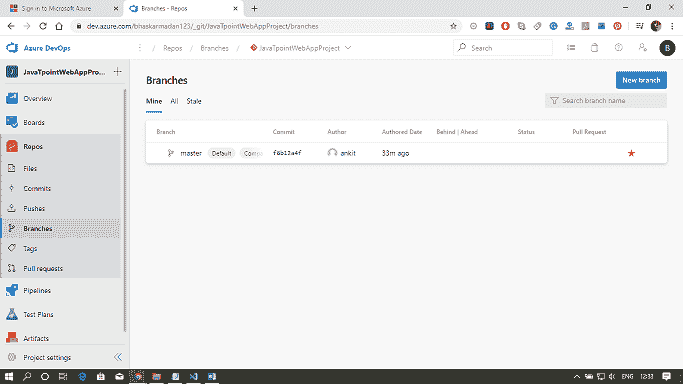

* * *