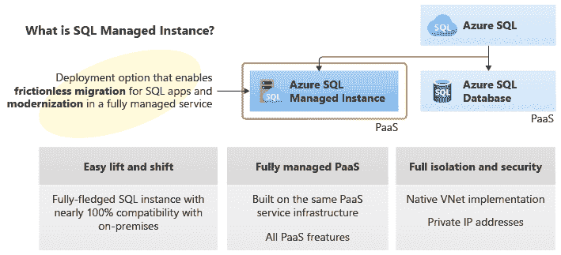

# 什么是微软 Azure 实例？

> 原文：<https://www.javatpoint.com/what-is-microsoft-azure-instance>

## 什么是 Azure？

与[亚马逊网络服务(AWS)和谷歌云类似，Azure](https://www.javatpoint.com/aws-vs-azure-vs-google-cloud-platform) 是微软对他们在公有云和私有云购买的房产的称呼。

云计算通常意味着您的组织将不再托管自己的基础架构。

Azure 提供了大量服务，例如部署 web 应用程序、支持远程应用程序访问、内容分发以及访问它们的 API。数据存储保证了大型项目的安全性；分析支持实时数据分析；网络提供流量管理和负载平衡，以及对加密密钥和敏感资产的保护。

## Azure 虚拟机的意义是什么？

简而言之，我们可以说，一个[微软 Azure](https://www.javatpoint.com/microsoft-azure) 虚拟机或者说 Azure 虚拟机，是一个数字文件，它模拟了一台物理的、固定的计算机的行为。在虚拟机上工作时，感觉我们在独立的基础架构上工作。

换句话说，我们可以说这是一台主要由另一台计算机制造的计算机。它在我们的浏览器中运行，给我们带来了与使用传统主机操作系统相同的体验。

沙盒与 Azure 虚拟机非常相似，它是与我们的软件资产的其余部分隔离的虚拟机。

## 关于 Azure 实例

简单地说，我们可以说虚拟机就是 Azure 中的一个实例。微软 Azure 网站是一个高密度的多租户平台。根据 TechTarget 的文章《多租户》，多租户指的是同时为众多客户服务的软件程序的单个实例。

这仅仅意味着每个使用系统的人都有权利根据自己的需要改变应用程序的外观，但是用户不允许对应用程序的主要代码进行核心更改。微软 Azure 使用虚拟机来跟踪操作，而不是作为一个扩展单元。

Azure 虚拟机(也称为网络角色或工作角色)中的每个实例都是一个虚拟机，其规格由您在创建时选择的实例大小决定。

使用 Azure 时会使用预订。Azure 实例有两种类型:

*   **保留实例**
    保留实例表示为 Azure 云资产中的保留虚拟机空间一次性预付一至三年的费用。在保留的情况下，我们可以根据需要随时取消或更改我们的保留。
*   只有当我们购买了企业版或现收现付版套餐后，我们才能进行预订。与现收现付选项相比，这种策略可以为我们节省 72%到 80%的 Azure 支出。
*   **共享实例**
    共享实例采用高密度方法，众多租户共享同一个虚拟机，但每个租户都有自己的进程，平台通过沙箱提供隔离。
    扩展单元不是一个完整的系统，而是一个很可能在虚拟机上执行的独立进程。因为一个通用的作用域可以在订阅中应用节省，所以这也是在 Azure 中节省资金的一个好方法。

## Azure 多少钱？

像许多其他云服务一样，Azure 通常遵循订阅型定价模式，即您可以边走边付费，并根据您的消费情况付费。如果单个应用程序使用许多 Azure 服务，每个服务可能会受到不同的定价级别。

因此，建议保留实例，因为如果客户承诺与提供商建立长期关系，则可以获得折扣。

因为影响 Azure 最终定价的变量太多，所以微软创建了一个 Azure 计算器，它可以根据您所在的区域、运营架构和层级，为您提供最终成本的大概估计。

## 是什么增加了微软 Azure 的成本？

*   如果项目完成后忘记关闭虚拟机。
*   如果你无意中让物联网传播。
*   如果你需要高级别的帮助。
*   如果你没有在设置中充分记录停机时间，你将受到处罚。
*   如果您当前的软件许可证与云不兼容。

这些类型的事件起初可能看起来很小，公司没有报告；然而，Azure 的定价方案让消费者无法预测最终成本。

如果一个东西每小时只需要几分钱就能运行，这似乎不算什么。然而，当应用于整个组织并让其持续运行时，可能要花费数千美元。

如果您决定为您的公司收购 Azure，了解 Azure 的工作原理可能有助于您充分利用它。

许多组织试图进入云只是为了发现意想不到的成本，因此提前规划并尽最大努力掌握技术将使您长期受益。

## 什么是 Azure SQL 托管实例？

Azure [SQL](
https://www.javatpoint.com/sql-tutorial) 托管实例是一种智能、可扩展的云数据库服务。Azure SQL 托管实例为用户提供了最广泛的 SQL Server 数据库引擎，其制造方式可实现与完全托管和常青平台即服务的所有优势的兼容性。

我们还可以在 SQL 托管实例的帮助下，以非常少的数据库和应用程序更改，将我们的内部 SQL 数据库迁移到云中。

同时，SQL 托管实例保留了所有 PaaS 特性(自动修补和版本升级、自动备份和高可用性)，显著降低了管理开销和总体拥有成本。

下图显示了托管 SQL 的基本特性。

## 实例要点

下表包含使用托管实例的要点和好处。

| **PaaS 福利** | **业务连续性** |
| 无需购买或管理硬件。
在管理底层基础设施方面没有开销。
服务可扩展性和快速配置
修补和版本升级是自动化的。
其他 PaaS 数据服务集成 | 99.99%服务级别协议的正常运行时间
内置高可用性。
自动备份确保您的数据安全。
可由客户定制的备份保留期
由用户启动的备份
在特定时间点的数据库恢复功能 |
| **安全与合规** | **管理** |
| 它提供了隔离的环境，以获得最大的安全性。
包括 VNet 集成、单租户服务、专用计算和存储。
透明数据加密(TDE)
支持 Azure Active Directory (Azure AD)身份验证和单点登录
Azure Active Directory 中的服务器主体(登录)
与 Azure SQL Database SQL 审核类似，它遵守合规性标准。
高级威胁防御 | Azure 资源管理器应用编程接口自动提供和扩展 Azure 服务。
手动服务供应和扩展功能可通过 Azure 界面获得。
数据迁移服务 |

* * *