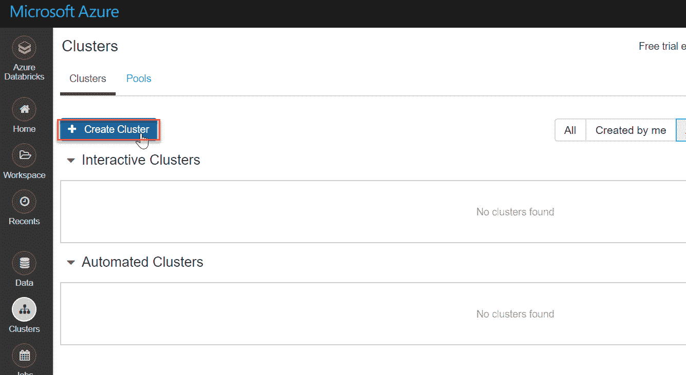
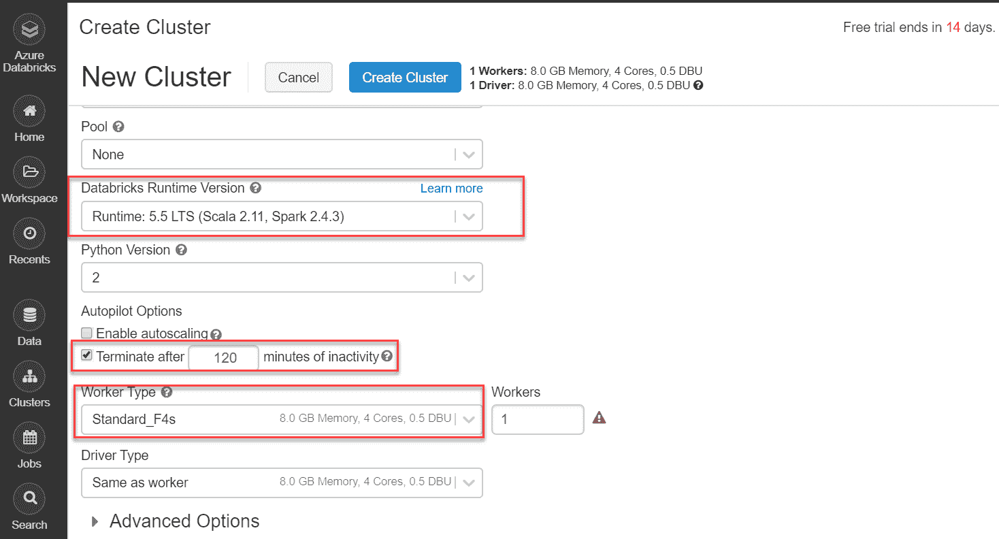

# 什么是数据块？

> 原文：<https://www.javatpoint.com/what-is-databrick>

这篇文章为新来者全面介绍了 Azure Databricks。我们将学习 Azure 中 Databricks 的基础知识，以及如何通过 Azure 门户和与之配套的不同组件和内部来创建它。

系统正在处理千兆字节甚至千兆字节的数据，这些数据仍在以指数级的速度增长。大数据无处不在，来自各种来源，如社交媒体网站、销售、消费者数据、交易数据等。而且，在我看来，这些数据只有在我们既能交互又能快速处理的情况下才有价值。

<u>Apache Spark 是一个流行的大数据分析框架，是一个开源的快速集群计算系统。这个框架有助于通过并行处理数据来提高性能。它是用高级编程语言 [Scala](https://www.javatpoint.com/scala-tutorial) 编写的，也支持 Python、SQL、 [Java](https://www.javatpoint.com/java-tutorial) 和 R APIs。</u>

## 什么是 Azure Databricks，它和 Spark 有什么关系？

简单来说，Databricks 是 [Apache Spark](https://www.javatpoint.com/apache-spark-tutorial) 的[微软 Azure](https://www.javatpoint.com/microsoft-azure) 实现。完全受管理的 Spark 集群用于处理大数据工作负载，并利用机器学习帮助数据工程、数据探索和数据可视化。

在从事数据仓库工作时，我发现这个分析平台对开发人员非常友好，适应性很强，有诸如 [Python](https://www.javatpoint.com/python-tutorial) 、 [R](https://www.javatpoint.com/r-tutorial) 等易于使用的应用编程接口。为了进一步说明，假设我们用 Python 构建了一个数据框架。

## 数据块的用例？

出于各种原因，数据仓库的采用在大数据世界中变得越来越重要和重要。除了支持多种语言之外，该服务还允许我们快速与各种 Azure 服务交互，如 Blob Storage、Data Lake Store、 [SQL](https://www.javatpoint.com/sql-tutorial) 数据库以及 [Power BI](https://www.javatpoint.com/power-bi) 和 [Tableau](https://www.javatpoint.com/tableau) 等 BI 工具。

这是一个优秀的协作平台，允许数据专业人员共享集群和工作空间，从而提高工作效率。

Azure 数据库的一些非常重要的特性是-

*   **Databricks Workspace** -它有一个非常有用的协作工作空间特性，不同的人可以在其中同时工作。
*   **Databricks Runtime** -它们是组件和升级的额外集合，包括 Apache Spark，可确保大数据工作负载和分析在性能和安全性方面的优势。这些更新定期进行。
*   如前所述，它与 Azure、Apache Kafka 和 Hadoop Storage 等其他服务紧密对接，允许我们将数据发布到机器学习、流分析、Power BI 和其他应用程序中。
*   **数据块文件系统(DBFS)** -在对象存储之上，这是一个抽象层。这使我们能够装载像 Azure Blob Storage 这样的存储项目，允许我们像访问本地文件系统一样访问数据。

## 创建 Azure 数据库服务

为了创建数据库，我们需要一个 Azure 订阅，就像任何其他 Azure 资源一样。我们可以通过访问 azure 网站获得免费订阅，并免费获得一条线索。

登录蔚蓝门户，在**创建资源**框中搜索**数据库**:

如下所示，单击创建按钮:

我们将被引导到下一个屏幕。我们需要输入以下信息:

*   订阅-选择退出我们的计划。
*   资源组——我们正在使用已经创建的 azure 组。一个人可以根据需要创造自己的。
*   工作区名称——我们想给数据库(azdatabricks)起的名字。
*   位置-美国东部(它基本上是我们想要部署服务的地方，最初它不会产生任何影响，但是对于高级层和大企业来说，它有很大的影响，这将在后面详细讨论。)
*   定价层-高级(我们将采用高级订阅)。
*   现在我们需要点击**查看+创建**按钮，这是创建集群的最后一步，在查看部分，它将最终向我们显示我们到目前为止所做的所有设置。

然后点击**创建**按钮进行服务:

创建后，转到通知选项卡并选择“转到资源”以打开我们刚刚建立的服务:

在门户网站上，我们可以看到关于我们的数据库服务的信息，如网址、价格细节等。

要访问 Azure 数据库网站，请单击启动工作区；我们将在这里创建一个集群:

要使用 Databricks Workspace，我们需要再次登录。

Databricks 门户的 Databricks 主页如下图所示。我们可以在“工作区”选项卡上创建笔记本和管理论文。我们可以使用下面的“数据”选项卡构建表和数据库。

我们还可以使用[卡珊德拉](https://www.javatpoint.com/cassandra-tutorial)、[卡夫卡](https://www.javatpoint.com/apache-kafka)、[天青 Blob 存储](https://www.javatpoint.com/azure-blob-storage)等数据源。在选项的垂直列表中，选择集群:

现在，在这里创建一个火花集群，更多细节请点击下面的图片。Databricks 是在完全受管理的 Apache Spark 环境中开发的。它们包含一个非常特殊的自动扩展功能，完全基于业务需求。在“集群”页面上，转到底部并单击创建集群:

下面的屏幕截图显示了创建新数据块集群的几个设置选项。我用来创建集群的设置是-

*   5.5 运行时(数据处理引擎)。
*   一个 Python 2。
*   对于低工作负载，配置了标准 F4s 系列。

我不会启用自动扩展，因为这是一个演示，如果该群集处于非活动状态达 120 分钟，我也不会激活终止该群集的选项。

最后，在**新建集群**页面，点击**创建集群**按钮启动:

基本上，我们可以随意设置集群。在此 Microsoft 参考页面上，包括高级选项在内的许多群集配置都有详细介绍。

在下面的截图中，集群的状态显示为挂起。因为它是在云基础架构中创建的，所以创建它仍然需要一点时间。

哇哦！我们已经成功创建了一个正在运行的集群。

默认情况下，Databricks 是一个完全托管的服务，这意味着集群的资源被部署到一个锁定的资源组 databricks-rg-azdatabricks-3...如下图所示，为数据块服务生成了虚拟机、磁盘和其他网络相关服务:

在预定义的资源组中，我们还将看到已经部署了一个专用存储帐户:

**在火花簇中创建笔记本**

在 Spark 集群中，笔记本是一个基于网络的界面，允许我们以多种语言运行代码和可视化。

我们可以在群集启动并运行后创建笔记本并运行 Spark 作业。

现在我们必须点击位于左侧垂直菜单栏的工作区选项卡下的**创建按钮**，然后我们必须点击**选择笔记本**选项。作为参考，请看下图:

现在我们需要给笔记本取一个名字，我们必须始终给出一个合适的名字，这样任何从事笔记本工作的人都必须通过阅读它的名字来正确理解它。现在我们必须在创建笔记本对话框中选择一种语言，如 Python、Scala、SQL、R 和集群名，然后我们必须点击创建按钮。这将为我们刚刚创建的 Spark 集群添加一个笔记本:

我将在这里结束这个话题，因为在我的下一篇文章中，我们将会看到 Databricks 笔记本的其他方面。

### 结论

在这里，我们试图以最容易理解的方式解释 Azure Databricks 的基本原理。我们试图以最简单的方式创建一个集群。本教程旨在帮助新手学习 Azure 中数据库的基础。

* * *