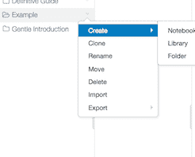
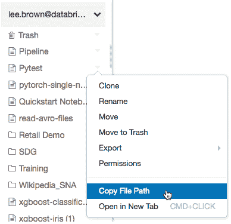
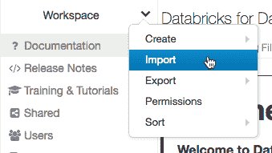
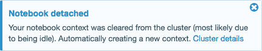
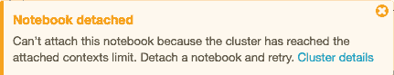

# 什么是《蓝色女士》中的笔记本？

> 原文：<https://www.javatpoint.com/what-is-a-notebook-in-ms-azure>

笔记本是一个基于网络的文档用户界面，包含可执行代码、图形和叙述性文字。

它还包括关于制作数据可视化、作为仪表板共享视觉效果、使用小部件参数化笔记本和仪表板、利用笔记本工作流构建复杂管道以及在 Scala 笔记本中定义类的最佳实践的文章。

工作区应用编程接口、用户界面和命令行界面都可以用来管理笔记本电脑。本文主要讨论如何使用用户界面来完成笔记本操作。

## 如何在 Microsoft Azure 中创建笔记本

### 使用“创建”按钮开始。

我们只需点击**创建**按钮，在默认文件夹中创建笔记本:

1.  从菜单中选择 **在边栏中点击**创建笔记本。将出现创建笔记本的对话框。
2.  给笔记本取个名字，选择默认语言。
3.  如果有任何正在运行的集群，将出现集群下拉列表。选择我们要将笔记本连接到的群集。
4.  按下创建按钮。

### 在任何文件夹中，制作一个笔记本。

为了在任何文件夹中创建笔记本，我们必须遵循以下步骤(例如，共享文件夹):

1.  从边栏中选择**工作区**。选择以下选项之一:
    *   点击**创建按钮**，然后点击文本右侧菜单中任意文件夹旁边的**笔记本按钮**。
        
        1.  我们也可以通过单击工作区中的创建按钮>笔记本来创建笔记本，或者我们可以使用用户文件夹。
        2.  现在进一步按照本文档标题中的步骤 2 到步骤 4<u>使用创建按钮开始。</u>

## 打开笔记本

为了打开笔记本，我们必须在工作区中选择一个笔记本。当您将鼠标悬停在笔记本标题上时，将显示笔记本路径。

### 复制笔记本路径

为了复制笔记本的路径，只需右键单击笔记本名称并选择复制文件路径即可复制笔记本文件路径，甚至无需打开笔记本。

### 重命名笔记本

单击活动笔记本的标题并内联修改，或转到**文件>重命名**将其重命名。

### 控制对笔记本的访问

我们甚至可以选择在笔记本中控制访问。这意味着我们可以向用户提供对谁可以访问笔记本的控制。我们可以选择工作区访问控制，但前提是我们的帐户是 azure 高级计划。

## 笔记本外部格式

[Azure](https://www.javatpoint.com/microsoft-azure) 数据库支持的外部笔记本格式包括:

*   源文件:扩展名为的文件。py。只包含源代码语句的 sql 或. r。
*   蓝色数据库笔记本的 HTML 扩展。
*   DBC 档案馆:这是一个数据库档案馆。
*   IPython 笔记本:这是一个扩展名为. ipynb 的 Jupyter 笔记本
*   这是一份扩展名为. Rmd 的 R Markdown 文档

## 导入笔记本

外部笔记本可以从网址或文件导入。

1.  从菜单中选择**导入**。
    *   选择单个笔记本，将其导出到当前文件夹。
    *   如果选择 DBC 或 ZIP 存档，将重建当前文件夹的文件夹结构，并导入每个笔记本。

## 导出笔记本

要导出笔记本，我们可以选择**文件选项**，然后点击**导出**选项，从笔记本工具栏中选择一种格式。

#### 注意:如果您在将笔记本导出为 HTML、IPython 笔记本或归档(DBC)时没有清除结果，则会包含运行笔记本的结果。它适用于单个笔记本，所有笔记本也意味着多个笔记本。

## 导出文件夹中的所有笔记本

要创建工作区文件夹中所有文件夹的 ZIP 存档，请执行以下步骤:

1.  在边栏中，选择工作区。选择以下选项之一:
    *   为了导出笔记本，我们需要从任何文件夹旁边的文本右侧的箭头中选择**导出选项**。
    *   或者，我们也可以通过从工作区或用户文件夹中的向下箭头选择导出选项来导出笔记本。
2.  然后，我们需要选择要导出笔记本的导出格式:
    *   **源文件**:从这个选项我们可以创建一个可以导入到 Azure Databricks 工作区的笔记本源文件的 ZIP 包。
    *   **DBC 档案**:是包含元数据和笔记本命令结果的二进制格式。
    *   **HTML 存档**:将 HTML 文件导出为 ZIP 包。
        包含笔记本命令的输出。

## 笔记本和集群

您必须先将笔记本链接到群集，然后才能在其中进行任何工作。本节介绍如何在集群中添加和删除笔记本，以及添加和删除笔记本时的幕后操作。

一个集群只能有一定数量的执行上下文(145)。在执行上下文数量达到此限制后，您不能将笔记本附加到群集或建立新的执行上下文。

### 空闲执行上下文

当先前完成的执行发生在给定空闲阈值之后时，执行上下文被认为是空闲的。默认情况下，空闲计时器设置为 24 小时。

使用该上下文的笔记本仍然连接到群集，并显示在群集的笔记本列表中，即使该上下文已被删除。

流式笔记本总是被认为是活动的，在它们的执行完成之前，它们的上下文不会被逐出。如果空闲上下文被逐出，用户界面会显示一条通知，指示使用该上下文的笔记本因空闲而断开连接。

如果您尝试将笔记本连接到具有最大数量执行上下文的集群，并且没有空闲上下文(或者如果自动收回已关闭)，则用户界面会显示一条消息，说明已达到当前最大执行上下文阈值，并且笔记本将保持分离状态。

当您分叉一个进程时，一个空闲的执行上下文保持空闲，直到分叉该进程的请求完成。使用 Spark，不建议分叉不同的进程。

### 配置上下文自动收回

Spark 属性 Spark . databricks . driver . enableidlecontexttracking 可用于允许上下文自动逐出。

*   在 Databricks 5.0 及更高版本中，默认情况下启用自动收回。将 spark . databricks . driver . enableidlecontexttracking 设置为 false 以停用群集的自动逐出。
*   在 Databricks 4.3 中，自动逐出功能默认处于关闭状态。为集群设置 spark . databricks . driver . enableidlecontexttracking 为 true 将启用自动逐出。

## 将群集连接到笔记本电脑。

它需要群集级别的权限才能将其附加到笔记本上。

要将笔记本电脑连接到群集，需要遵循以下步骤:

1.  首先，我们需要点击笔记本工具栏，然后我们需要点击分离选项。
2.  然后从下拉菜单中，我们需要选择一个集群。

### 确定火花和数据块运行时版本

运行以下命令来识别笔记本所连接的集群的 Spark 版本:

python 副本

spark .版本

运行以下命令来查找笔记本所连接的集群的 Databricks 运行时版本:

**斯卡拉**

ScalaCopy

db styles . notebook . get context . tags(" spark version ")

**蟒蛇**

python 副本

spark . conf . get(" spark . databricks . clusterusagetags . sparkversion ")

**提示**

Azure Databricks 建议从集群中分离不需要的笔记本。这允许驱动程序有更多的内存。

**可以查看与一个集群关联的所有笔记本。**

在群集详细信息页面上，“笔记本”选项卡列出了与群集相关联的所有笔记本。还会显示每个附加笔记本的状态，以及上次从笔记本运行命令的时间。

* * *