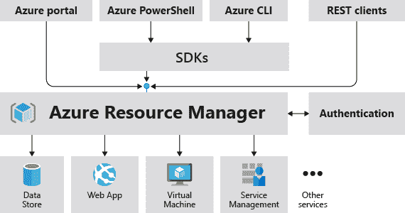
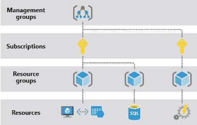

# 什么是 Azure 资源管理器？

> 原文：<https://www.javatpoint.com/what-is-azure-resource-manager>

Azure 资源管理器是管理和部署 Azure 资源的服务。它有一个管理层，允许我们创建、更新和删除 Azure 帐户资源。部署后，我们使用管理工具(如访问控制、锁和标签)来保护和组织我们的资源。

## 一致管理层

当用户使用 Azure 工具、应用编程接口或软件开发工具包中的一个来传递请求时，资源管理器会接收到它。它验证请求并授权它。该请求被发送到 Azure 服务，该服务执行指定的操作。因为所有请求都是通过同一个应用编程接口路由的，所以所有工具的结果和功能都是一致的。

下图描述了 Azure 资源管理器在处理 Azure 请求中的角色。

[PowerShell](https://www.javatpoint.com/powershell) 、 [Azure](https://www.javatpoint.com/microsoft-azure) CLI、REST APIs 和客户端 SDK 提供了对门户中提供的所有功能的访问。在最初发布后的 180 天内，基于 API 的功能将显示在门户中。

## 术语

如果你是第一次使用 Azure，有几个名字或术语你可能不熟悉。

*   **资源** -可以通过 Azure 访问的托管项目。azure 中的资源可以包括虚拟计算机、存储帐户、数据库、网络应用程序和虚拟网络。
*   **资源组**-Azure 解决方案的容器，包含连接的资源。换句话说，我们可以说资源组包含了我们想要集体管理的所有资源。
*   **资源提供者** -使 Azure 资源可用的服务。微软。例如，计算是一种流行的资源提供者，它提供虚拟机资源。另一个常见的资源提供商是微软存储
*   **资源管理器模板** -一个 JSON 文件，指定一个或多个要部署到资源组、订阅、管理组或租户的资源。
*   **声明性语法** -允许我们说“这是我要做的”的语法，而不需要编写编程命令来实现它。声明性语法在资源管理器模板中演示。

## 使用资源管理器的好处

使用 Azure 资源管理器有几个好处，其中一些如下:

*   使用声明性模板来管理基础结构。
*   不是管理单个资源，而是作为一个整体来部署、管理和监控我们解决方案的所有资源。
*   定义资源依赖关系，以便它们以正确的顺序分布。
*   使用标签合理地组织我们订阅中的所有资源。
*   查看具有相同标签的一组资源的价格，以更好地了解我们组织的计费。

## 理解范围

管理组、订阅、资源组和资源是 Azure 中可用的四个范围。下图中可以看到这些层的示例。

在任何这些范围级别，我们都可以应用管理设置。设置的范围由我们选择的级别决定。较高级别的设置会向下传递到较低级别。

租户、管理组、订阅和资源组都可以接收模板。

## 资源组

定义资源组时，请记住以下几点:

*   我们资源组的资源应该都有相同的生命周期。我们同时部署、更新和删除它们。如果某个资源(如服务器)必须在不同的时间部署，则它应该位于不同的资源组中。
*   一个资源组可以包含一个独立的资源。
*   我们可以随时在资源组中添加或删除资源。
*   我们可以将资源组从一个移动到另一个。
*   资源组的资源可以位于不同于资源组本身的区域。
*   我们必须有一个好习惯，在创建资源组时，给它一个合适的名称和位置。有人可能会想，“为什么资源组必须有物理位置？而且，如果资源可以位于不同于资源组的位置，那么资源组的位置又有什么关系呢？”
    关于资源的元数据存储在资源组中。当我们给一个资源组一个位置时，我们告诉它在哪里保存它的元数据。出于合规原因，我们可能需要验证我们的数据是否存储在特定位置。
    因为当资源组的区域暂时不可用时，元数据不可访问，所以我们不能更改资源组中的资源。
*   资源可以链接到同一资源组中的其他资源。当两个资源相关但不在同一个生命周期时，这是一种常见的情况。
*   当我们删除一个资源组时，它也会删除其中的所有资源。有关 Azure 资源管理器如何管理这些删除的更多详细信息，请访问此处。
*   每个资源组最多可以有 800 个资源类型实例。800 个实例的限制可能不适用于所有资源类型。
*   有些资源不属于资源组。订户、管理组或租户接收这些资源。

## Azure 资源管理器的弹性

Azure 资源管理器服务专为高可用性和弹性而构建。在 REST 应用编程接口中，资源管理器和控制平面操作(发往 management.azure.com 的请求)是:

*   他们分散在全国各地。有些服务只在某些地区提供。
*   在 azure 中，我们有多个可用的位置和区域。它们跨越不同的区域，也取决于可用的区域。

这种弹性仅适用于通过资源管理器接受请求的服务。例如，密钥库就受益于这种健壮性。

## 资源组中限额的管理

**必须注意“某些服务具有可调整的限制”。**

当服务没有可变限制时，它使用标题限制。在这种情况下，默认限制和最大限制是相同的。

当可以修改限制时，这些表提供默认限制和最大限制标题。该限制可以超过默认值，但不能超过最大值。

如果我们想将限额或配额增加到预设限额之外，请打开免费的在线客户支持请求。

限额和配额的增加不适用于免费试用会员资格。我们可以随时从免费试用套餐升级到现收现付套餐计划。

* * *