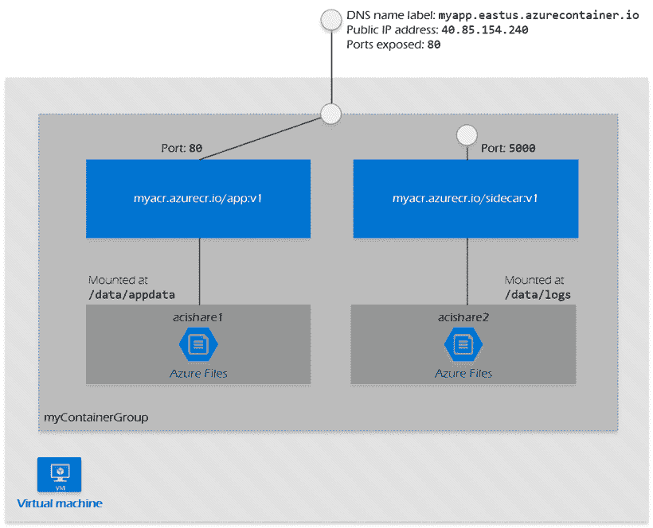

# 什么是微软 Azure 中的容器组？

> 原文：<https://www.javatpoint.com/what-is-a-container-group-in-microsoft-azure>

在同一台主机上运行的一组容器被称为 Microsoft azure 中的一个容器组。容器组的生命周期、资源、本地网络和存储卷都由组中的容器共享。就想法而言，它类似于一个 [Kubernetes](https://www.javatpoint.com/kubernetes) 吊舱。

下图显示了包含多个容器的容器组的示例。

容器组的上述示例有-

*   它只在一个主机系统上运行。
*   有一个附加的域名标签。
*   仅暴露一个公共 IP 地址和一个易受攻击的端口。
*   它由两个容器组成。

#### 注意 Azure 容器实例只允许为窗口容器部署单个容器实例。当我们努力为 Windows 容器提供所有功能时，服务概述解释了现有的平台差异。目前只有 Linux 容器受到多容器组的支持，根据微软正在开发它的消息，我们可能很快会得到更新。

## 资源管理器的部署

资源管理器模板或 YAML 文件是部署多容器组的两种常见方式。对于一个实例，如果我们正在部署一个 azure 文件实例，如果我们在部署容器实例时需要部署额外的 Azure 服务资源，通常建议使用资源管理器模板。

当我们的部署只包含容器实例时，YAML 文件更好，因为它更简洁。

我们可以使用 Azure CLI 命令 az 容器导出将容器组的配置导出到 YAML 文件，以保留配置。

## 资源分配

通过添加组中实例的资源需求， [Azure](https://www.javatpoint.com/microsoft-azure) 容器实例向多容器组提供资源，如中央处理器、内存，可能还有图形处理器(预览)。例如，如果我们用两个容器实例构建一个容器组，每个实例要求一个 CPU，那么容器组将被给予两个 CPU。

#### 注意:我们的容器可以访问组的大部分资源，但不能访问所有资源。因此，在为组中的容器请求资源时，请记住适度的资源缓冲区。

## 最小和最大分配

*   给每个容器组至少一个 CPU 和一 GB 内存。在一个组中，可以为单个容器实例提供少于一个 CPU 和一 GB 的内存。
*   为了检查容器组中最大资源的部署区域，必须检查 Azure 容器实例的资源可用性。

## 容器组中的存储

我们可以在容器组中装载外部甚至内部卷。支持的卷如下-

*   空目录
*   容器组中的克隆 git repo
*   秘密
*   文件共享

在一个组中的不同容器中，我们可以将这些卷映射到指定的路径。

## 常见场景

当我们需要将单个功能任务分解成有限数量的容器图片时，多容器组就派上了用场。然后，这些照片可以由几个团队交付，每个团队都有自己的资源集。

示例用法可能包括:

*   监控容器定期向应用程序发送请求，以确认它正在运行并正确响应，如果没有，它将生成警报。
*   有两个容器，其中一个用于前端，另一个用于后端。前端可以提供网络应用，而后端可以托管数据检索服务。

Azure 虚拟网络允许我们以安全和私有的方式连接我们的 Azure 和内部资源。

#### 注意:如果我们的容器组分配了一个 IP 地址，当容器组重新启动时，该 IP 地址可能会改变。

## 虚拟网络

创建一个或多个子网的位置是虚拟网络中的地址空间。然后，Azure 资源(如容器组)被部署到虚拟网络的子网中。

## 子网(委托)

子网将虚拟网络划分为不同的地址空间，放置在其中的 Azure 资源可以访问这些地址空间。在虚拟网络中，我们可以构建一个或多个子网。

我们使用可能位于子网中的唯一一个容器组，我们可以将其用于容器组。当我们第一次向 Azure 容器实例部署容器组时，Azure 将子网委托给它。子网只有在被委派后才能用于容器组。如果我们尝试将容器组部署到委派的子网，那么该过程将自动失败。

## 容器组的网络配置文件

微软 Azure 资源的网络配置模板是一个网络配置文件。该网络配置文件提供了资源的网络属性，例如它应该部署到的子网。如果我们将容器组部署到一个子网，然后部署到一个虚拟网络，那么当我们使用 az 容器创建命令时，azure 会为我们生成一个网络配置文件。

然后，我们可以使用该网络配置文件在将来部署到子网。

我们可以利用使用 az 容器构建生成的现有概要文件，或者使用资源管理器模板从头开始(参见模板示例和参考资料)。使用 az 网络配置文件列表命令获取以前生成的配置文件的标识。

在我们将一个容器组部署到子网之后，我们可以使用相同的网络配置文件向它部署更多的容器组。

* * *