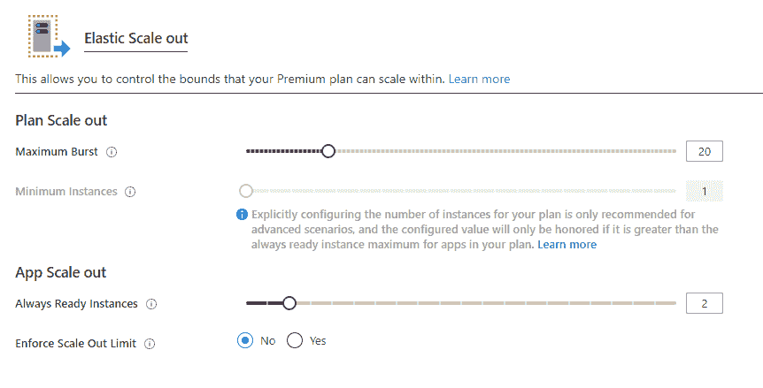
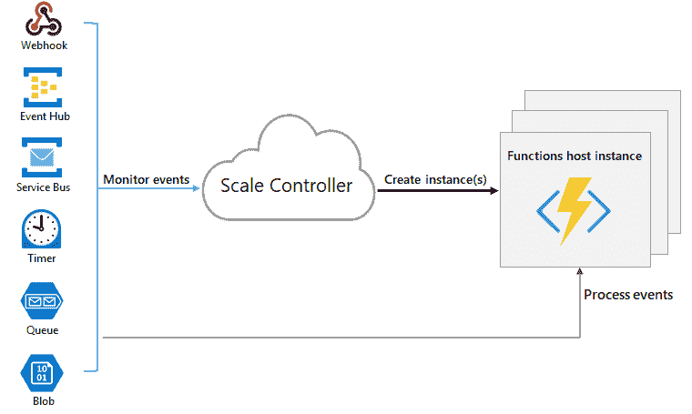

# 微软 Azure 函数高级版计划是什么？

> 原文：<https://www.javatpoint.com/what-is-microsoft-azure-functions-premium-plan>

Azure 功能高级计划(也称为弹性高级计划)是一个功能应用程序托管选项。其他托管计划可用。

我们的职能部门将通过以下方式从高级计划托管中获益:

*   如果情况总是温暖的，不要冷启动。
*   连接到虚拟网络。
*   执行时间不限，保证最少 60 分钟。
*   有多个核心实例可用。
*   与消费计划相比，价格更容易预测。
*   高密度的应用分配，适用于包含大量功能应用的计划。

## 演员表

高级计划的计费完全取决于使用的内核数量和所有实例共享的内存。另一方面，消耗计划是根据每个操作和消耗的内存开具发票的。高级计划没有执行费用。在所有计划或任何一个单独的计划中，必须始终分配至少一个实例。

## 不再有冷启动

应用冷启动是指第一次呼叫时经历的额外延迟。

始终就绪实例和预热实例是高级计划中的两项功能，它们共同有效地避免了我们运营中的冷启动。

## 始终就绪的实例

我们可以让我们的应用程序随时准备在一定数量的实例与高级包。始终就绪的最大实例数是 20。当事件开始触发应用程序时，它们首先被发送到始终就绪的实例。当该功能激活时，所有附加实例将作为缓冲区预热。

该缓冲区可防止新实例在扩展过程中变冷。缓冲实例是预热的实例。我们的程序可以通过将总是准备好的实例与预热的缓冲区相结合来成功防止冷启动。

## 预热实例

已经预热的实例将继续缓冲，直到达到最大扩展限制。在大多数情况下，预热实例计数设置为 1，建议在大多数情况下保持该值。

如果我们的程序需要很长时间来预热，我们可能需要提高这个缓冲区(例如，一个定制的容器图像)。只有在充分利用所有活动实例后，预热的实例才会变为活动的。

在这个例子中，看看总是准备好的和预热的实例是如何一起工作的。默认情况下，高级功能应用程序配置有五个始终就绪实例和一个预热实例。

我们现在不会为预热的实例收费，因为始终准备好的实例没有被使用，也没有预热的实例被分配。

一旦接收到第一个触发器，五个始终准备就绪的实例就会激活，并分配一个预热的实例。因此，现在该应用程序正在运行六个已配置的实例:其中包括五个当前活动的始终就绪的实例，以及第六个预热的缓冲区，该缓冲区在其自然状态下处于非活动状态。

如果处决率继续上升，目前的五个实例最终将被使用。当平台达到超过五个实例的容量时，它会切换到预热的实例。那么到目前为止，现在有六个活动实例，第七个实例是从预热的缓冲区中调配和填充的。

这种缩放和预热过程一直持续到应用程序达到最大实例数。没有预热或超过最大容量的活动实例。

**最大功能应用实例**

应用程序比例限制可用于设置应用程序最大值。

## 专用网络连接

网络应用的虚拟网络集成适用于向高级计划推出的功能应用。现在，我们的应用程序可以与资源进行通信，而不会在我们的虚拟网络中出现任何问题或错误，或者在以正确的方式进行配置后通过服务端点进行安全通信。还可以使用应用程序中的 IP 限制来限制传入流量。

我们需要一个至少有 100 个可访问地址的 IP 块。

## 运行时间更长

10 分钟是 azure 功能单次执行的消费计划限制。为了防止执行失控，高级计划中的运行持续时间默认为 30 分钟。对于 Premium plan 应用程序，我们可以更改 host.json 配置，使持续时间无限。当我们的函数应用程序被设置为非有界持续时间时，它可以运行至少 60 分钟。

## 高级计划中的计划和 SKU 设置。

创建计划时有两种计划大小设置:最小实例数(或计划大小)和最大爆发限制。

我们可以继续向外扩展，直到达到最大突发限制，如果我们的应用程序需要的实例比随时可用的实例多，在某些情况下，我们也会向上扩展。

在每秒的基础上，我们只在大于我们计划规模的实例运行并分配给我们时才收费。该平台尽最大努力将我们的应用程序扩展到指定的最大限制。每个计划至少需要一个实例。

**重要**

**用户将为最小实例计数中分配的每个实例付费，无论功能是否运行。**

在大多数情况下，这种自动缩放功能非常有效，而且不需要任何用户修改。另一方面，超越最低限度是最后的努力。如果新实例在某个时刻不可用，横向扩展可能会延迟，但这是不寻常的。

## 可用实例 SKU

在创建或扩展计划时，我们有三种实例大小可供选择。我们将根据每个实例分配给我们的内核和内存总数来收费。根据需要，我们的软件可以自动扩展到多个实例。

| 库存单位 | 记忆 | 核心 | 仓库 |
| EP1 | 3.5GB | one | 250GB |
| EP2 | 7GB | Two | 250GB |
| EP3 | 14GB | four | 250GB |

## 内存使用

在内存更大的系统上运行我们的函数应用程序并不总是意味着它使用了所有的内存。

例如，Node.js 中的默认内存限制限制了一个 JavaScript 函数应用程序的大小。添加应用程序设置 languageWorkers:node:参数，其值为-max-old-space-size =最大内存(以 MB 为单位)>以增加此固定内存限制。

## Azure 功能:专用托管计划

在传统托管中，这些计算资源类似于服务器场。可以设置一个或多个功能应用程序，与其他应用程序服务应用程序(如网络应用程序)共享计算资源(应用程序服务计划)。

考虑在以下场景中使用应用服务策略:

*   我们有未充分利用的虚拟机，它们已经托管了其他应用程序服务实例。
*   我们想为我们的功能提供一个自定义的运行图像。

### 演员表

无论计划中有多少功能应用或网络应用在运行，我们只对计划收费。

### 始终开启

如果我们订阅了应用程序服务，我们应该打开“始终打开”选项，以确保我们的功能应用程序正常工作。

“始终开启”选项仅适用于应用服务计划。该平台会自动激活消费计划中的功能应用。

### 缩放比例

我们可以通过添加新的虚拟机实例，利用应用服务计划手动横向扩展。我们还可以启用自动缩放，尽管它将比高级计划的弹性缩放慢。

必须记住，当使用应用服务计划来运行 JavaScript (Node.js)函数时，我们应该选择一个 vCPUs 较少的计划。

### 应用服务环境

与应用服务计划相比，在应用服务环境(ASE)中运行允许我们完全隔离我们的功能并利用更多的实例。

如果我们只想在虚拟网络中操作我们的功能应用程序，高级计划就是为我们准备的。

Azure Functions 通过添加更多的 Functions 主机实例，扩展了消费和高级计划中的 CPU 和内存容量。

当我们删除功能 app 的主存储账号时，功能代码文件也会丢失，无法恢复。

### 运行时缩放

缩放控制器是 Azure Functions 中的一个组件，它监控事件的速率，并确定是向外扩展还是向内扩展。对于每种触发类型，比例控制器都采用试探法。

函数应用程序是 Azure 函数的缩放单位。另一方面，随着计算需求的减少，缩放控制器会移除函数主机实例。当函数应用程序中没有正在运行的函数时，实例的数量最终被“放大”为零。

### 冷启动

在我们的功能应用程序空闲了一定的时间后，平台可能会将我们的功能应用程序运行的实例数量减少到零。从零扩展到一会增加下一个请求的延迟。冷启动是指这段等待时间。

我们的函数应用程序所需的依赖项数量会对冷启动时间产生影响。冷启动更关心必须传递响应的同步进程，例如 HTTP 触发器。

### 理解缩放行为

缩放取决于各种各样的事情，它根据触发器和使用的语言而变化。我们应该注意缩放行为的一些细微差别:

*   **最大实例数:**单个功能应用只能扩展 200 个实例。如有必要，我们可以设置较低的最大油门。
*   **新实例率:**每秒最多分配一次新的 HTTP 触发器实例。每 30 秒为非 HTTP 触发器分配一次新实例。使用高级计划时，扩展速度要快得多。
*   **扩展效率:**由于队列长度不能用于驱动扩展决策，因此使用侦听权限进行扩展不太精确。我们可以使用管理权限来实现服务总线或触发器的高效可伸缩性。

* * *