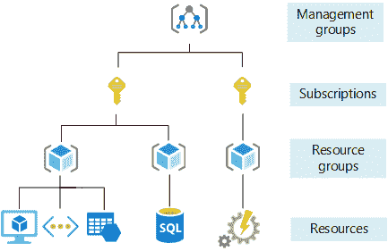

# 什么是微软 Azure 订阅？

> 原文：<https://www.javatpoint.com/what-is-microsoft-azure-subscription>

要使用 Azure 基于云的服务，您必须首先购买订阅。它充当 Azure 资源的单一计费单位，对 Azure 中使用的服务进行订阅计费。

Azure 订阅绑定到一个帐户，该帐户用于创建订阅，也用于计费。资源可以作为订阅下许多 Azure 产品和服务的实例来提供。

免费、现收现付和会员优惠是可获得的三种主要订阅类型。免费帐户是一个订阅，让你不受限制地访问 Azure 资源，以及 200 美元的付费产品信用。

除非我们将订阅升级为付费订阅，否则我们在此期间创建的所有资源和服务将在免费试用期结束时自动禁用。免费账户需要信用卡，但信用卡仅用于身份识别。在此网址(https://azure . Microsoft . com/en-us/free/)可以申请免费账号。

您可以使用现收现付订阅(https://azure . Microsoft . com/en-us/offers/ms-azr-0003 p/)按月支付您使用的服务和资源。该账户需要使用信用卡或借记卡，并按月计费。现收现付的 Azure 账户可以从免费的 Azure 账户转换而来。

您可以使用现收现付订阅(https://azure . Microsoft . com/en-us/offers/ms-azr-0003 p/)按月支付您使用的服务和资源。该账户需要使用信用卡或借记卡，并按月计费。现收现付的 Azure 账户可以从免费的 Azure 账户转换而来。此网址包含最新的产品。

许多组织有许多订阅，它们将这些订阅用于计费目的，因为每个订阅都创建自己的一组计费报告和发票。分割订阅还可以用来将开发和测试环境与生产环境分开。

建立 Azure 订阅的人成为订阅的全局管理员，可以完全控制订阅的所有方面，但只能控制订阅。因此，可以使用单独的订阅来为 Azure 服务创建责任分离。

Azure 中的订阅是一个容器，它保存了一组相关的业务或技术资源。资源作为一个组使用和计费。

具有各种访问管理策略和开票程序的多个订阅可以添加到 Azure 帐户中。Azure 订阅可以定义以下界限:

*   计费边界:访问资源的计费要求由该订阅类型定义。Azure 将为我们的每个订阅提供不同的计费方式，这样我们就可以根据业务需求创建多个订阅。
*   访问控制边界:为了分离订阅，通过应用不同的管理策略，我们可以在订阅级别构建访问控制边界，以表示不同的组织结构

Azure 向企业提供的服务有收费结构。每个企业都有一个 Azure 广告租户，这允许他们为各种服务创建 Azure 帐户和不同的订阅。这些术语的定义如下:

*   组织-任何打算使用 Azure 资源的公司或个人。在这里，域名被用来识别公司。
*   租户-租户标识标识并授权某个 Azure AD 实例。完成 Azure 注册流程后，组织将被分配到 Azure AD 租户。为了管理帐户、组、权限和用户，azure active directory 为它们提供了单一平台。
*   帐户-所有为使用 Azure 的服务而建立的帐户都存储在 Azure AD 租户中。

现在您已经熟悉了这些术语，您可以研究帐户、租户和订阅是如何关联的:

*   在一家公司里可能会发现许多租户。
*   每个租户都可以拥有多个订阅和帐户。
*   一个帐户可以使用许多不同的订阅。
*   哪个帐户可以使用哪个订阅由 Azure 广告租户决定。

## Azure 订阅如何帮助我们扩展您的环境？

组织经常使用几个 Azure 订阅来规避每个订阅的限制。有效利用资源有几种方法。

在您创建原始订阅后，我们可以根据您组织的模式生成额外的订阅来扩展您的环境。在开始扩展订户之前，请考虑以下事项:

*   某些资源施加的订阅限制。如果订阅的资源有限，您可能需要生成其他订阅。
*   将治理、迁移、运营、创新和安全视为公司目标。
*   有几种方法可以帮助人们决定如何购买和设计更多的 Azure 订阅。这里有几个例子:

工作负载分离:随着新工作负载添加到云中，您可以使用工作负载分离策略，基于生产和非生产管理组来划分订阅。

应用程序类别:订阅也可以根据访问限制、业务需求、数据安全问题或法规要求进行分类。订阅也可以根据其是否是关键任务、是否受监管限制或所提供商品的部分成本进行分类。

职能线:根据角色订阅，如财务、销售或信息技术支持。

业务单元:订阅也可以使用管理结构按业务部门甚至损益进行分类。

地理区域:如果您的公司遍布全球，您还可以根据地理区域对订阅和帐户进行分类。

Azure 订阅:将 Azure 活动目录更改为新目录

Azure 广告链接到每个 Azure 订阅。如果您有大量订阅，您可能希望将一些订阅移动到不同的 Azure 广告。因为传输订阅可能会导致停机，所以您可能需要考虑其他选项，例如重新创建资源并将数据复制到目标订阅，或者使用多目录体系结构。

如果 azure 向 Azure 平台引入任何新服务，以及任何相关价格，我们也会提前通知您。只有当我们使用新服务时，我们才会被收费。我们有责任支付因接受免费服务而产生的任何税款。

**限制、配额和约束**

如果您需要查看这些限制，请联系客户服务部，以便适当调整您的限制。

**取消政策**

我们可以随时取消订阅。对此不会有任何问题。这完全取决于用户。如果我们的账户有任何逾期费用，我们必须支付。

**资源承诺**

服务使用率的所有增长都取决于可用的服务资源。增加正在运行的计算实例的数量或可用存储的数量就是这种增强的两个例子。

如果 Azure 免费帐户不产生任何成本，或者它被设置为 90 天以上的理想状态，azure 完全有权删除任何实例或计算资源或任何虚拟机。在消除任何计算资源之前，我们会提前一个月通知。

**账户类型-**

有两种主要类型的帐户-

*   免费账户
*   现收现付账户。

两个账户都如其名。

### 免费账户

**消费限制&免费账户升级。**

注册 Azure 免费帐户的合格客户将获得 14，409.052 美元的积分，可在头 30 天内用于大多数 Azure 服务。未使用的点数不能转移到其他 Azure 订阅或结转到下一个月。

要继续使用 Azure 免费帐户并在该期限内选择免费服务，您必须升级到现收现付定价，方法是在注册后 30 天内或直到点数用完(以先到者为准)之前取消支出限制。

**支付选项**

除非您被批准开具发票，否则注册时需要信用卡或借记卡进行身份验证。不接受预付或虚拟信用卡。除了短暂的授权持有，您的卡最初不会被收费。因获得免费服务而产生的任何税费完全由接受方负责。

**从 Azure 免费账户升级**

如果您从免费 Azure 帐户升级，您仍然可以在优惠的剩余 12 个月期间(从您注册之日开始)使用一些免费服务。

* * *