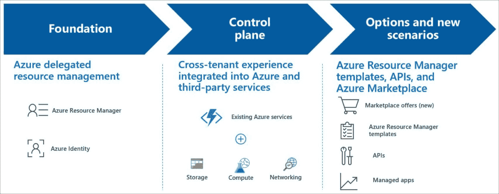
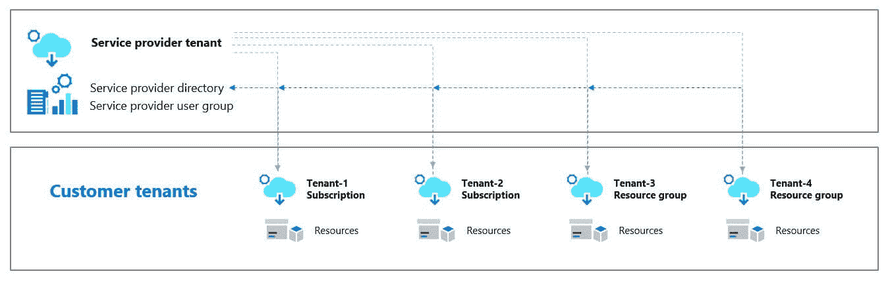
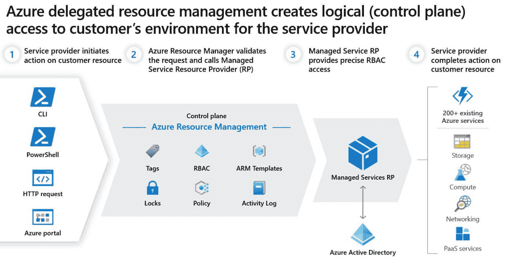

# 什么是Azure灯塔？

> 原文：<https://www.javatpoint.com/what-is-azure-lighthouse>

具有增强的可扩展性、自动化和资源治理的多租户管理是在 Azure 灯塔的帮助下完成的。

服务提供商可以利用 Azure 灯塔，利用 Azure 平台广泛而强大的功能来提供托管服务。

在这项服务的帮助下，客户可以完全控制谁可以访问什么资源，他们的租户可以访问什么，以及他们可以采取什么行动。跨不同租户管理资源的企业信息技术公司可以从这项服务中获益。

### 利益

Azure 灯塔使服务提供商更容易创建和提供托管服务。以下是一些优点:

*   **规模化管理**:现在做客户参与和全生命周期运营来管理客户资源更简单、更可扩展。委托资源，包括托管在 Azure 之外的计算机，可以使用现有的应用编程接口、管理工具和工作流来使用，而不管它们位于哪个区域。
*   **为客户提供更高的可见性和控制力**:客户可以完全控制他们分配的管理范围和授予的权限。他们有能力检查服务提供商、行为，如果有必要，他们可以完全取消访问。
*   **全面统一的平台工装**:这种适应性支持多种服务商场景，包括 EA、CSP、现收现付的授权模式。

### 能力

Azure 灯塔具有许多有助于参与和管理的功能:

*   **Azure 委托资源管理**:在控制租户中，可以将客户订阅和资源组分配给特定的用户和职责，可以根据需要灵活撤销访问权限。
*   **全新 Azure 门户体验**:客户可以在相关服务商页面监控和管理自己的服务商访问。
*   **Azure 资源管理器模板**:客户可以在专门的网站上为其检查和调整服务提供商的访问权限。
*   **Azure market**中的托管服务优惠:客户可以通过私人或公共优惠注册这些服务，它们将被自动添加到 Azure 灯塔中。

**提示**

微软 365 灯塔是一个类似的产品，它帮助服务提供商大规模地入职、监控和管理他们的微软 365 用户。微软 365 灯塔的预览版目前可用。

### 定价和可用性

使用 Azure 灯塔管理 Azure 资源不涉及额外费用。Azure 灯塔可供任何 Azure 客户或合作伙伴使用。

### 跨区域和云考虑事项

Azure 灯塔是一项不限于特定地区的服务。我们可以处理委派给我们的、位于不同地区的资源。

### Azure灯塔支持

如果我们需要任何帮助，我们可以开一张支持票。选择技术作为问题类型。选择订阅，然后选择灯塔(在监控和管理下)。

### Azure灯塔建筑

服务提供商可以灵活、精确地管理委托资源，同时使用 Azure 灯塔来简化客户参与和入职流程。

如果客户的 Azure Active Directory (Azure AD)租户中没有帐户，或者不是客户租户的共同所有者，则授权用户、组和服务主体可以直接在客户订阅的上下文中工作。Azure 委托资源管理是实现这种访问的技术。

### 在客户租户中创建的委托资源

注册定义和注册分配资源可以通过应用编程接口和管理工具访问，或者我们可以直接在 Azure 站点中处理它们，它们是在客户的资源组加入 Azure 灯塔时创建的。

### 注册分配

每个注册分配都必须与有效的订阅级注册定义相关，该定义将服务提供商的授权与委托范围联系起来，从而授予访问权限。

在某些情况下，资源管理器可以根据资源定义的信息授予访问权限。

保存在客户租户中的活动日志跟踪服务提供商租户中用户的活动。这允许客户看到谁进行了修改以及修改是何时完成的。

## Azure灯塔是如何工作的

高端灯塔的工作:

1.  确定组、服务主体或用户的责任。
2.  客户端启动后，授权用户登录到我们的控制租户，并根据我们设置的权限在客户范围(订阅或资源组)内执行任务。客户能够随时检查所有操作并删除访问权限。
3.  虽然大多数客户只有一个服务提供商管理特定的资源，但是客户端可以为同一个订阅或资源组创建多个委托，从而支持多个服务提供商的访问。

## 跨租户管理经验

使用 Azure 委托资源管理，各种任务和服务可以在托管租户之间共享。

为了简化跨租户管理，Azure 灯塔可以在拥有众多 Azure AD 租户的企业中使用。

## 理解租户和授权

每个 Azure AD 租户都有自己的租户 ID，并且不同于其他 Azure AD 租户(一个 GUID)。

然后，这些用户可以使用自己的凭据登录 Azure 网站。他们可以通过 Azure 界面为所有可以访问的客户管理资源。您可以借助 Azure 门户的“我的客户”页面，或者直接在该客户的订阅上下文中工作，或者借助 Azure 门户或通过应用编程接口来完成。

Azure 灯塔无需登录不同租户的各种帐户，在为多个客户端管理资源时，它为我们提供了更多的自由。授权用户可以通过使用 Azure 灯塔登录服务提供商的租户来访问这些资源。

## API 和管理工具支持

我们可以直接在门户中或者通过应用编程接口和管理工具对委托的资源执行管理任务。工具可以是 Azure 命令行界面和 Azure PowerShell。只要跨租户管理支持该功能，并且用户在使用委托资源时具有必要的权限，就可以使用任何现有的 API。

默认情况下，Azure PowerShell Get-azSubscription cmdlet 显示管理租户的租户 Id。

homeTenantId 和 managedByTenants 特性在 Azure 命令行界面操作(如 az 帐户列表)中也是可见的。

我们也有致力于完成蓝色灯塔任务的应用程序接口。

## 增强的服务和场景

大多数操作和服务可以使用委派的资源跨托管租户完成。以下是跨租户管理非常有益的一些最常见的情况。

### Azure弧线:

*   使用的所有服务器都是支持 azure arc 的服务器。

*   它有管理 Linux 机器或视窗服务器。
*   使用 Azure 元素(如 Azure 策略和标记)来管理连接的计算机。
*   必须始终确保客户端的混合环境具有相同的策略集。

### Azure 备份:

截至目前，备份资源管理器选项仅适用于 Azure 虚拟机数据。

*   跟踪历史趋势，评估备份存储利用率，并在分配的订阅中使用备份报告审核备份和恢复。

### Azure 中的成本管理+计费:

*   CSP 合作伙伴可以通过管理租户访问、管理和分析 Azure 计划客户的税前消费支出(不包括购买)。价格将由零售价格和合作伙伴对客户订阅的基于 Azure 角色的访问控制(Azure RBAC)权限决定。

### 蓝色立方体服务(AK):

管理由他人托管的 Kubernetes 环境，以及客户租户内部容器化应用程序的部署和管理。

* * *