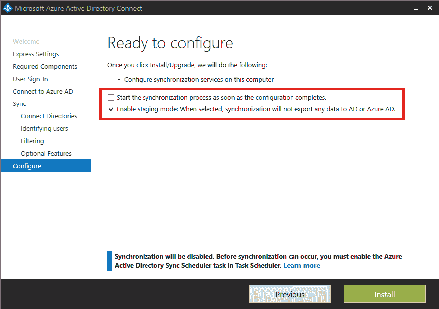

# Azure 中的活动目录标识和访问管理操作

> 原文：<https://www.javatpoint.com/active-directory-identity-in-azure-and-access-management-operations>

这些建议在发布之日是最新的，但将来可能会有所变化。随着微软产品和服务的发展，组织应该定期检查他们的识别程序。

## 主要操作流程

### 将所有者分配给 Azure 中的关键任务

管理 Azure Active Directory 需要持续执行重要的运营任务和流程，而这些任务和流程并不总是部署的一部分。然而，重要的是，我们要做好这些家务，以保持我们周围环境的良好状态。

当我们查看列表时，必须为没有所有者的活动分配所有者，或者更改任务的所有权。

## 内部系统的身份同步

### 同步问题的识别和解决

长期存在的未解决的同步故障可能会导致支持问题。同步错误故障排除概述了各种类型的同步失败，以及导致这些失败的一些可能情况和可能的解决方案。

#### 注意:如果由于遗留域迁移、合并或收购，单个人类身份拥有多个帐户，我们应该只同步用户每天使用的帐户，例如他们用来登录其计算机的帐户。

在一个理想的世界里，我们会在需要同步的项目数量和规则的复杂性之间取得平衡。

**重要**

如果我们仍然在生产中使用组过滤，我们应该切换到不同的过滤方法。

## Azure 色中的灾难恢复

灾难恢复也称为同步故障转移。供应过程在很大程度上依赖于 Azure AD Connect。如果同步服务器因任何原因停机，内部进行的更改将不会在云中更新，这可能会导致用户的访问问题。因此，定义一个允许管理员在同步服务器离线时立即恢复同步的故障转移计划至关重要。以下是这种策略的一些例子:

*   **在分段模式下部署 Azure AD Connect 服务器-** 管理员只需进行一个小小的修改，就可以将分段服务器“升级”到生产环境。
*   **虚拟化方法的使用-** 如果在虚拟机(VM)上安装了 Azure AD connect，则管理员可以使用其虚拟化堆栈来实时移动或快速重新安装 VM，从而恢复同步。

***定制规则***

Azure AD Connect 中的自定义规则允许我们管理内部和云对象之间的属性流。过度使用或误用自定义规则会导致许多风险，这对组织来说非常危险。

它们可以是:

*   排除复杂性故障时，跨项目执行复杂操作时性能下降。
    *   生产服务器和暂存服务器之间出现配置差异的可能性更高(由内置规则使用)
*   升级 Azure AD Connect 时的额外开销如果自定义规则建立在超过 100 的优先级内
    如果我们有极其复杂的法规，我们应该研究为什么它们如此复杂，并寻找简化它们的方法。类似地，如果我们已经编写了优先级值超过 100 的自定义规则，我们应该确保它们没有处于危险中或者与默认设置冲突。
    误用自定义规则的示例包括:
    *   **弥补肮脏的目录数据-** 在这种情况下，最好与 AD 团队的所有者接洽，将清理目录数据作为一项补救任务，并更改协议以避免不良数据的重新引入。
    *   **单个用户一次性修复-** 通常会遇到特殊情况异常值的规则，通常是由于特定用户的问题。
*   **过度复杂的“云过滤”-** 虽然减少项目数量是一个好主意，但是使用大量同步规则会有过度复杂同步范围的风险。如果有复杂的逻辑来包含/排除不在 OU 过滤范围内的项目，最好在同步之外进行，并用简单的“云过滤”属性指定对象，该属性可能由简单的同步规则触发。

## 微软云服务许可(基于集团)

通过 Azure Active Directory 基于组的许可，微软云服务的许可得到了简化。通过这种方式，IAM 提供了组基础设施，同时将组管理委托给公司内的适当团队。在 Azure AD 中，我们可以通过多种方法设置组成员资格，包括:

*   可以从内部目录同步组，这可能非常适合已经有组管理系统的企业，这些系统可以扩展到在 Microsoft 365 中分配许可证。
    *   **基于属性/动态-** Azure AD 会跟踪群组成员，并确保他们与短语匹配。当这种类型的组用于许可证分配时，基于属性的许可证分配是可能的，这对于其目录中具有高数据质量的企业来说是理想的。
    *   **委托所有权-** 可以创建组，也可以分配所有者。我们可以让公司领导，如协作或商业智能团队，定义谁应该以这种方式访问。

服务计划(许可证组件)的定义是许可管理的另一个方面，它应该根据公司中的工作角色来启用。让用户访问他们不需要的服务计划可能会导致他们在 Office 门户上看到他们没有接受过培训或不应该使用的工具。向不允许共享内容的人员调配 OneDrive for Business 时，可能会导致帮助台容量增加、资源调配浪费，并危及我们的合规性和治理。

要为用户定义服务计划，请遵循以下准则:

*   管理员应该根据用户的工作职能为其创建“一揽子”服务计划，例如白领对地板工人。
*   将许可证分配给服务计划，并按群集创建组。

**重要**

如果我们发现任何许可错误，我们应该立即调查并补救任何许可分配问题。

***生命周期管理 IMA***

如果我们当前的方法不考虑新员工或离开公司的员工，我们应该实施动态的基于组的许可，并指定组成员生命周期。最后，如果我们对没有生命周期管理的内部组使用基于组的许可，请考虑利用云组来提供委托所有权和基于属性的动态成员资格等功能。

分配给“所有用户”组的应用程序

所有用户组可能看起来只包含企业员工，但实际上可能同时包含企业员工和来宾。

**Azure AD Connect 增量同步周期基线**

了解我们业务中的变化量至关重要，确保同步需要合理的时间也是如此。

默认情况下，增量同步频率设置为 30 分钟。如果增量同步定期超过 30 分钟，或者转移和生产的增量同步性能差异很大，我们应该分析和检查影响 Azure AD Connect 性能的变量。

【Azure AD Connect 故障排除推荐阅读

*   使用 IdFix 工具，准备与 Microsoft 365 同步的目录属性
*   Azure AD Connect:同步错误疑难解答

安全的身份基础架构有五个组成部分。该列表将帮助我们快速识别和实施所需的步骤，以保护和管理我们公司中身份及其权利的生命周期。

*   将主要责任分配给所有者。
*   识别并纠正同步问题。
*   定义灾难恢复故障转移策略。
*   简化许可证和应用分配的管理。
*   自动化用户应用程序供应。

* * *