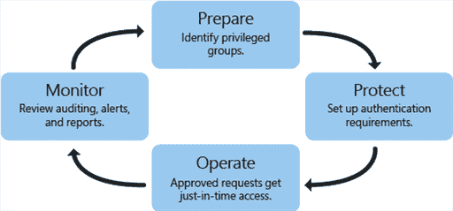
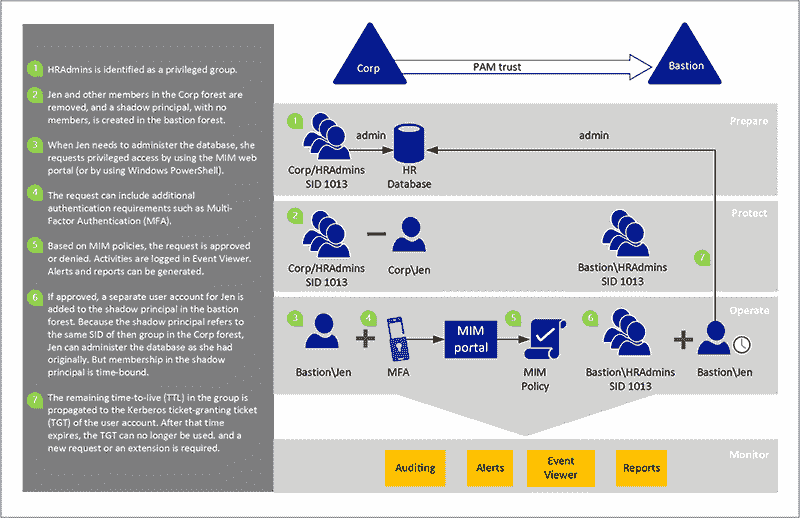
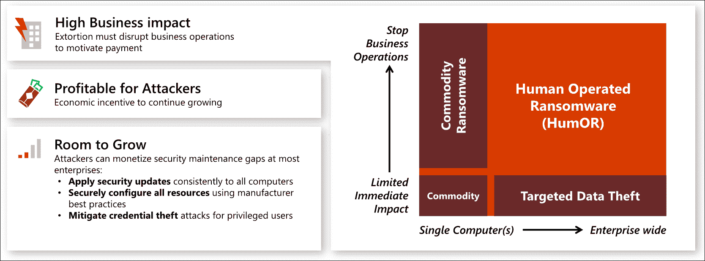

# 什么是 Azure 中活动目录域服务的特权访问管理？

> 原文：<https://www.javatpoint.com/what-is-privileged-access-management-for-active-directory-domain-services-in-azure>

在隔离的活动目录环境中限制特权访问的解决方案称为 MIM 特权访问管理，简称为 PAM。

通过使用 PAM，我们可以实现两个主要目标:

*   我们可以通过建立一个独立的堡垒环境来重新控制被黑客入侵的活动目录环境，该环境已知可以免受恶意攻击。
*   隔离特权帐户的使用，以限制凭据被盗的机会。

#### 注意:MIM PAM 是为隔离的内部 AD 环境设计的。Azure AD PIM 是 Azure AD 中的一项服务，允许我们管理、控制和监控对 Azure AD、Azure 和其他微软在线服务(包括微软 365 和 Intune)的访问。

## MIM PAM 在哪些问题上提供帮助？

如今，攻击者非常容易获得域管理员帐户凭据，而且在攻击发生后很难检测到这些攻击。PAM 的目的是在增强我们对环境的控制和了解的同时，减少恶意的人进入的机会。

PAM 的使用使得攻击者更难闯入网络并访问特权帐户。PAM 增加了特权组的安全性，允许他们管理对各种加入域的个人电脑和应用程序的访问。还包括更多的监控、可见性和细粒度控制。PAM 让企业更好地了解管理账户在工作场所的使用方式。

## 最小均方误差聚丙烯酰胺

PAM 是基于及时管理的概念，它指的是管理足够多的东西(JEA)。Windows PowerShell 的 JEA 工具包定义了一组用于执行特权任务的命令。这是一个命令执行端点，管理员可以在这里获得运行命令的权限。在 JEA，管理员决定允许哪些用户以哪些权限完成哪些任务。

这些权利在一定时间后到期，使得心怀不轨的人不可能获得访问权。同样，当用户满足要求的条件时，它就会被启用。

在我们的环境中设置 PAM 主要有 4 个步骤。

1.  **准备:**确定哪些组在我们当前的林中拥有重要特权。在堡垒森林中，在没有个体的情况下重新创建这些分组。
2.  **保护:**当用户寻求及时管理时，设置生命周期和身份验证保护。
3.  **操作:**当完成身份验证要求并授权请求时，用户帐户被临时添加到堡垒林中的特权组。在一段预定的时间内，管理员拥有提供给该组的所有权力和访问权限。过了这段时间后，该帐户将从组中删除。
4.  **监控:** PAM 通过审核、警报和报告来增强特权访问请求。我们可以查阅特权访问的历史，找出是谁做了什么。这个阶段对于检测恶意软件以及追踪“内部”攻击者至关重要。

## 什么是 MIM PAM 及其工作原理。

PAM 基于新的 AD DS 功能构建，特别是针对域帐户身份验证和授权，以及新的 Microsoft Identity Manager 功能。PAM 将特权帐户与已有的活动目录基础结构隔离开来。在使用特权账户之前，必须先申请并获得批准。

MIM 服务、活动目录和该系统的其他组件也可以在高可用性架构中实现。

以下示例更深入地解释了 PIM。

有时间限制的组成员资格由 bastion forest 颁发，而 bastion forest 又会生成有时间限制的票证授予票证(TGT)。

日常使用的用户帐户不需要移动到新的林中。计算机、应用程序及其相关组织也是如此。他们仍然留在他们现在所在的森林里。考虑一家公司的情况，该公司目前关注网络安全，但没有任何立即将其服务器基础架构升级到最新版本的 Windows Server 的计划。通过将 MIM 与新的堡垒森林相结合，该组织仍然可以从这种集成方法中受益，并更好地限制对当前资源的访问。

聚丙烯酰胺的优点如下:

*   **权限的隔离/作用域:**用户必须请求所需的权限，否则将不会授予这些权限。PAM 管理员定义的 MIM 策略决定了请求是被允许还是被拒绝。在请求获得授权之前，权限访问不可用。
*   **升级和验证:**用户可以寻求行政账户提升，通过 MIM 程序处理。
*   **可定制工作流:** MIM 工作流可以针对各种情况进行设置，根据请求用户的规格或被请求的职责，可以采用多个工作流。
*   **附加日志记录:**除了内置的 MIM 程序之外，PAM 还有附加日志记录，用于识别请求、如何允许请求以及批准后发生的任何事件。

## 有哪些不同的流程和监控选项？

在安装 PAM 之前，让我们假设用户是管理组的成员。作为 PAM 设置的一部分，用户随后从管理组中删除，并在 MIM 中创建一个策略。该策略规定，如果用户寻求管理访问，该请求将被批准，并且该用户将在堡垒林的特权组中获得一个单独的帐户。

## 脉冲幅度调制 （Pulse Amplitude Modulation 的缩写）

微软建议实施这种特权访问策略，以降低我们组织遭受高影响和高概率特权访问攻击的风险。

***每个组织的最高安全优先级应该是特权访问。*** 这些用户的任何妥协肯定会对公司产生严重的负面影响。当攻击者能够访问特权用户的帐户时，他们几乎总是会对组织的业务重要资产产生重大影响。

微软提供了实施指南，帮助我们快速部署这一战略的防御。

**重要**

没有一种技术方案能奇迹般地限制特权访问的危险；相反，我们必须将众多技术结合成一个整体解决方案，抵御许多攻击者的进入点。组织必须为每项任务带来合适的工具。

## 特权访问的意义是什么？

因为特权访问安全是所有其他安全保证的基础，所以拥有我们特权帐户的攻击者可能会危及所有其他安全保障。

这些攻击方法首先用于有针对性的数据盗窃攻击，导致知名公司发生多起引人注目的违规事件(以及许多未报告的事件)。最近，勒索软件攻击者采用了类似的方法，导致利润丰厚的人工操作的勒索软件攻击激增，损害了各行业的公司运营。

**重要**

人类控制的软件不同于单个计算机软件攻击，单个计算机软件攻击的目标是单个计算机或设备。

此图描述了使用特权访问的这种基于勒索的攻击的影响和可能性如何增加:

*   重大经济影响
*   失去特权访问可能造成的业务影响和损害再怎么估计也不过分。拥有特权访问权限的攻击者实际上可以完全控制所有企业资产和资源，允许他们泄露任何机密信息、停止所有业务流程或破坏业务流程和机器，从而造成财产损失、伤害或更严重的后果。在每个行业，都有巨大的商业影响，包括:在引入人工操作的软件(幽默)之前，这些攻击很常见，但由于以下原因，它们经常被忽视或误解:
    *   **有针对性的数据窃取-** 攻击者利用特权访问来获取敏感知识产权的访问权限，并将其窃取以供自己使用，或者将其出售或转让给竞争对手或外国政府。
    *   自从引入高级凭据窃取方法(如 pass hash 技术)以来，特权访问攻击的流行程度有所增加。These assaults were common prior to the introduction of human-operated ransomware (HumOR), but they were often ignored or misinterpreted due of:
*   **攻击者货币化限制&无声冲击-** 这些攻击只能让知道如何将目标公司的敏感知识产权商业化的当事人和个人受益。
    随着人工操作软件的出现，对这些攻击的无声影响和攻击者赚钱限制正在瓦解，人工操作软件的数量、影响和知名度都在增长，因为它同时:
*   **响亮而具有破坏性-** 从商业运作到勒索要求付款。
*   **普遍适用-** 每个领域的每个公司都有保持正常运营的财务激励。

由于这些原因，任何组织的最高安全优先级都应该是特权访问。

## 整体实践战略

需要跨多种技术的全面、整体和优先的风险缓解组合来降低特权访问的风险。

构建这个策略需要理解攻击者就像水，因为他们有太多的选择(其中一些一开始可能看起来很小)，他们可以灵活地利用这些选择，并且通常会追求阻力最小的路径来实现他们的目标。

* * *